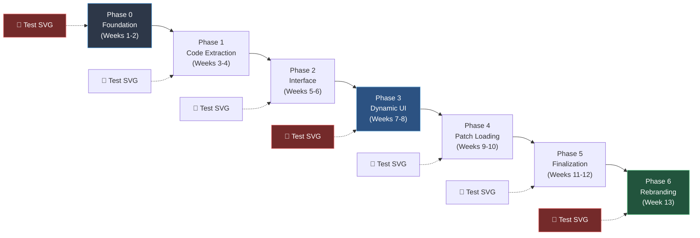

# SpaceFlow Migration Strategy
**ZigMap26 → SpaceFlow: Comprehensive Implementation Plan**

**Created:** May 25, 2026  
**Status:** Implementation Guide  
**Version:** 1.0  
**Estimated Duration:** 13 weeks

---

## Table of Contents

1. [Overview](#overview)
2. [Prerequisites](#prerequisites)
3. [Migration Principles](#migration-principles)
4. [Phase 0: Foundation](#phase-0-foundation-weeks-1-2)
5. [Phase 1: Code Extraction](#phase-1-code-extraction-weeks-3-4)
6. [Phase 2: Interface Implementation](#phase-2-interface-implementation-weeks-5-6)
7. [Phase 3: Dynamic UI](#phase-3-dynamic-ui-weeks-7-8)
8. [Phase 4: Patch Loading](#phase-4-patch-loading-weeks-9-10)
9. [Phase 5: Finalization](#phase-5-finalization-weeks-11-12)
10. [Phase 6: Rebranding](#phase-6-rebranding-week-13)
11. [Testing Strategy](#testing-strategy)
12. [Quality Gates](#quality-gates)
13. [Rollback Procedures](#rollback-procedures)
14. [Risk Mitigation](#risk-mitigation)

---

## Overview

### Transformation Goal

Transform ZigMap26 from a **monolithic zigzag generator** into **SpaceFlow**, a modular framework for pluggable generative art patches, while maintaining 100% backward compatibility and ensuring **ZERO disruption** to existing functionality.



### Success Criteria

✅ All existing features work identically  
✅ **SVG export works perfectly** (NON-NEGOTIABLE)  
✅ All 12+ existing presets load and function  
✅ Performance is maintained or improved  
✅ Code is cleaner and more maintainable  
✅ New patches can be added easily  
✅ Zero data loss for users

### Critical Requirements

**🚨 SVG EXPORT MUST WORK AFTER EVERY PHASE**

This is the #1 testing priority. If SVG export breaks at any phase:
1. Stop immediately
2. Identify the breaking change
3. Fix or revert
4. Re-test before proceeding

No phase can be considered complete until SVG export is verified working.

---

## Prerequisites

### Before Starting

#### 1. Backup Everything
```bash
# Create backup branch
git checkout -b backup/pre-spaceflow-migration
git push origin backup/pre-spaceflow-migration

# Tag current state
git tag v2.0-final
git push origin v2.0-final

# Create working branch
git checkout -b feature/spaceflow-migration
```

#### 2. Document Current State
- [ ] Export list of all presets with screenshots
- [ ] Record current SVG export output (save sample files)
- [ ] Document all keyboard shortcuts and UI interactions
- [ ] List all known bugs/quirks (to ensure they're preserved if expected)
- [ ] Performance baseline (fps with 100 lines)

#### 3. Set Up Testing Environment
```bash
# Install testing dependencies (if not already present)
npm install --save-dev jest @testing-library/dom

# Create test directory structure
mkdir -p tests/{unit,integration,e2e}
mkdir -p tests/fixtures/{presets,exports}
```

#### 4. Prepare Development Environment
- [ ] VS Code with ESLint configured
- [ ] Browser DevTools console monitoring
- [ ] Local development server running
- [ ] Git configured for frequent commits

---

## Migration Principles

### Guiding Rules

1. **🚨 SVG Export First** — Test after every change, no exceptions
2. **Incremental Changes** — Small commits, frequent testing
3. **Backward Compatibility** — Old presets must always work
4. **No Feature Loss** — Everything that works today must work tomorrow
5. **Reversibility** — Every phase can be rolled back
6. **Zero Downtime** — Code is always in a working state
7. **Test-Driven** — Write tests before refactoring

### Testing Philosophy

**Every phase follows this cycle:**
1. Write tests for current behavior (ensure they pass)
2. Make incremental changes
3. Run tests continuously
4. Test SVG export manually
5. Commit when all tests pass
6. Document what was changed

---

## Phase 0: Foundation (Weeks 1-2)

### Goal
Set up project structure and interfaces **without changing any existing code behavior**.

---

### Week 1: Directory Structure & Documentation

#### Tasks

**Day 1-2: Create Directory Structure**
```bash
# Create new directories
mkdir -p js/framework
mkdir -p js/patches
mkdir -p js/patches/zigzag
mkdir -p tests/unit
mkdir -p tests/integration
```

**Files to create:**
- `js/framework/PatchInterface.js` (base class, not used yet)
- `js/framework/SpaceFlowAPI.js` (abstraction layer, not used yet)
- `js/patches/README.md` (developer guide)

**Day 3-4: Document Current Dependencies**

Create `docs/DEPENDENCY-AUDIT.md`:
```markdown
# Current Code Dependencies

## Emitter.js dependencies:
- Direct: colorUtils, Projection, ZigzagLine
- Global: ZM object, params object

## ZigzagLine.js dependencies:
- Direct: colorUtils, buildRibbonSides function
- Global: ZM object, params object

## main.js orchestration:
- Creates Emitter instance
- Passes global functions as config
- Updates params object directly
```

**Day 5: Write PatchInterface**

`js/framework/PatchInterface.js`:
```javascript
/**
 * Base interface for all SpaceFlow patches
 * This defines the contract between framework and patches
 */
export class PatchInterface {
  constructor(config) {
    if (new.target === PatchInterface) {
      throw new Error('PatchInterface is abstract - cannot instantiate directly');
    }
  }

  // REQUIRED METHODS
  
  setup(config) {
    throw new Error('setup() must be implemented');
  }

  update(dt, params) {
    throw new Error('update() must be implemented');
  }

  draw(p, camera, params) {
    throw new Error('draw() must be implemented');
  }

  getManifest() {
    throw new Error('getManifest() must be implemented');
  }

  getGeometry() {
    throw new Error('getGeometry() must be implemented');
  }

  // OPTIONAL METHODS
  
  onParameterChange(key, value) {
    // Optional: react to specific parameter changes
  }

  onResize(width, height) {
    // Optional: handle canvas resize
  }

  destroy() {
    // Optional: cleanup when patch unloads
  }
}
```

#### Testing

**Tests to write (all should pass immediately):**

`tests/unit/current-code.test.js`:
```javascript
describe('Current ZigMap26 Code (baseline)', () => {
  test('Emitter exists and has expected methods', () => {
    expect(typeof Emitter).toBe('function');
    expect(Emitter.prototype.update).toBeDefined();
    expect(Emitter.prototype.draw).toBeDefined();
  });

  test('ZigzagLine exists and has expected methods', () => {
    expect(typeof ZigzagLine).toBe('function');
    expect(ZigzagLine.prototype.update).toBeDefined();
  });

  test('defaults.js exports DEFAULT_PARAMS', () => {
    expect(DEFAULT_PARAMS).toBeDefined();
    expect(DEFAULT_PARAMS.segmentLength).toBeDefined();
  });
});
```

**Manual Testing:**
- [ ] Application loads normally
- [ ] All presets load
- [ ] Export SVG and verify it matches baseline
- [ ] Export PNG/Video/Depth (verify working)
- [ ] States work (save/load/transition)
- [ ] All keyboard shortcuts work

#### Quality Gate

**✅ Phase 0 Complete When:**
- [ ] New directories exist
- [ ] PatchInterface.js created (not used yet)
- [ ] Dependency audit complete
- [ ] Baseline tests written and passing
- [ ] **SVG export verified working (baseline saved)**
- [ ] Git commit: "Phase 0: Foundation structure"

**❌ Cannot Proceed If:**
- Existing code stops working
- Tests don't pass
- SVG export breaks

---

### Week 2: Abstraction Layer & Test Infrastructure

#### Tasks

**Day 1-2: Create SpaceFlow API**

`js/framework/SpaceFlowAPI.js`:
```javascript
/**
 * Abstraction layer for patch access to framework services
 * Prevents direct global access
 */
export class SpaceFlowAPI {
  constructor(framework) {
    this._framework = framework;
  }

  // Color System
  getColor(slotIndex) {
    return this._framework.colorSystem.getColor(slotIndex);
  }

  getPalette() {
    return this._framework.colorSystem.getCurrentPalette();
  }

  // Canvas Info
  getCanvasWidth() {
    return this._framework.canvas.width;
  }

  getCanvasHeight() {
    return this._framework.canvas.height;
  }

  // Camera (read-only)
  getCamera() {
    return { ...this._framework.camera.getState() };
  }

  // Utilities
  log(message, level = 'info') {
    console[level](`[Patch] ${message}`);
  }
}
```

**Day 3-4: Set Up Testing Infrastructure**

`tests/test-helpers.js`:
```javascript
// Test utilities
export function loadPreset(filename) {
  // Load preset JSON for testing
}

export function compareGeometry(geo1, geo2, tolerance = 0.01) {
  // Compare two geometry objects
}

export function mockP5Instance() {
  // Create mock p5 instance for testing
}

export function mockCamera() {
  // Create mock camera for testing
}
```

**Day 5: Write Integration Tests**

`tests/integration/svg-export.test.js`:
```javascript
import { exportSVG } from '../../js/export/SVGExporter.js';

describe('SVG Export (baseline)', () => {
  beforeEach(() => {
    // Set up test environment
    setupCanvas();
    loadDefaultPreset();
  });

  test('exports valid SVG markup', () => {
    const svg = exportSVG();
    expect(svg).toContain('<svg');
    expect(svg).toContain('</svg>');
  });

  test('includes all visible lines', () => {
    const geometry = getCurrentGeometry();
    const svg = exportSVG();
    
    const visibleLines = geometry.filter(line => line.alpha > 0);
    const pathCount = (svg.match(/<path/g) || []).length;
    
    expect(pathCount).toBeGreaterThanOrEqual(visibleLines.length);
  });

  test('SVG is pixel-perfect with baseline', async () => {
    const baseline = await loadBaselineSVG();
    const current = exportSVG();
    
    expect(compareSVG(baseline, current)).toBe(true);
  });
});
```

#### Testing

**All Phase 0 tests plus:**
- [ ] SpaceFlowAPI instantiates correctly
- [ ] Test helpers work
- [ ] Integration test suite runs
- [ ] SVG export test passes

#### Quality Gate

**✅ Week 2 Complete When:**
- [ ] SpaceFlowAPI created (not integrated yet)
- [ ] Test infrastructure working
- [ ] Integration tests passing
- [ ] **SVG export still working perfectly**
- [ ] Git commit: "Phase 0: Test infrastructure and abstraction layer"

---

## Phase 1: Code Extraction (Weeks 3-4)

### Goal
Move zigzag-specific code to patch directory **without breaking anything**.

---

### Week 3: Copy Files

#### Tasks

**Day 1: Copy Emitter.js**

```bash
# Copy (don't move yet)
cp js/core/Emitter.js js/patches/zigzag/Emitter.js

# Update imports in copied file
# js/patches/zigzag/Emitter.js
import { ZigzagLine } from './ZigzagLine.js';
import { getColor } from '../../core/colorUtils.js';
```

**Day 2: Copy ZigzagLine.js**

```bash
cp js/core/ZigzagLine.js js/patches/zigzag/ZigzagLine.js

# Update imports
```

**Day 3: Create Patch README**

`js/patches/zigzag/README.md`:
```markdown
# Zigzag Emitter Patch

Original monolithic code from ZigMap26, now wrapped as a SpaceFlow patch.

## Files
- `Emitter.js` - Emission logic
- `ZigzagLine.js` - Line geometry and animation
- `ZigzagEmitterPatch.js` - SpaceFlow interface wrapper (Week 4)
- `manifest.json` - Parameter definitions (Week 4)

## Status
Phase 1 (Week 3): Files copied, still using originals
```

**Day 4-5: Verify Copies Compile**

- Check for import errors
- Ensure no circular dependencies
- **Don't integrate yet** — originals still active

#### Testing

**Test that nothing broke:**
```javascript
describe('Phase 1: Copied files', () => {
  test('original Emitter still works', () => {
    const emitter = new Emitter(config);
    expect(emitter).toBeDefined();
  });

  test('copied Emitter compiles without errors', async () => {
    const { Emitter: CopiedEmitter } = await import('../js/patches/zigzag/Emitter.js');
    expect(CopiedEmitter).toBeDefined();
  });
});
```

**Manual Testing:**
- [ ] Application works identically
- [ ] Export SVG — verify still works
- [ ] All presets load
- [ ] Performance unchanged

#### Quality Gate

**✅ Week 3 Complete When:**
- [ ] Files copied to `js/patches/zigzag/`
- [ ] Imports updated in copied files
- [ ] Copied files compile without errors
- [ ] **Original code still active and working**
- [ ] **SVG export verified**
- [ ] Git commit: "Phase 1: Copy zigzag files to patch directory"

---

### Week 4: Create Manifest & Wrapper

#### Tasks

**Day 1-2: Extract Parameters to Manifest**

`js/patches/zigzag/manifest.json`:
```json
{
  "name": "Zigzag Emitter",
  "version": "1.0.0",
  "description": "Animated 3D zigzag ribbons (original ZigMap26 algorithm)",
  "author": "ddelcourt",
  "category": "generative",
  "tags": ["3d", "ribbons", "animated", "zigzag"],
  
  "parameters": [
    {
      "key": "segmentLength",
      "label": "Segment Length",
      "description": "Height of each zigzag segment",
      "type": "slider",
      "scope": "patch",
      "category": "geometry",
      "min": 5,
      "max": 200,
      "default": 50,
      "step": 1,
      "unit": "px"
    },
    {
      "key": "lineThickness",
      "label": "Line Thickness",
      "description": "Base thickness of lines",
      "type": "slider",
      "scope": "patch",
      "category": "geometry",
      "min": 5,
      "max": 100,
      "default": 26.8,
      "step": 0.1,
      "unit": "px"
    },
    {
      "key": "emitterRotation",
      "label": "Emitter Rotation",
      "description": "Rotation angle of the emitter",
      "type": "slider",
      "scope": "patch",
      "category": "geometry",
      "min": 0,
      "max": 360,
      "default": 180,
      "step": 1,
      "unit": "°"
    },
    {
      "key": "geometryScale",
      "label": "Geometry Scale",
      "description": "Overall scale of the geometry",
      "type": "slider",
      "scope": "patch",
      "category": "geometry",
      "min": 10,
      "max": 300,
      "default": 100,
      "step": 1,
      "unit": "%"
    },
    {
      "key": "fadeDuration",
      "label": "Fade Duration",
      "description": "Time for lines to fade out",
      "type": "slider",
      "scope": "patch",
      "category": "animation",
      "min": 0.1,
      "max": 10,
      "default": 3,
      "step": 0.1,
      "unit": "s"
    },
    {
      "key": "emitRate",
      "label": "Emit Rate",
      "description": "Lines emitted per second",
      "type": "slider",
      "scope": "patch",
      "category": "animation",
      "min": 0.1,
      "max": 10,
      "default": 1,
      "step": 0.1,
      "unit": "/s"
    },
    {
      "key": "speed",
      "label": "Animation Speed",
      "description": "Speed of line animation",
      "type": "slider",
      "scope": "patch",
      "category": "animation",
      "min": 10,
      "max": 500,
      "default": 100,
      "step": 5,
      "unit": "%"
    },
    {
      "key": "randomThickness",
      "label": "Random Thickness",
      "description": "Enable thickness variation per line",
      "type": "checkbox",
      "scope": "patch",
      "category": "modulation",
      "default": false
    },
    {
      "key": "randomSpeed",
      "label": "Random Speed",
      "description": "Enable speed variation per line",
      "type": "checkbox",
      "scope": "patch",
      "category": "modulation",
      "default": false
    },
    {
      "key": "thicknessRangeMin",
      "label": "Min Thickness",
      "type": "slider",
      "scope": "patch",
      "category": "modulation",
      "min": 10,
      "max": 100,
      "default": 50,
      "step": 1,
      "unit": "%",
      "dependsOn": "randomThickness"
    },
    {
      "key": "thicknessRangeMax",
      "label": "Max Thickness",
      "type": "slider",
      "scope": "patch",
      "category": "modulation",
      "min": 100,
      "max": 300,
      "default": 150,
      "step": 1,
      "unit": "%",
      "dependsOn": "randomThickness"
    },
    {
      "key": "speedRangeMin",
      "label": "Min Speed",
      "type": "slider",
      "scope": "patch",
      "category": "modulation",
      "min": 10,
      "max": 100,
      "default": 80,
      "step": 1,
      "unit": "%",
      "dependsOn": "randomSpeed"
    },
    {
      "key": "speedRangeMax",
      "label": "Max Speed",
      "type": "slider",
      "scope": "patch",
      "category": "modulation",
      "min": 100,
      "max": 300,
      "default": 120,
      "step": 1,
      "unit": "%",
      "dependsOn": "randomSpeed"
    }
  ],
  
  "categories": [
    {
      "id": "geometry",
      "label": "Geometry",
      "icon": "📐",
      "scope": "patch",
      "order": 1
    },
    {
      "id": "animation",
      "label": "Animation",
      "icon": "⚡",
      "scope": "patch",
      "order": 2
    },
    {
      "id": "modulation",
      "label": "Modulation",
      "icon": "🎲",
      "scope": "patch",
      "order": 3
    }
  ]
}
```

**Day 3-5: Create Wrapper Class**

`js/patches/zigzag/ZigzagEmitterPatch.js`:
```javascript
import { PatchInterface } from '../../framework/PatchInterface.js';
import { Emitter } from './Emitter.js';

/**
 * Legacy wrapper for ZigMap26 zigzag code
 * Wraps existing Emitter/ZigzagLine classes without modification
 */
export class ZigzagEmitterPatch extends PatchInterface {
  constructor(config) {
    super(config);
    this.emitter = null;
    this.manifest = null;
  }

  async setup(config) {
    // Load manifest
    const response = await fetch('js/patches/zigzag/manifest.json');
    this.manifest = await response.json();

    // Create emitter with existing interface (ZERO changes to Emitter.js)
    this.emitter = new Emitter({
      p: config.p,
      camera: config.camera,
      getColor: config.getColor,
      canvasWidth: config.width,
      canvasHeight: config.height,
      getSpawnDistanceFn: config.getSpawnDistance,
      buildRibbonSidesFn: config.buildRibbonSides
    });
  }

  update(dt, params) {
    // Pass through to existing emitter (ZERO changes)
    if (this.emitter) {
      this.emitter.update(dt);
    }
  }

  draw(p, camera, params) {
    // Pass through to existing emitter (ZERO changes)
    if (this.emitter) {
      this.emitter.draw(p);
    }
  }

  getManifest() {
    // Return loaded manifest
    return this.manifest;
  }

  getGeometry() {
    // Adapter: convert existing internal format to SpaceFlow format
    if (!this.emitter || !this.emitter.lines) {
      return { type: 'ribbons', items: [], metadata: {} };
    }

    return {
      type: 'ribbons',
      items: this.emitter.lines
        .filter(line => line._alpha() > 0)
        .map(line => ({
          type: 'ribbon',
          vertices: line._buildVertices(),
          thickness: line.lineThickness,
          color: {
            r: line.currentColor[0],
            g: line.currentColor[1],
            b: line.currentColor[2]
          },
          opacity: line._alpha(),
          zOffset: line.zOffset
        })),
      metadata: {
        lineCount: this.emitter.lines.length,
        visibleCount: this.emitter.lines.filter(l => l._alpha() > 0).length
      }
    };
  }

  onResize(width, height) {
    if (this.emitter) {
      this.emitter.canvasWidth = width;
      this.emitter.canvasHeight = height;
    }
  }

  destroy() {
    if (this.emitter) {
      this.emitter.lines = [];
      this.emitter = null;
    }
  }
}
```

#### Testing

**Test manifest:**
```javascript
describe('Zigzag Manifest', () => {
  test('manifest.json is valid JSON', async () => {
    const response = await fetch('js/patches/zigzag/manifest.json');
    const manifest = await response.json();
    expect(manifest).toBeDefined();
  });

  test('all parameters have required fields', async () => {
    const response = await fetch('js/patches/zigzag/manifest.json');
    const manifest = await response.json();
    
    manifest.parameters.forEach(param => {
      expect(param.key).toBeDefined();
      expect(param.label).toBeDefined();
      expect(param.type).toBeDefined();
      expect(param.default).toBeDefined();
    });
  });

  test('parameter defaults match current defaults.js', async () => {
    const response = await fetch('js/patches/zigzag/manifest.json');
    const manifest = await response.json();
    
    manifest.parameters.forEach(param => {
      if (DEFAULT_PARAMS[param.key] !== undefined) {
        expect(param.default).toBe(DEFAULT_PARAMS[param.key]);
      }
    });
  });
});
```

**Test wrapper:**
```javascript
describe('ZigzagEmitterPatch', () => {
  let patch;

  beforeEach(async () => {
    patch = new ZigzagEmitterPatch({});
    await patch.setup(mockConfig);
  });

  test('implements all required methods', () => {
    expect(typeof patch.setup).toBe('function');
    expect(typeof patch.update).toBe('function');
    expect(typeof patch.draw).toBe('function');
    expect(typeof patch.getManifest).toBe('function');
    expect(typeof patch.getGeometry).toBe('function');
  });

  test('getManifest returns valid manifest', async () => {
    const manifest = patch.getManifest();
    expect(manifest.name).toBe('Zigzag Emitter');
    expect(manifest.parameters).toBeDefined();
  });

  test('getGeometry returns valid geometry', () => {
    // Run a few update cycles
    for (let i = 0; i < 60; i++) {
      patch.update(1/60, mockParams);
    }

    const geometry = patch.getGeometry();
    expect(geometry.type).toBe('ribbons');
    expect(Array.isArray(geometry.items)).toBe(true);
  });
});
```

**Manual Testing:**
- [ ] Application still works with original code
- [ ] Wrapper instantiates without errors
- [ ] **SVG export from wrapper matches original**
- [ ] Manifest loads correctly

#### Quality Gate

**✅ Week 4 Complete When:**
- [ ] manifest.json created with all 13 parameters
- [ ] ZigzagEmitterPatch wrapper class complete
- [ ] Wrapper tests passing
- [ ] **Wrapper's getGeometry() produces identical output to current code**
- [ ] **SVG export verified working**
- [ ] Git commit: "Phase 1: Create zigzag patch wrapper and manifest"

---

## Phase 2: Interface Implementation (Weeks 5-6)

### Goal
Switch from original code to wrapper **without any visible changes**.

---

### Week 5: Integration Preparation

#### Tasks

**Day 1-2: Create Framework Bootstrap**

`js/framework/SpaceFlow.js`:
```javascript
/**
 * Main SpaceFlow framework class
 * Coordinates patches, parameters, UI, export
 */
export class SpaceFlow {
  constructor(config) {
    this.currentPatch = null;
    this.params = {};
    this.camera = config.camera;
    this.colorSystem = config.colorSystem;
    this.canvas = config.canvas;
  }

  async loadPatch(patchName) {
    // For now, only zigzag is supported
    if (patchName !== 'zigzag-emitter') {
      throw new Error(`Unknown patch: ${patchName}`);
    }

    const { ZigzagEmitterPatch } = await import('../patches/zigzag/ZigzagEmitterPatch.js');
    
    this.currentPatch = new ZigzagEmitterPatch({});
    
    await this.currentPatch.setup({
      p: this.p5Instance,
      camera: this.camera,
      getColor: (index) => this.colorSystem.getColor(index),
      width: this.canvas.width,
      height: this.canvas.height,
      getSpawnDistance: () => this.camera.distance,
      buildRibbonSides: this.buildRibbonSides.bind(this)
    });

    return this.currentPatch;
  }

  update(dt) {
    if (this.currentPatch) {
      this.currentPatch.update(dt, this.params);
    }
  }

  draw() {
    if (this.currentPatch) {
      this.currentPatch.draw(this.p5Instance, this.camera, this.params);
    }
  }

  exportGeometry() {
    if (!this.currentPatch) {
      throw new Error('No patch loaded');
    }
    return this.currentPatch.getGeometry();
  }
}
```

**Day 3: Modify SketchFactory (Dual Mode)**

`js/rendering/SketchFactory.js`:
```javascript
// Add at top
const USE_SPACEFLOW = false; // Feature flag

// ... existing code ...

// In setup():
if (USE_SPACEFLOW) {
  // NEW: Initialize SpaceFlow
  window.SF = new SpaceFlow({
    camera: ZM.camera,
    colorSystem: ZM.colorSystem,
    canvas: { width, height }
  });
  await SF.loadPatch('zigzag-emitter');
} else {
  // OLD: Keep existing code path
  ZM.emitterInstance = new Emitter({ /* ... */ });
}

// In draw():
if (USE_SPACEFLOW) {
  SF.update(scaledDt);
  SF.draw();
} else {
  ZM.emitterInstance.update(scaledDt);
  ZM.emitterInstance.draw(p);
}
```

**Day 4-5: Modify SVGExporter (Dual Mode)**

`js/export/SVGExporter.js`:
```javascript
// Add at top
const USE_SPACEFLOW = false; // Must match SketchFactory

export function exportSVG() {
  let geometry;

  if (USE_SPACEFLOW) {
    // NEW: Get geometry from SpaceFlow
    geometry = window.SF.exportGeometry();
  } else {
    // OLD: Get geometry directly from emitter
    geometry = {
      type: 'ribbons',
      items: ZM.emitterInstance.lines
        .filter(line => line._alpha() > 0)
        .map(line => ({
          // ... existing mapping ...
        }))
    };
  }

  // Rest of export logic unchanged (uses geometry object)
  return generateSVGMarkup(geometry, ZM.camera, ZM.projection);
}
```

#### Testing

**Test dual mode:**
```javascript
describe('Dual Mode Operation', () => {
  test('old code path still works', () => {
    // Set USE_SPACEFLOW = false
    const result = render();
    expect(result).toMatchSnapshot('legacy-mode');
  });

  test('new code path works identically', () => {
    // Set USE_SPACEFLOW = true
    const result = render();
    expect(result).toMatchSnapshot('spaceflow-mode');
  });

  test('both modes produce identical SVG', () => {
    const legacySVG = exportSVG_Legacy();
    const spaceflowSVG = exportSVG_SpaceFlow();
    expect(compareSVG(legacySVG, spaceflowSVG)).toBe(true);
  });
});
```

**Manual Testing:**
- [ ] Test with `USE_SPACEFLOW = false` (should work as before)
- [ ] Export SVG (should match baseline)
- [ ] Switch to `USE_SPACEFLOW = true`
- [ ] **Export SVG again (should be identical to baseline)**
- [ ] Test all presets in both modes
- [ ] Verify performance is similar

#### Quality Gate

**✅ Week 5 Complete When:**
- [ ] SpaceFlow class created
- [ ] Feature flag system in place
- [ ] Both code paths work
- [ ] **SVG export identical in both modes**
- [ ] Git commit: "Phase 2: Add SpaceFlow framework with feature flag"

---

### Week 6: Switch to SpaceFlow

#### Tasks

**Day 1: Enable SpaceFlow**

```javascript
// js/rendering/SketchFactory.js
const USE_SPACEFLOW = true; // 🚀 FLIP THE SWITCH

// js/export/SVGExporter.js
const USE_SPACEFLOW = true; // 🚀 FLIP THE SWITCH
```

**Day 2-3: Intensive Testing**

Run through entire test suite:
- [ ] All unit tests pass
- [ ] All integration tests pass
- [ ] Manual testing of all features
- [ ] **SVG export test (CRITICAL)**
- [ ] Performance benchmarking
- [ ] Load all 12+ presets
- [ ] Test state transitions

**Day 4: Fix Any Issues**

If anything breaks:
1. Identify the issue
2. Fix in patch wrapper or SpaceFlow class
3. Re-test
4. Document the fix

**Day 5: Remove Old Code Paths**

Once confirmed working:
```javascript
// Remove feature flags
// Remove old Emitter initialization
// Remove old draw() code
// Keep old files in js/core/ for now (safety)
```

#### Testing

**Regression test everything:**
```bash
# Run full test suite
npm test

# Manual checklist
- Load app
- Load each preset
- Export SVG (verify quality)
- Export PNG
- Record video
- Export depth map
- Save new state
- Load existing state
- Transition between states
- Auto-trigger states
- Change camera
- Switch palettes
- Test keyboard shortcuts
- Test framebuffer mode
- Test stereoscopic mode
- Test overlay
- Test window sync
```

#### Quality Gate

**✅ Week 6 Complete When:**
- [ ] SpaceFlow is active (feature flag enabled)
- [ ] All features work identically
- [ ] **SVG export perfect**
- [ ] All tests passing
- [ ] Performance maintained
- [ ] Old code paths removed
- [ ] Git commit: "Phase 2: Switch to SpaceFlow framework"

**🚨 If ANY issue found:**
- Revert to feature flag `false`
- Fix the issue
- Re-test thoroughly
- Try again

---

## Phase 3: Dynamic UI (Weeks 7-8)

### Goal
Generate UI from manifest instead of hardcoded controls.

---

### Week 7: Build Dynamic UI System

#### Tasks

**Day 1-3: Create DynamicUI Class**

`js/framework/DynamicUI.js`:
```javascript
/**
 * Generates UI controls from patch manifest
 */
export class DynamicUI {
  constructor(containerElement) {
    this.container = containerElement;
    this.controls = new Map();
  }

  generate(manifest, currentParams) {
    // Clear existing patch controls
    this.clearPatchControls();

    // Group parameters by category
    const categories = this.groupByCategory(manifest.parameters);

    // Generate controls for each category
    categories.forEach((params, categoryId) => {
      const category = manifest.categories.find(c => c.id === categoryId);
      this.generateCategory(category, params, currentParams);
    });
  }

  generateCategory(category, parameters, currentParams) {
    // Create category pane
    const pane = document.createElement('div');
    pane.className = 'control-pane';
    pane.id = `pane-${category.id}`;
    
    // Add header
    const header = document.createElement('h3');
    header.textContent = `${category.icon} ${category.label}`;
    pane.appendChild(header);

    // Generate controls for each parameter
    parameters.forEach(param => {
      const control = this.generateControl(param, currentParams[param.key]);
      pane.appendChild(control);
    });

    this.container.appendChild(pane);
  }

  generateControl(param, currentValue) {
    switch (param.type) {
      case 'slider':
        return this.generateSlider(param, currentValue);
      case 'checkbox':
        return this.generateCheckbox(param, currentValue);
      case 'select':
        return this.generateSelect(param, currentValue);
      default:
        console.warn(`Unknown parameter type: ${param.type}`);
        return document.createElement('div');
    }
  }

  generateSlider(param, currentValue) {
    const wrapper = document.createElement('div');
    wrapper.className = 'control-item';
    wrapper.dataset.paramKey = param.key;

    // Label
    const label = document.createElement('label');
    label.textContent = param.label;
    label.title = param.description;
    wrapper.appendChild(label);

    // Slider
    const slider = document.createElement('input');
    slider.type = 'range';
    slider.min = param.min;
    slider.max = param.max;
    slider.step = param.step;
    slider.value = currentValue;
    slider.dataset.paramKey = param.key;

    // Value display
    const valueDisplay = document.createElement('span');
    valueDisplay.className = 'param-value';
    valueDisplay.textContent = `${currentValue}${param.unit || ''}`;

    // Event listener
    slider.addEventListener('input', (e) => {
      const value = parseFloat(e.target.value);
      valueDisplay.textContent = `${value}${param.unit || ''}`;
      this.onParameterChange(param.key, value);
    });

    wrapper.appendChild(slider);
    wrapper.appendChild(valueDisplay);

    this.controls.set(param.key, { slider, valueDisplay });
    return wrapper;
  }

  generateCheckbox(param, currentValue) {
    const wrapper = document.createElement('div');
    wrapper.className = 'control-item checkbox-item';
    wrapper.dataset.paramKey = param.key;

    // Checkbox
    const checkbox = document.createElement('input');
    checkbox.type = 'checkbox';
    checkbox.id = `param-${param.key}`;
    checkbox.checked = currentValue;
    checkbox.dataset.paramKey = param.key;

    // Label
    const label = document.createElement('label');
    label.htmlFor = `param-${param.key}`;
    label.textContent = param.label;
    label.title = param.description;

    // Event listener
    checkbox.addEventListener('change', (e) => {
      this.onParameterChange(param.key, e.target.checked);
      this.updateDependentControls(param.key, e.target.checked);
    });

    wrapper.appendChild(checkbox);
    wrapper.appendChild(label);

    this.controls.set(param.key, { checkbox });
    return wrapper;
  }

  onParameterChange(key, value) {
    // Emit event for framework to handle
    window.dispatchEvent(new CustomEvent('parameterChanged', {
      detail: { key, value }
    }));
  }

  updateDependentControls(parentKey, parentValue) {
    // Show/hide controls based on dependencies
    this.controls.forEach((control, key) => {
      const param = this.getParameterByKey(key);
      if (param.dependsOn === parentKey) {
        const wrapper = control.slider?.parentElement || control.checkbox?.parentElement;
        wrapper.style.display = parentValue ? 'block' : 'none';
      }
    });
  }

  clearPatchControls() {
    // Remove only patch-specific controls, keep universal controls
    const patchPanes = this.container.querySelectorAll('[data-scope="patch"]');
    patchPanes.forEach(pane => pane.remove());
    this.controls.clear();
  }

  syncWithParams(params) {
    // Update UI to reflect current parameter values
    this.controls.forEach((control, key) => {
      if (control.slider) {
        control.slider.value = params[key];
        control.valueDisplay.textContent = `${params[key]}${control.unit || ''}`;
      } else if (control.checkbox) {
        control.checkbox.checked = params[key];
      }
    });
  }
}
```

**Day 4-5: Integrate with SketchFactory**

`js/rendering/SketchFactory.js`:
```javascript
import { DynamicUI } from '../framework/DynamicUI.js';

// In setup():
window.dynamicUI = new DynamicUI(document.getElementById('patch-controls'));

// After loading patch:
const manifest = SF.currentPatch.getManifest();
dynamicUI.generate(manifest, SF.params);

// Listen for parameter changes:
window.addEventListener('parameterChanged', (e) => {
  const { key, value } = e.detail;
  SF.params[key] = value;
  
  // Notify patch (optional callback)
  if (SF.currentPatch.onParameterChange) {
    SF.currentPatch.onParameterChange(key, value);
  }
  
  // Auto-save state if enabled
  StateManager.autoSave();
});
```

#### Testing

**Test UI generation:**
```javascript
describe('DynamicUI', () => {
  let ui;
  let container;

  beforeEach(() => {
    container = document.createElement('div');
    ui = new DynamicUI(container);
  });

  test('generates controls from manifest', () => {
    const manifest = {
      parameters: [
        { key: 'test1', label: 'Test 1', type: 'slider', min: 0, max: 100, default: 50 },
        { key: 'test2', label: 'Test 2', type: 'checkbox', default: false }
      ],
      categories: [
        { id: 'test', label: 'Test', icon: '🧪' }
      ]
    };

    ui.generate(manifest, { test1: 50, test2: false });

    expect(container.querySelectorAll('.control-item').length).toBe(2);
    expect(container.querySelector('[data-param-key="test1"]')).toBeDefined();
  });

  test('slider emits parameterChanged event', (done) => {
    const manifest = {
      parameters: [{ key: 'test', type: 'slider', min: 0, max: 100, default: 50 }],
      categories: [{ id: 'test', label: 'Test' }]
    };

    ui.generate(manifest, { test: 50 });

    window.addEventListener('parameterChanged', (e) => {
      expect(e.detail.key).toBe('test');
      expect(e.detail.value).toBe(75);
      done();
    });

    const slider = container.querySelector('input[type="range"]');
    slider.value = 75;
    slider.dispatchEvent(new Event('input'));
  });
});
```

**Manual Testing:**
- [ ] UI generates from manifest
- [ ] All controls appear correctly
- [ ] Sliders work and update values
- [ ] Checkboxes toggle
- [ ] Dependent controls show/hide
- [ ] Parameter changes affect rendering
- [ ] **SVG export still works**

#### Quality Gate

**✅ Week 7 Complete When:**
- [ ] DynamicUI class complete
- [ ] UI generates from manifest
- [ ] All controls functional
- [ ] Tests passing
- [ ] **SVG export verified**
- [ ] Git commit: "Phase 3: Dynamic UI generation from manifest"

---

### Week 8: Replace Hardcoded UI

#### Tasks

**Day 1-2: Identify Hardcoded Controls**

Audit `index.html` and `UIController.js`:
```html
<!-- OLD: Hardcoded controls -->
<div id="geometry-controls">
  <label>Segment Length</label>
  <input id="segmentLength" type="range" min="5" max="200" />
  <!-- ... -->
</div>
```

**Day 3-4: Remove & Replace**

```html
<!-- NEW: Dynamic container -->
<div id="patch-controls" data-scope="patch">
  <!-- DynamicUI populates this -->
</div>
```

Remove corresponding code from `UIController.js`:
```javascript
// REMOVE:
// setupGeometryControls()
// setupAnimationControls()
// setupModulationControls()

// KEEP (universal):
// setupCameraControls()
// setupColorControls()
// setupExportControls()
```

**Day 5: Test & Refine**

- Test that all parameter changes still work
- Verify state save/load includes new UI values
- Ensure keyboard shortcuts still function

#### Testing

**Regression tests:**
```javascript
describe('UI after hardcoded removal', () => {
  test('all patch parameters still accessible', () => {
    const controls = document.querySelectorAll('#patch-controls .control-item');
    expect(controls.length).toBe(13); // 13 zigzag parameters
  });

  test('parameter changes still affect rendering', () => {
    const slider = document.querySelector('[data-param-key="segmentLength"]');
    const oldValue = SF.params.segmentLength;
    
    slider.value = 150;
    slider.dispatchEvent(new Event('input'));
    
    expect(SF.params.segmentLength).toBe(150);
    expect(SF.params.segmentLength).not.toBe(oldValue);
  });

  test('state save includes all parameters', () => {
    const state = StateManager.captureCurrentState('test');
    expect(state.patch.parameters.segmentLength).toBeDefined();
  });
});
```

**Manual Testing:**
- [ ] All controls work
- [ ] UI looks correct
- [ ] Presets load and apply parameters
- [ ] State save/load works
- [ ] **SVG export verified**

#### Quality Gate

**✅ Week 8 Complete When:**
- [ ] Hardcoded UI removed
- [ ] Dynamic UI fully functional
- [ ] All features work
- [ ] **SVG export perfect**
- [ ] Git commit: "Phase 3: Remove hardcoded UI, fully dynamic"

---

## Phase 4: Patch Loading (Weeks 9-10)

### Goal
Enable runtime patch switching and multi-patch presets.

---

### Week 9: Patch Registry & Loader

#### Tasks

**Day 1-2: Create Patch Registry**

`js/framework/PatchRegistry.js`:
```javascript
/**
 * Central registry of available patches
 */
export class PatchRegistry {
  constructor() {
    this.patches = new Map();
    this.registerBuiltInPatches();
  }

  registerBuiltInPatches() {
    this.register({
      id: 'zigzag-emitter',
      name: 'Zigzag Emitter',
      description: 'Animated 3D zigzag ribbons',
      module: () => import('../patches/zigzag/ZigzagEmitterPatch.js'),
      className: 'ZigzagEmitterPatch',
      thumbnail: 'assets/patches/zigzag-thumb.png',
      category: 'generative',
      tags: ['3d', 'ribbons', 'animated']
    });

    // Future patches will be registered here
  }

  register(patchInfo) {
    this.patches.set(patchInfo.id, patchInfo);
  }

  get(id) {
    return this.patches.get(id);
  }

  getAll() {
    return Array.from(this.patches.values());
  }

  async load(id) {
    const info = this.get(id);
    if (!info) {
      throw new Error(`Patch not found: ${id}`);
    }

    const module = await info.module();
    const PatchClass = module[info.className];
    return new PatchClass({});
  }
}
```

**Day 3-4: Create Patch Loader**

`js/framework/PatchLoader.js`:
```javascript
/**
 * Handles patch loading and switching
 */
export class PatchLoader {
  constructor(spaceflow) {
    this.spaceflow = spaceflow;
    this.registry = new PatchRegistry();
    this.currentPatchId = null;
    this.loadingPatch = false;
  }

  async loadPatch(patchId, params = {}) {
    if (this.loadingPatch) {
      throw new Error('Already loading a patch');
    }

    this.loadingPatch = true;

    try {
      // Clean up current patch
      if (this.spaceflow.currentPatch) {
        this.spaceflow.currentPatch.destroy?.();
      }

      // Load new patch
      const patch = await this.registry.load(patchId);

      // Setup patch
      await patch.setup({
        p: this.spaceflow.p5Instance,
        camera: this.spaceflow.camera,
        getColor: (i) => this.spaceflow.colorSystem.getColor(i),
        width: this.spaceflow.canvas.width,
        height: this.spaceflow.canvas.height,
        // ... other config
      });

      // Apply parameters
      const manifest = patch.getManifest();
      manifest.parameters.forEach(paramDef => {
        if (params[paramDef.key] !== undefined) {
          this.spaceflow.params[paramDef.key] = params[paramDef.key];
        } else {
          this.spaceflow.params[paramDef.key] = paramDef.default;
        }
      });

      // Generate UI
      this.spaceflow.dynamicUI.generate(manifest, this.spaceflow.params);

      // Set as current
      this.spaceflow.currentPatch = patch;
      this.currentPatchId = patchId;

      console.log(`✅ Loaded patch: ${patchId}`);
      return patch;

    } finally {
      this.loadingPatch = false;
    }
  }

  getCurrentPatchId() {
    return this.currentPatchId;
  }

  getAvailablePatches() {
    return this.registry.getAll();
  }
}
```

**Day 5: Add Patch Selector UI**

`index.html`:
```html
<div id="patch-selector">
  <label>Patch:</label>
  <select id="patch-select">
    <!-- Populated dynamically -->
  </select>
</div>
```

`js/ui/UIController.js`:
```javascript
setupPatchSelector() {
  const select = document.getElementById('patch-select');
  
  // Populate options
  const patches = window.SF.patchLoader.getAvailablePatches();
  patches.forEach(patch => {
    const option = document.createElement('option');
    option.value = patch.id;
    option.textContent = patch.name;
    select.appendChild(option);
  });

  // Handle changes
  select.addEventListener('change', async (e) => {
    const patchId = e.target.value;
    await window.SF.patchLoader.loadPatch(patchId);
    toast(`Loaded: ${patchId}`, 'success');
  });
}
```

#### Testing

**Test patch loading:**
```javascript
describe('PatchLoader', () => {
  let spaceflow;
  let loader;

  beforeEach(() => {
    spaceflow = new SpaceFlow(mockConfig);
    loader = new PatchLoader(spaceflow);
  });

  test('loads zigzag patch', async () => {
    await loader.loadPatch('zigzag-emitter');
    expect(loader.getCurrentPatchId()).toBe('zigzag-emitter');
    expect(spaceflow.currentPatch).toBeDefined();
  });

  test('cleans up previous patch when loading new one', async () => {
    const patch1 = await loader.loadPatch('zigzag-emitter');
    const destroySpy = jest.spyOn(patch1, 'destroy');
    
    await loader.loadPatch('zigzag-emitter'); // Load again
    
    expect(destroySpy).toHaveBeenCalled();
  });

  test('applies default parameters from manifest', async () => {
    await loader.loadPatch('zigzag-emitter');
    expect(spaceflow.params.segmentLength).toBe(50); // Default from manifest
  });
});
```

**Manual Testing:**
- [ ] Patch selector appears
- [ ] Can switch between patches (only zigzag for now)
- [ ] UI rebuilds when switching
- [ ] Parameters reset to defaults
- [ ] **SVG export works after switching**

#### Quality Gate

**✅ Week 9 Complete When:**
- [ ] Patch registry created
- [ ] Patch loader functional
- [ ] Can switch patches dynamically
- [ ] Tests passing
- [ ] **SVG export verified**
- [ ] Git commit: "Phase 4: Patch loading system"

---

### Week 10: Multi-Patch Preset Support

#### Tasks

**Day 1-3: Update Preset Format**

`js/storage/PresetManager.js`:
```javascript
savePreset(filename) {
  const patchId = SF.patchLoader.getCurrentPatchId();
  const manifest = SF.currentPatch.getManifest();

  // Extract patch-specific parameters
  const patchParams = {};
  manifest.parameters.forEach(paramDef => {
    if (paramDef.scope === 'patch') {
      patchParams[paramDef.key] = SF.params[paramDef.key];
    }
  });

  // Build v3.0 preset
  const preset = {
    version: '3.0',
    metadata: {
      created: Date.now(),
      appVersion: '1.0.0'
    },
    
    // Universal parameters
    universal: {
      camera: this.extractCameraParams(),
      palette: this.extractPaletteParams(),
      animation: this.extractAnimationParams(),
      export: this.extractExportParams(),
      // ...
    },
    
    // Active patch
    activePatch: patchId,
    
    // Patches (future: multiple)
    patches: {
      [patchId]: {
        name: manifest.name,
        version: manifest.version,
        parameters: patchParams
      }
    },
    
    // States
    states: this.captureStates(patchId),
    activeStateId: StateManager.getActiveStateId()
  };

  // Save
  this.saveJSON(filename, preset);
}

loadPreset(filename) {
  const preset = this.loadJSON(filename);
  
  // Detect version
  if (!preset.version || preset.version === '2.0') {
    // Auto-migrate v2.0 → v3.0
    return this.migrateV2ToV3(preset);
  }
  
  // Load v3.0
  return this.loadV3Preset(preset);
}

loadV3Preset(preset) {
  // Apply universal params
  this.applyUniversalParams(preset.universal);
  
  // Load active patch
  const patchId = preset.activePatch;
  const patchData = preset.patches[patchId];
  
  await SF.patchLoader.loadPatch(patchId, patchData.parameters);
  
  // Load states
  StateManager.loadStates(preset.states);
  StateManager.setActive(preset.activeStateId);
}
```

**Day 4-5: Test Migration**

Test that v2.0 presets still load:
```javascript
describe('Preset Migration', () => {
  test('loads v2.0 preset', async () => {
    const v2Preset = {
      version: '2.0',
      params: {
        segmentLength: 120,
        lineThickness: 26.8,
        // ... all v2.0 params
      },
      states: [/* v2.0 states */]
    };

    await PresetManager.loadPreset(v2Preset);
    
    expect(SF.params.segmentLength).toBe(120);
    expect(SF.patchLoader.getCurrentPatchId()).toBe('zigzag-emitter');
  });

  test('loads v3.0 preset', async () => {
    const v3Preset = {
      version: '3.0',
      activePatch: 'zigzag-emitter',
      patches: {
        'zigzag-emitter': {
          parameters: { segmentLength: 150 }
        }
      },
      universal: { /* ... */ }
    };

    await PresetManager.loadPreset(v3Preset);
    
    expect(SF.params.segmentLength).toBe(150);
  });
});
```

**Manual Testing:**
- [ ] Load all 12+ existing v2.0 presets
- [ ] Verify they work identically
- [ ] Save new v3.0 preset
- [ ] Load v3.0 preset
- [ ] **SVG export from both v2.0 and v3.0 presets**

#### Quality Gate

**✅ Week 10 Complete When:**
- [ ] v3.0 preset format implemented
- [ ] v2.0 → v3.0 migration works
- [ ] All existing presets load
- [ ] Can save/load v3.0 presets
- [ ] **SVG export verified with both formats**
- [ ] Git commit: "Phase 4: Multi-patch preset support"

---

## Phase 5: Finalization (Weeks 11-12)

### Goal
Production-ready code with full testing and documentation.

---

### Week 11: Testing & Performance

#### Tasks

**Day 1-2: Full Regression Testing**

Run comprehensive test suite:
```bash
# Unit tests
npm run test:unit

# Integration tests
npm run test:integration

# E2E tests (manual)
npm run test:e2e
```

**Manual test checklist:**
- [ ] Load application
- [ ] Load each of 12+ presets
- [ ] Export SVG from each preset
- [ ] Export PNG/Video/Depth from each
- [ ] Create new state
- [ ] Load existing state
- [ ] Transition between states (all presets)
- [ ] Auto-trigger states
- [ ] Change camera in all axes
- [ ] Switch palettes (1-4)
- [ ] Test all keyboard shortcuts
- [ ] Framebuffer mode on/off
- [ ] Stereoscopic mode
- [ ] Overlay system
- [ ] Window sync (open display window)
- [ ] Test on different browsers (Chrome, Firefox, Safari)
- [ ] Test on different screen sizes
- [ ] Test with 10, 50, 100+ active lines

**Day 3-4: Performance Benchmarking**

`tests/performance/benchmark.js`:
```javascript
describe('Performance', () => {
  test('maintains 60fps with 100 lines', () => {
    // Run for 5 seconds
    const fps = runBenchmark(5000, { lineCount: 100 });
    expect(fps).toBeGreaterThanOrEqual(58); // Allow 2fps variance
  });

  test('patch switching < 100ms', async () => {
    const start = performance.now();
    await SF.patchLoader.loadPatch('zigzag-emitter');
    const duration = performance.now() - start;
    expect(duration).toBeLessThan(100);
  });

  test('state transition smooth', () => {
    const fps = monitorDuringStateTransition();
    expect(fps).toBeGreaterThanOrEqual(55); // Allow some drop during transition
  });

  test('SVG export < 500ms', () => {
    const start = performance.now();
    exportSVG();
    const duration = performance.now() - start;
    expect(duration).toBeLessThan(500);
  });
});
```

**Day 5: Fix Performance Issues**

If any performance regressions found:
- Profile with Chrome DevTools
- Identify bottlenecks
- Optimize (without breaking functionality)
- Re-benchmark

#### Quality Gate

**✅ Week 11 Complete When:**
- [ ] All tests passing
- [ ] Performance meets or exceeds baseline
- [ ] No regressions found
- [ ] **SVG export perfect on all presets**
- [ ] Git commit: "Phase 5: Full testing and benchmarking"

---

### Week 12: Documentation

#### Tasks

**Day 1-2: Update User Documentation**

Update files:
- `docs/English/User-Manual.md` — Patch switching UI
- `docs/English/Preset-JSON-Format.md` — v3.0 format
- `docs/English/Player-README.md` — Updated for SpaceFlow

**Day 3: Create Patch Developer Guide**

`docs/English/PATCH-DEVELOPER-GUIDE.md`:
```markdown
# SpaceFlow Patch Developer Guide

## Creating Your First Patch

### Step 1: Set Up Directory
...

### Step 2: Implement Interface
...

### Step 3: Create Manifest
...

### Step 4: Test Patch
...

## Best Practices
- Always implement getGeometry() for SVG export
- Keep patches stateless from framework perspective
- Use manifest for ALL parameters
- Clean up in destroy()

## Common Pitfalls
...

## Example Patches
- See `js/patches/zigzag/` for reference
...
```

**Day 4: Update Architecture Docs**

- Review `SPACEFLOW-ARCHITECTURE.md` for accuracy
- Update any changed APIs
- Add "Migration Complete" status

**Day 5: Create Change Log**

`CHANGELOG.md`:
```markdown
# Changelog

## [1.0.0] - SpaceFlow Release - 2026-05-XX

### Added
- Modular patch system
- Dynamic UI generation from manifests
- Patch loading and switching
- v3.0 preset format (multi-patch support)

### Changed
- Refactored from monolithic to framework architecture
- Zigzag algorithm now a plugin patch

### Maintained
- 100% backward compatibility with v2.0 presets
- All export formats (PNG, Video, SVG, Depth)
- All existing features and keyboard shortcuts
- Performance characteristics

### For Developers
- New PatchInterface for creating patches
- Manifest-driven parameter system
- See PATCH-DEVELOPER-GUIDE.md for details
```

#### Quality Gate

**✅ Week 12 Complete When:**
- [ ] All documentation updated
- [ ] Patch developer guide complete
- [ ] Changelog written
- [ ] README.md updated
- [ ] Git commit: "Phase 5: Documentation complete"

---

## Phase 6: Rebranding (Week 13)

### Goal
Complete transformation from ZigMap26 to SpaceFlow.

---

### Tasks

**Day 1-2: Global Rename**

```bash
# Search and replace
find . -type f -name "*.js" -exec sed -i '' 's/ZigMap26/SpaceFlow/g' {} +
find . -type f -name "*.html" -exec sed -i '' 's/ZigMap26/SpaceFlow/g' {} +
find . -type f -name "*.md" -exec sed -i '' 's/ZigMap26/SpaceFlow/g' {} +

# Update specific files
# - manifest.json: name, short_name
# - config/appInfo.json: appName, version
# - index.html: title, meta tags
# - README.md: title, description
```

**Day 3: Update Branding**

Optional visual updates:
- App icon/logo
- Color scheme
- Welcome screen
- About dialog

**Day 4: Final Testing**

Run through complete test suite again:
- [ ] All tests pass with new name
- [ ] Application loads
- [ ] All features work
- [ ] **SVG export verified**

**Day 5: Tag Release**

```bash
# Final commit
git add .
git commit -m "Release: SpaceFlow v1.0.0"

# Tag
git tag v1.0.0
git push origin v1.0.0

# Merge to main
git checkout main
git merge feature/spaceflow-migration
git push origin main
```

#### Quality Gate

**✅ Phase 6 Complete When:**
- [ ] Rename complete
- [ ] All references updated
- [ ] Tests passing
- [ ] **SVG export verified**
- [ ] Tagged v1.0.0
- [ ] Merged to main
- [ ] 🎉 **MIGRATION COMPLETE!**

---

## Testing Strategy

### Test Pyramid

```
     /\
    /E2E\         ← Manual testing (10%)
   /------\
  / Integration\  ← API contracts (20%)
 /-------------\
/  Unit Tests   \ ← Individual functions (70%)
-----------------
```

### SVG Export Testing (Highest Priority)

**After every phase:**
1. Export SVG from zigzag patch
2. Save to `tests/fixtures/exports/phase-N-svg.svg`
3. Compare visually against baseline
4. Compare programmatically:
   ```javascript
   const baseline = loadSVG('tests/fixtures/baseline.svg');
   const current = exportSVG();
   expect(compareSVG(baseline, current, tolerance: 0.01)).toBe(true);
   ```

**SVG Export Test Cases:**
- Default preset
- Each of 12+ presets
- Extreme parameters (min/max values)
- Multiple camera angles
- Different palette
- Framebuffer mode on/off

### Automated Testing

**Unit Tests (`tests/unit/`):**
- PatchInterface instantiation
- Manifest validation
- Geometry format validation
- Parameter type checking
- UI control generation
- Preset migration logic

**Integration Tests (`tests/integration/`):**
- SpaceFlow ↔ Patch communication
- UI ↔ Parameters binding
- Export pipeline
- State save/load
- Preset load/save

**E2E Tests (manual checklist):**
- See Phase 5, Week 11

### Test Coverage Goal

Aim for:
- **90%+ code coverage** on framework code
- **80%+ code coverage** on patch code
- **100% manual test checklist** completed

---

## Quality Gates

### Gate Criteria

Each phase **MUST** pass these checks:

**✅ Functionality**
- [ ] All existing features work
- [ ] No regressions
- [ ] New features work as designed

**✅ SVG Export (CRITICAL)**
- [ ] SVG export produces valid markup
- [ ] Output is pixel-perfect vs baseline
- [ ] Works with all test presets
- [ ] Performance acceptable

**✅ Tests**
- [ ] All unit tests pass
- [ ] All integration tests pass
- [ ] Manual checklist complete

**✅ Code Quality**
- [ ] No console errors
- [ ] No warnings (except expected)
- [ ] Code passes ESLint
- [ ] Commits are clean and descriptive

**✅ Performance**
- [ ] 60fps maintained (current)
- [ ] Export times similar to baseline
- [ ] No memory leaks

**🚫 Block Criteria (Cannot Proceed If):**
- SVG export broken
- Any feature regressed
- Tests failing
- Performance degraded significantly

---

## Rollback Procedures

### When to Rollback

**Immediate rollback if:**
- SVG export breaks
- Critical feature stops working
- Performance drops below 45fps
- Data loss occurs
- Cannot proceed within 2 days of issue discovery

### How to Rollback

**Phase-level rollback:**
```bash
# Find last good commit
git log --oneline

# Reset to that commit
git reset --hard <commit-hash>

# If needed, force push to backup branch
git push origin HEAD:backup/phase-N-rollback --force
```

**Feature flag rollback:**

If feature flags still in place:
```javascript
// Flip back to old code path
const USE_SPACEFLOW = false;
```

**Selective rollback:**

Can revert individual files:
```bash
# Revert specific file to earlier version
git checkout <commit-hash> -- path/to/file.js
```

### Recovery Steps

After rollback:
1. Document what went wrong
2. Create issue ticket
3. Develop fix in separate branch
4. Test fix thoroughly
5. Apply fix to migration branch
6. Resume migration

---

## Risk Mitigation

### Identified Risks

**🔴 High Risk**

| Risk | Impact | Likelihood | Mitigation |
|------|--------|-----------|------------|
| **SVG export breaks** | CRITICAL | Medium | Test after every change, maintain baseline files, rollback procedure ready |
| **Performance regression** | High | Medium | Benchmark continuously, profile regularly, optimize before proceeding |
| **Data loss (presets/states)** | High | Low | Backup all user data, test migration extensively, validate format |

**🟡 Medium Risk**

| Risk | Impact | Likelihood | Mitigation |
|------|--------|-----------|------------|
| **Backward compatibility breaks** | Medium | Medium | Comprehensive preset tests, version detection, automatic migration |
| **Feature missing after refactor** | Medium | Low | Detailed test checklist, user acceptance testing |
| **UI/UX regression** | Medium | Low | Visual comparison, user feedback sessions |

**🟢 Low Risk**

| Risk | Impact | Likelihood | Mitigation |
|------|--------|-----------|------------|
| **Code organization confusion** | Low | Medium | Clear documentation, code comments, architecture diagrams |
| **Merge conflicts** | Low | Medium | Frequent commits, small PRs, clear commit messages |

### Mitigation Strategies

**For SVG Export (CRITICAL):**
1. Test after EVERY code change (no exceptions)
2. Maintain baseline SVG files for comparison
3. Automated visual regression testing
4. Manual verification by exporting and opening in Illustrator
5. Rollback procedure documented and practiced
6. Dedicated backup of SVG export code

**For Performance:**
1. Benchmark before starting
2. Monitor fps continuously during development
3. Profile with Chrome DevTools regularly
4. Set performance budgets (targets)
5. Optimize hot paths early

**For Backward Compatibility:**
1. Test with all 12+ existing presets
2. Implement comprehensive migration logic
3. Version detection and graceful fallbacks
4. Keep old code temporarily for reference
5. User data backup before migration

---

## Success Metrics

### Definition of Done

**Technical Criteria:**
- ✅ All 6 phases complete
- ✅ All tests passing (unit, integration, manual)
- ✅ SVG export pixel-perfect
- ✅ Performance ≥ baseline
- ✅ Zero data loss
- ✅ All 12+ presets working

**User Experience Criteria:**
- ✅ Zero visible changes (for existing users)
- ✅ All features work identically
- ✅ No new bugs introduced
- ✅ Smooth transitions

**Developer Experience Criteria:**
- ✅ Code is cleaner and more maintainable
- ✅ Architecture is extensible
- ✅ Documentation is complete
- ✅ New patches can be added easily

### Post-Migration Validation

**Week 1 after completion:**
- [ ] Monitor for bug reports
- [ ] Gather user feedback
- [ ] Check analytics (if any)
- [ ] Verify no performance issues in production

**Week 2-4:**
- [ ] Create first new patch (validate system)
- [ ] Gather feedback from patch development
- [ ] Make any needed refinements

---

## Timeline Summary

| Phase | Duration | Key Deliverable | Critical Test |
|-------|----------|-----------------|---------------|
| **Phase 0** | 2 weeks | Foundation structure | SVG baseline established |
| **Phase 1** | 2 weeks | Zigzag extraction | Wrapper SVG matches original |
| **Phase 2** | 2 weeks | SpaceFlow framework | Framework SVG matches original |
| **Phase 3** | 2 weeks | Dynamic UI | UI changes don't break SVG |
| **Phase 4** | 2 weeks | Patch loading | Multi-preset SVG works |
| **Phase 5** | 2 weeks | Testing & docs | All presets export SVG |
| **Phase 6** | 1 week | Rebrand to SpaceFlow | Final SVG verification |
| **TOTAL** | **13 weeks** | **SpaceFlow v1.0** | **🎉 Migration Complete** |

---

## Contact & Support

**Migration Lead:** [Your name]  
**Architecture Reference:** `docs/English/SPACEFLOW-ARCHITECTURE.md`  
**Issue Tracker:** [GitHub/GitLab URL]

**Questions during migration:**
- Check this document first
- Review architecture document
- Search existing issues
- Create new issue if needed

---

**🚀 Ready to begin! Good luck with the migration!**

*Document Status: Complete*  
*Last Updated: May 25, 2026*  
*Next: Begin Phase 0*
