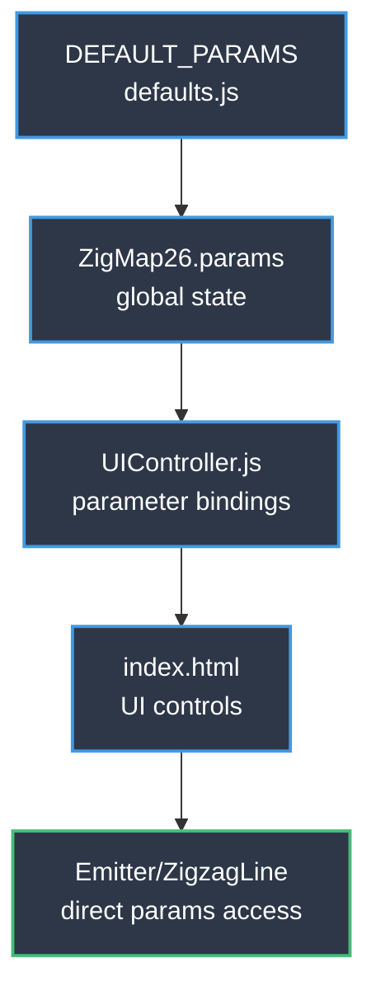
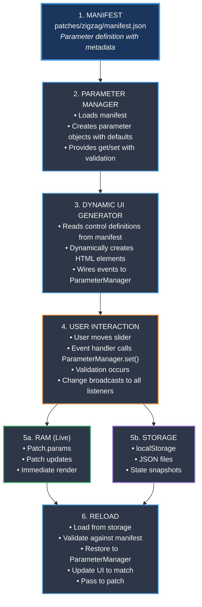
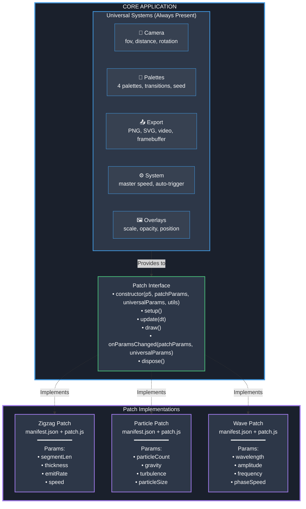

# Patch System — Complete Architecture Guide
**Decoupling the p5.js Patch Interface**

**Created:** May 19, 2026  
**Status:** Planning Phase — Strategy & Implementation Guide

---

# Table of Contents

1. [Executive Summary](#1-executive-summary)
2. [Current Architecture Analysis](#2-current-architecture-analysis)
3. [Core Principle: Universal vs Patch-Specific](#3-core-principle-universal-vs-patch-specific)
4. [Complete Parameter Pipeline](#4-complete-parameter-pipeline)
5. [Proposed Architecture](#5-proposed-architecture)
6. [Implementation Strategies](#6-implementation-strategies)
7. [Technical Design Details](#7-technical-design-details)
8. [Code Examples: Before & After](#8-code-examples-before--after)
9. [Migration Strategy](#9-migration-strategy)
10. [Player & Display Windows Compatibility](#10-player--display-windows-compatibility)
11. [Implementation Timeline](#11-implementation-timeline)
12. [Success Criteria & Next Steps](#12-success-criteria--next-steps)

---

# 1. Executive Summary

## Architecture Overview
**Manifest-driven patch system** where:
- Patches define parameters in `manifest.json`
- UI automatically generated from manifest
- Complete pipeline guaranteed: manifest → UI → storage → reload
- Camera and palettes are **universal systems** (work with all patches)
- Only geometry/behavior/modulation are patch-specific

## Key Innovation
Three core classes handle everything:
1. **ParameterManager** — Central hub with validation
2. **DynamicUI** — Generates controls from manifest
3. **PatchStorage** — Save/load with validation

**Add a parameter to the manifest → Everything works automatically**

---

# 2. Current Architecture Analysis

## Architecture Flow



## Design Characteristics

- **UI Layer**: Controls defined in HTML with manual bindings
- **Parameter Layer**: `wireSlider()` calls connect UI to state
- **Data Layer**: `defaults.js` contains parameter definitions
- **Rendering Layer**: Direct access to parameter object
- **Extensibility**: New patches require coordinated updates across multiple files

---

# 3. Core Principle: Universal vs Patch-Specific

## 🌍 Universal Systems (Always the Same)

These are **core features** that work with ANY patch:

### 🎥 Camera System
- FOV, near/far clipping planes
- Position (distance, rotationX, rotationY, offsetX, offsetY)
- Projection matrix calculations
- **Why universal:** All patches render in 3D space

### 🎨 Color Palette System
- 4 palettes with 4 colors each
- Color roles: `line`, `background`, `none`
- Deterministic RNG for color selection (with seed)
- Color transitions with duration control
- **Why universal:** Provides visual consistency

### 📤 Export System
- PNG, SVG, Video export
- Framebuffer resolution settings
- Stereoscopic rendering (VR)
- Depth map export
- **Why universal:** Captures canvas regardless of patch

### ⚙️ System Parameters
- `ambientSpeedMaster` — Global speed control
- `autoTriggerStates` — Automatic state transitions
- `stateTransitionDuration` — Transition duration
- `colorTransitionDuration` — Color change duration
- **Why universal:** Meta-controls affecting entire application

### 🖼️ Overlay System
- Load and position overlay images
- Scale, opacity, position controls
- **Why universal:** Visual layer over any output

## 🔧 Patch-Specific Parameters (Unique per Patch)

### 📐 Geometry
What shapes/structures the patch creates:
- **Zigzag**: `segmentLength`, `lineThickness`, `emitterRotation`, `geometryScale`
- **Particle**: `particleCount`, `particleSize`, `particleShape`
- **Wave**: `wavelength`, `amplitude`, `gridResolution`

### 🎭 Behavior
How the patch animates:
- **Zigzag**: `emitRate`, `speed`, `fadeDuration`
- **Particle**: `gravity`, `turbulence`, `lifetime`
- **Wave**: `frequency`, `phaseSpeed`, `dampening`

### 🎚️ Modulation
Variations and randomness:
- **Zigzag**: `randomThickness`, `thicknessRange`, `randomSpeed`, `speedRange`
- **Particle**: `sizeVariation`, `velocitySpread`, `colorJitter`
- **Wave**: `noiseScale`, `distortionAmount`

---

# 4. Complete Parameter Pipeline

## The Critical Question
**Can we guarantee the complete pipeline manifest → UI → storage → reload with arbitrary parameters?**

**Answer: YES.** Here's exactly how.

## The Data Flow



## Key Guarantees

### 1. Type Safety
```javascript
paramManager.set('lineThickness', 24);    // ✓ Valid (number)
paramManager.set('lineThickness', 'abc'); // ✗ Rejected (not a number)
paramManager.set('lineThickness', 150);   // ✗ Rejected (> max: 100)
```

### 2. Storage Integrity
```javascript
const loaded = { lineThickness: 500 };  // Invalid (max: 100)
storage.restore(loaded, manifest);       // Uses default instead
```

### 3. UI Synchronization
```javascript
paramManager.set('lineThickness', 50);
// → Slider moves to 50
// → Display shows "50"
// → Patch receives update
// → localStorage updated
```

### 4. Live Wiring
```javascript
// User moves slider
// → onChange event fires
// → ParameterManager validates and updates
// → All listeners notified:
//    • Patch updates
//    • Storage saves
//    • Display windows sync
//    • UI updates
```

---

# 5. Proposed Architecture

## 5.1 Architecture Diagram



## 5.2 Patch Manifest Example

```json
{
  "id": "zigzag-emitter-v1",
  "name": "Zigzag Emitter",
  "version": "1.0.0",
  "author": "David Delcourt",
  "description": "Emits zigzag lines in 3D space",
  "entryPoint": "./patch.js",
  
  "parameters": {
    "geometry": {
      "label": "Geometry",
      "collapsed": false,
      "controls": [
        {
          "id": "lineThickness",
          "type": "slider",
          "label": "Thickness",
          "default": 24,
          "min": 1,
          "max": 100,
          "step": 0.1,
          "unit": "px"
        },
        {
          "id": "emitterRotation",
          "type": "slider",
          "label": "Emitter Rotation",
          "default": 0,
          "min": 0,
          "max": 360,
          "step": 1,
          "unit": "°"
        }
      ]
    },
    "behavior": {
      "label": "Behavior",
      "controls": [
        {
          "id": "emitRate",
          "type": "slider",
          "label": "Emit Rate",
          "default": 1.5,
          "min": 0.1,
          "max": 10,
          "step": 0.1,
          "unit": "lines/s"
        },
        {
          "id": "speed",
          "type": "slider",
          "label": "Speed",
          "default": 80,
          "min": -200,
          "max": 200,
          "step": 1,
          "unit": "px/s"
        }
      ]
    },
    "modulation": {
      "label": "Modulation",
      "controls": [
        {
          "id": "randomThickness",
          "type": "checkbox",
          "label": "Random Thickness",
          "default": false
        },
        {
          "id": "thicknessRange",
          "type": "range",
          "label": "Thickness Range",
          "default": [10, 200],
          "min": 0,
          "max": 500,
          "step": 1,
          "unit": "%",
          "dependsOn": "randomThickness",
          "enabledWhen": true
        }
      ]
    }
  },
  
  "usesSharedSystems": {
    "camera": true,
    "palettes": true,
    "export": true,
    "overlays": true
  }
}
```

**Note:** Camera, palettes, export, and overlays are NOT in the manifest — they're universal!

## 5.3 Patch Interface

```javascript
// patches/[patchName]/patch.js
export class PatchRenderer {
  constructor(p5Instance, patchParams, universalParams, sharedUtils) {
    this.p = p5Instance;
    this.params = patchParams;        // YOUR parameters
    this.universal = universalParams; // Camera, palettes, system
    this.utils = sharedUtils;         // Helper functions
  }
  
  setup() {
    // Initialize patch-specific objects
  }
  
  update(dt) {
    // Update animation state
  }
  
  draw() {
    // Render to canvas
    const bgColor = this.utils.getBackgroundColor(this.universal);
    this.p.background(bgColor);
    
    this.utils.camera.apply(this.p, this.universal);
    
    // Your rendering logic here
  }
  
  onParamsChanged(changedPatchParams, changedUniversalParams) {
    // React to parameter updates
  }
  
  onStateTransition(targetPatchParams, duration) {
    // Handle smooth transitions
  }
  
  dispose() {
    // Release resources
  }
}
```

## 5.4 File Structure

```
patches/
  ├── manifest.json           ← Lists all available patches
  ├── zigzag/
  │   ├── manifest.json       ← Patch definition
  │   ├── patch.js            ← Rendering logic
  │   └── presets/            ← Patch-specific presets
  │       ├── Init.json
  │       └── DowntownAmbient.json
  └── particles/              ← Example future patch
      ├── manifest.json
      └── patch.js

js/
  ├── core/
  │   ├── PatchLoader.js      ← NEW: Loads and validates patches
  │   ├── DynamicUI.js        ← NEW: Generates UI from manifest
  │   ├── ParameterManager.js ← NEW: Manages parameters
  │   ├── CameraSystem.js     ← EXTRACTED: Universal camera
  │   ├── PaletteSystem.js    ← EXTRACTED: Universal palettes
  │   └── ... (existing files)
  └── ui/
      └── UIController.js     ← MODIFIED: Uses DynamicUI

config/
  └── universalDefaults.json  ← NEW: Camera, palettes, system params
```

---

# 6. Implementation Strategies

## Strategy A: Full Dynamic System ⭐ **RECOMMENDED**

**Complexity:** High  
**Flexibility:** Maximum  
**Timeline:** 3-4 weeks

### Advantages
- ✅ Complete decoupling
- ✅ Any patch can be loaded
- ✅ UI entirely generated from manifest
- ✅ Easy to create new patches
- ✅ No code changes for new patches

### Disadvantages
- ⚠️ Significant refactoring effort
- ⚠️ Need to migrate existing presets
- ⚠️ More complex debugging
- ⚠️ Learning curve for patch creators

### Implementation Steps
1. Create patch manifest schema and validator
2. Build `PatchLoader` to load and instantiate patches
3. Build `DynamicUI` to generate controls from manifest
4. Build `ParameterManager` to handle parameters
5. Migrate zigzag code to patch format
6. Update preset/state system
7. Update export system
8. Testing and documentation

---

## Strategy B: Hybrid System

**Complexity:** Medium  
**Flexibility:** High  
**Timeline:** 2-3 weeks

### Description
Keep zigzag as "built-in" patch, add plugin system for new patches.

### Advantages
- ✅ Less refactoring
- ✅ Existing functionality unchanged
- ✅ Gradual migration path

### Disadvantages
- ⚠️ Two systems to maintain (legacy + new)
- ⚠️ Eventually need full migration
- ⚠️ More technical debt

---

## Strategy C: Configuration-Based

**Complexity:** Low  
**Flexibility:** Medium  
**Timeline:** 1 week

### Description
Make params configurable via JSON but keep most code structure.

### Advantages
- ✅ Minimal refactoring
- ✅ Quick to implement
- ✅ Easy to understand

### Disadvantages
- ⚠️ Still requires code changes for different patches
- ⚠️ Not truly decoupled
- ⚠️ Limited to patches with similar structure

---

# 7. Technical Design Details

## 7.1 Parameter Manager (Core System)

```javascript
// js/core/ParameterManager.js
class ParameterManager {
  constructor(manifest) {
    this.manifest = manifest;
    this.params = {};
    this.listeners = [];
    this.controlMap = new Map();
    this._initialize();
  }
  
  _initialize() {
    // Build parameter objects from manifest with defaults
    for (const [groupId, groupDef] of Object.entries(this.manifest.parameters)) {
      for (const control of groupDef.controls) {
        this.params[control.id] = control.default;
        this.controlMap.set(control.id, control);
      }
    }
  }
  
  get(key) {
    return this.params[key];
  }
  
  set(key, value) {
    const control = this.controlMap.get(key);
    if (!control) {
      console.error(`Unknown parameter: ${key}`);
      return false;
    }
    
    // Validate against manifest rules
    if (!this._validate(control, value)) {
      console.error(`Invalid value for ${key}: ${value}`);
      return false;
    }
    
    const oldValue = this.params[key];
    this.params[key] = value;
    
    // Notify all listeners
    this._notifyChange(key, value, oldValue);
    
    return true;
  }
  
  setAll(paramObject) {
    const changes = {};
    for (const [key, value] of Object.entries(paramObject)) {
      if (this.params.hasOwnProperty(key)) {
        const control = this.controlMap.get(key);
        if (control && this._validate(control, value)) {
          this.params[key] = value;
          changes[key] = value;
        }
      }
    }
    if (Object.keys(changes).length > 0) {
      this._notifyChange(null, changes, null);
    }
  }
  
  getAll() {
    return { ...this.params };
  }
  
  _validate(control, value) {
    switch (control.type) {
      case 'slider':
        return typeof value === 'number' && 
               value >= control.min && 
               value <= control.max;
      case 'checkbox':
        return typeof value === 'boolean';
      case 'range':
        return Array.isArray(value) && 
               value.length === 2 &&
               value[0] >= control.min && 
               value[1] <= control.max;
      default:
        return true;
    }
  }
  
  onChange(callback) {
    this.listeners.push(callback);
    return () => {
      const index = this.listeners.indexOf(callback);
      if (index > -1) this.listeners.splice(index, 1);
    };
  }
  
  _notifyChange(key, value, oldValue) {
    for (const listener of this.listeners) {
      listener(key, value, oldValue);
    }
  }
}
```

## 7.2 Dynamic UI Generator

```javascript
// js/ui/DynamicUI.js
class DynamicUI {
  constructor(paramManager) {
    this.paramManager = paramManager;
  }
  
  render(manifest, containerElement) {
    containerElement.innerHTML = '';
    
    for (const [groupId, groupDef] of Object.entries(manifest.parameters)) {
      const section = this._createSection(groupDef.label, groupId);
      const sectionBody = section.querySelector('.section-body');
      
      for (const control of groupDef.controls) {
        const controlElement = this._createControl(control);
        sectionBody.appendChild(controlElement);
      }
      
      containerElement.appendChild(section);
    }
  }
  
  _createControl(control) {
    switch (control.type) {
      case 'slider':
        return this._createSlider(control);
      case 'checkbox':
        return this._createCheckbox(control);
      case 'range':
        return this._createRange(control);
      default:
        console.warn(`Unknown control type: ${control.type}`);
        return document.createElement('div');
    }
  }
  
  _createSlider(control) {
    const wrapper = document.createElement('div');
    wrapper.className = 'control-group';
    
    const label = document.createElement('label');
    label.textContent = control.label;
    if (control.unit) {
      label.innerHTML += ` <span style="color:#666">(${control.unit})</span>`;
    }
    
    const sliderRow = document.createElement('div');
    sliderRow.className = 'slider-row';
    
    const slider = document.createElement('input');
    slider.type = 'range';
    slider.id = control.id;
    slider.min = control.min;
    slider.max = control.max;
    slider.step = control.step;
    slider.value = this.paramManager.get(control.id);
    
    const display = document.createElement('span');
    display.className = 'value-display';
    display.id = `${control.id}-val`;
    display.textContent = this._formatValue(slider.value, control);
    
    // Wire to ParameterManager
    slider.addEventListener('input', (e) => {
      const value = parseFloat(e.target.value);
      display.textContent = this._formatValue(value, control);
      this.paramManager.set(control.id, value);
    });
    
    sliderRow.appendChild(slider);
    sliderRow.appendChild(display);
    wrapper.appendChild(label);
    wrapper.appendChild(sliderRow);
    
    return wrapper;
  }
  
  _createCheckbox(control) {
    const wrapper = document.createElement('div');
    wrapper.className = 'control-group';
    
    const label = document.createElement('label');
    const checkbox = document.createElement('input');
    checkbox.type = 'checkbox';
    checkbox.id = control.id;
    checkbox.checked = this.paramManager.get(control.id);
    
    checkbox.addEventListener('change', (e) => {
      this.paramManager.set(control.id, e.target.checked);
    });
    
    label.appendChild(checkbox);
    label.appendChild(document.createTextNode(' ' + control.label));
    wrapper.appendChild(label);
    
    return wrapper;
  }
  
  _formatValue(value, control) {
    const decimals = control.step < 1 ? 1 : 0;
    return decimals > 0 ? value.toFixed(decimals) : value.toString();
  }
  
  syncFromParams() {
    for (const [key, value] of Object.entries(this.paramManager.params)) {
      const element = document.getElementById(key);
      if (!element) continue;
      
      const control = this.paramManager.controlMap.get(key);
      
      if (control.type === 'slider') {
        element.value = value;
        const display = document.getElementById(`${key}-val`);
        if (display) {
          display.textContent = this._formatValue(value, control);
        }
      } else if (control.type === 'checkbox') {
        element.checked = value;
      }
    }
  }
}
```

## 7.3 Storage System

```javascript
// js/storage/PatchStorage.js
class PatchStorage {
  constructor(paramManager, universalParams) {
    this.paramManager = paramManager;
    this.universalParams = universalParams;
  }
  
  saveToLocal(patchId) {
    const data = {
      version: '3.0',
      patchId: patchId,
      timestamp: Date.now(),
      patchParams: this.paramManager.getAll(),
      universalParams: this.universalParams
    };
    
    try {
      localStorage.setItem('zigmap-autosave', JSON.stringify(data));
      return true;
    } catch (e) {
      console.error('Failed to save to localStorage:', e);
      return false;
    }
  }
  
  loadFromLocal() {
    try {
      const json = localStorage.getItem('zigmap-autosave');
      if (!json) return null;
      
      const data = JSON.parse(json);
      
      if (data.version !== '3.0') {
        console.warn('Old save format, attempting migration...');
        return this._migrate(data);
      }
      
      return data;
    } catch (e) {
      console.error('Failed to load from localStorage:', e);
      return null;
    }
  }
  
  exportToFile(filename, patchId, statesData = null) {
    const data = {
      version: '3.0',
      patchId: patchId,
      exportDate: new Date().toISOString(),
      patchParams: this.paramManager.getAll(),
      universalParams: this.universalParams,
      states: statesData
    };
    
    const blob = new Blob([JSON.stringify(data, null, 2)], {
      type: 'application/json'
    });
    
    const url = URL.createObjectURL(blob);
    const a = document.createElement('a');
    a.href = url;
    a.download = filename;
    a.click();
    URL.revokeObjectURL(url);
  }
  
  async loadFromFile(file) {
    return new Promise((resolve, reject) => {
      const reader = new FileReader();
      
      reader.onload = (e) => {
        try {
          const data = JSON.parse(e.target.result);
          
          if (!data.patchId || !data.patchParams) {
            reject(new Error('Invalid file format'));
            return;
          }
          
          resolve(data);
        } catch (err) {
          reject(err);
        }
      };
      
      reader.onerror = () => reject(reader.error);
      reader.readAsText(file);
    });
  }
  
  restore(data, manifest) {
    const validParams = {};
    
    for (const [key, value] of Object.entries(data.patchParams)) {
      const control = this.paramManager.controlMap.get(key);
      if (control) {
        if (this.paramManager._validate(control, value)) {
          validParams[key] = value;
        } else {
          console.warn(`Invalid value for ${key}, using default`);
        }
      } else {
        console.warn(`Parameter ${key} not in manifest, skipping`);
      }
    }
    
    this.paramManager.setAll(validParams);
    return validParams;
  }
}
```

## 7.4 Application Initialization

```javascript
// js/main.js
async function initializeApplication() {
  // 1. Load patch manifest
  const patchId = 'zigzag-emitter-v1';
  const manifest = await loadManifest(patchId);
  
  // 2. Create ParameterManager from manifest
  const patchParamManager = new ParameterManager(manifest);
  
  // 3. Try to load saved parameters
  const storage = new PatchStorage(patchParamManager, universalParams);
  const savedData = storage.loadFromLocal();
  
  if (savedData && savedData.patchId === patchId) {
    storage.restore(savedData, manifest);
  }
  
  // 4. Generate UI dynamically
  const dynamicUI = new DynamicUI(patchParamManager);
  const container = document.getElementById('patch-controls');
  dynamicUI.render(manifest, container);
  
  // 5. Instantiate patch with parameters
  const patch = await loadPatch(
    patchId,
    p5Instance,
    patchParamManager.params,
    universalParams,
    sharedUtils
  );
  
  // 6. Wire parameter changes
  patchParamManager.onChange((key, value, oldValue) => {
    if (key === null) {
      patch.onParamsChanged(value, {});
    } else {
      patch.onParamsChanged({ [key]: value }, {});
    }
    
    storage.saveToLocal(patchId);
    
    if (windowSync) {
      windowSync.broadcastParamChanges({ [key]: value });
    }
  });
  
  return { patch, patchParamManager, storage, dynamicUI };
}
```

---

# 8. Code Examples: Before & After

## 8.1 Parameter Definition

### BEFORE (defaults.js)
```javascript
export const DEFAULT_PARAMS = {
  // Hardcoded in application core
  segmentLength: 120,
  lineThickness: 24,
  emitterRotation: 0,
  emitRate: 1.5,
  speed: 80,
  randomThickness: false,
  // ... 40+ other parameters
};
```

### AFTER (patches/zigzag/manifest.json)
```json
{
  "id": "zigzag-emitter-v1",
  "parameters": {
    "geometry": {
      "controls": [
        {
          "id": "lineThickness",
          "type": "slider",
          "default": 24,
          "min": 1,
          "max": 100,
          "step": 0.1
        }
      ]
    }
  }
}
```

## 8.2 UI Binding

### BEFORE (UIController.js)
```javascript
function initializeAllControls(ZM) {
  // Each parameter manually wired
  wireSlider(ZM, 'thickness', 'thickness-val', 'lineThickness', 1, 'Thickness');
  wireSlider(ZM, 'emit-rate', 'emit-rate-val', 'emitRate', 1, 'Emit Rate');
  wireSlider(ZM, 'speed', 'speed-val', 'speed', 0, 'Speed');
  // ... 20+ more wireSlider calls
}
```

### AFTER (DynamicUI.js)
```javascript
class DynamicUI {
  render(manifest, container) {
    // Automatically generates all controls from manifest
    for (const [groupId, groupDef] of Object.entries(manifest.parameters)) {
      for (const control of groupDef.controls) {
        const element = this._createControl(control);
        container.appendChild(element);
      }
    }
  }
}
```

## 8.3 Preset Format

### BEFORE
```json
{
  "version": "2.0",
  "params": {
    "segmentLength": 120,
    "lineThickness": 24,
    "fov": 60,
    "palettes": [ ... ]
  }
}
```

### AFTER
```json
{
  "version": "3.0",
  "patchId": "zigzag-emitter-v1",
  "patchParams": {
    "segmentLength": 120,
    "lineThickness": 24
  },
  "camera": {
    "fov": 60,
    "distance": 600
  },
  "palettes": [ ... ]
}
```

---

# 9. Migration Strategy

## Phase 1: Extract Universal Systems (Week 1)
1. Move camera code to `js/core/CameraSystem.js`
2. Move palette code to `js/core/PaletteSystem.js`
3. Move export code to `js/export/ExportSystem.js`
4. Test that everything still works

## Phase 2: Build Core System (Week 1)
1. Create `ParameterManager.js`
2. Create `DynamicUI.js`
3. Create `PatchLoader.js`
4. Create `PatchStorage.js`
5. Write unit tests

## Phase 3: Migrate Zigzag (Week 2)
1. Create `patches/zigzag/manifest.json`
2. Extract Emitter/ZigzagLine to `patches/zigzag/patch.js`
3. Test equivalence with current system
4. Update all existing presets to v3.0 format

## Phase 4: Integration (Week 2-3)
1. Update main.js to use new system
2. Update StateManager for patch support
3. Update export system
4. Update window synchronization

## Phase 5: Validation (Week 3-4)
1. Create a second simple patch (particles or circles)
2. Test patch switching
3. Performance benchmarks
4. Fix edge cases

## Phase 6: Documentation (Week 4)
1. Patch creation guide
2. Manifest reference
3. API documentation
4. Migration guide

---

# 10. Player & Display Windows Compatibility

## Overview

The application has two additional window modes that must continue working with the patch system:

1. **player.html** — Standalone player that loads and displays JSON presets without UI controls
2. **display.html** — Secondary window that syncs with main window via BroadcastChannel API

Both require updates to support the patch system, but **core functionality remains the same**.

## Current Architecture

### player.html
```javascript
// Directly imports DEFAULT_PARAMS and core classes
import { DEFAULT_PARAMS } from './config/defaults.js';
import { Emitter } from './core/Emitter.js';
import { ZigzagLine } from './core/ZigzagLine.js';

// Loads JSON preset → applies params → renders
window.SpaceFlow = {
  params: { ...DEFAULT_PARAMS },
  emitterInstance: new Emitter()
};
```

### display.html
```javascript
// Syncs with main window
import { DEFAULT_PARAMS } from './config/defaults.js';
const channel = new BroadcastChannel('zigmap26-sync');

channel.onmessage = (event) => {
  if (event.data.type === 'param-change') {
    ZM.params[event.data.key] = event.data.value;
  }
};
```

## Updated Architecture

### Key Changes

1. **Presets now include `patchId`** — JSON v3.0 format tells us which patch to load
2. **PatchLoader replaces direct imports** — Dynamically loads the correct patch
3. **Sync messages include `patchId`** — Display windows know which patch to load
4. **Backwards compatible** — Old v2.0 presets automatically migrate to zigzag patch

## Player Window Updates

### Step 1: Add PatchLoader Support

```javascript
// js/player.js
import { PatchLoader } from './core/PatchLoader.js';
import { ParameterManager } from './core/ParameterManager.js';
import { universalDefaults } from './config/universalDefaults.json';

window.SpaceFlow = {
  // NEW: Patch system
  patchId: null,
  patch: null,
  patchParamManager: null,
  
  // Universal params (camera, palettes, system)
  universalParams: { ...universalDefaults },
  
  // Keep existing structure
  camera: null,
  p5Instance: null,
  ...
};
```

### Step 2: Update Preset Loading

```javascript
async function loadPreset(jsonData) {
  const ZM = window.SpaceFlow;
  
  // 1. Determine patch ID (with fallback for legacy presets)
  const patchId = jsonData.patchId || 'zigzag-emitter-v1';
  console.log(`📦 Loading patch: ${patchId}`);
  
  // 2. Load patch manifest
  const manifest = await PatchLoader.loadManifest(patchId);
  
  // 3. Create parameter manager for patch params
  const patchParamManager = new ParameterManager(manifest);
  
  // 4. Apply preset parameters
  if (jsonData.version === '3.0') {
    // New format: separate structure
    patchParamManager.setAll(jsonData.patchParams);
    
    ZM.universalParams = {
      ...ZM.universalParams,
      ...jsonData.camera,
      palettes: jsonData.palettes,
      ...jsonData.system
    };
  } else {
    // Legacy format: extract and migrate
    const migrated = migratePresetToV3(jsonData, manifest);
    patchParamManager.setAll(migrated.patchParams);
    ZM.universalParams = migrated.universalParams;
  }
  
  // 5. Instantiate patch
  const patch = await PatchLoader.instantiate(
    patchId,
    ZM.p5Instance,
    patchParamManager.params,
    ZM.universalParams,
    { camera: ZM.camera, colorUtils, ... }
  );
  
  // 6. Store references
  ZM.patchId = patchId;
  ZM.patch = patch;
  ZM.patchParamManager = patchParamManager;
  
  // 7. Initialize patch
  patch.setup();
  
  console.log('✅ Patch loaded successfully');
}
```

### Step 3: Update Render Loop

```javascript
// In p5 sketch
function draw() {
  const ZM = window.SpaceFlow;
  
  if (!ZM.patch) return;
  
  // Let patch handle rendering
  ZM.patch.update(deltaTime / 1000);
  ZM.patch.draw();
}
```

## Display Window Updates

### Step 1: Add Patch Loading

```javascript
// js/display.js
import { PatchLoader } from './core/PatchLoader.js';
import { ParameterManager } from './core/ParameterManager.js';

window.SpaceFlow = {
  displayId: urlParams.get('id') || 'display-unknown',
  patchId: null,
  patch: null,
  patchParamManager: null,
  universalParams: { ...universalDefaults },
  isDisplayMode: true,
  ...
};
```

### Step 2: Update Sync Handler

```javascript
// js/sync/WindowSync.js - Display side
export function initializeDisplaySync(ZM) {
  const channel = new BroadcastChannel('zigmap26-sync');
  
  channel.onmessage = async (event) => {
    const { type, data } = event.data;
    
    switch (type) {
      case 'full-state':
        // Main window sent complete state
        await handleFullState(ZM, data);
        break;
        
      case 'patch-change':
        // Main window switched patches
        await loadNewPatch(ZM, data.patchId, data.patchParams, data.universalParams);
        break;
        
      case 'param-change':
        // Individual parameter changed
        if (data.isPatchParam) {
          ZM.patchParamManager.set(data.key, data.value);
          ZM.patch.onParamsChanged({ [data.key]: data.value }, {});
        } else {
          // Universal param
          ZM.universalParams[data.key] = data.value;
          ZM.patch.onParamsChanged({}, { [data.key]: data.value });
        }
        break;
        
      case 'camera-update':
        // Real-time camera sync
        Object.assign(ZM.camera, data);
        break;
    }
  };
  
  // Request initial state from main window
  channel.postMessage({ type: 'display-ready', displayId: ZM.displayId });
}

async function handleFullState(ZM, data) {
  const { patchId, patchParams, universalParams } = data;
  
  // Load patch if different or first load
  if (!ZM.patch || ZM.patchId !== patchId) {
    console.log(`🔄 Loading patch: ${patchId}`);
    await loadNewPatch(ZM, patchId, patchParams, universalParams);
  } else {
    // Same patch, just update parameters
    ZM.patchParamManager.setAll(patchParams);
    ZM.universalParams = universalParams;
    ZM.patch.onParamsChanged(patchParams, universalParams);
  }
  
  console.log('✅ Display synced with main window');
}

async function loadNewPatch(ZM, patchId, patchParams, universalParams) {
  // Dispose old patch
  if (ZM.patch) {
    ZM.patch.dispose();
  }
  
  // Load manifest
  const manifest = await PatchLoader.loadManifest(patchId);
  
  // Create parameter manager
  const patchParamManager = new ParameterManager(manifest);
  patchParamManager.setAll(patchParams);
  
  // Instantiate patch
  const patch = await PatchLoader.instantiate(
    patchId,
    ZM.p5Instance,
    patchParamManager.params,
    universalParams,
    { camera: ZM.camera, colorUtils, ... }
  );
  
  // Store references
  ZM.patchId = patchId;
  ZM.patch = patch;
  ZM.patchParamManager = patchParamManager;
  ZM.universalParams = universalParams;
  
  // Initialize
  patch.setup();
}
```

### Step 3: Update Primary Sync Broadcaster

```javascript
// js/sync/WindowSync.js - Primary side
export function initializePrimarySync(ZM) {
  const channel = new BroadcastChannel('zigmap26-sync');
  
  // Send full state to new display windows
  function sendFullState() {
    channel.postMessage({
      type: 'full-state',
      data: {
        patchId: ZM.patchId,
        patchParams: ZM.patchParamManager.getAll(),
        universalParams: {
          camera: {
            fov: ZM.params.fov,
            near: ZM.params.near,
            far: ZM.params.far,
            distance: ZM.params.cameraDistance,
            rotationX: ZM.params.cameraRotationX,
            rotationY: ZM.params.cameraRotationY,
            offsetX: ZM.params.cameraOffsetX,
            offsetY: ZM.params.cameraOffsetY
          },
          palettes: ZM.params.palettes,
          activePaletteIndex: ZM.params.activePaletteIndex,
          system: {
            ambientSpeedMaster: ZM.params.ambientSpeedMaster,
            autoTriggerStates: ZM.params.autoTriggerStates,
            stateTransitionDuration: ZM.params.stateTransitionDuration,
            colorTransitionDuration: ZM.params.colorTransitionDuration
          },
          overlays: {
            overlayVisible: ZM.params.overlayVisible,
            overlayImageSrc: ZM.params.overlayImageSrc,
            overlayScale: ZM.params.overlayScale,
            overlayOpacity: ZM.params.overlayOpacity,
            overlayX: ZM.params.overlayX,
            overlayY: ZM.params.overlayY
          }
        }
      }
    });
  }
  
  // Listen for display-ready messages
  channel.onmessage = (event) => {
    if (event.data.type === 'display-ready') {
      console.log(`🖥️ Display window connected: ${event.data.displayId}`);
      sendFullState();
    }
  };
  
  // Broadcast patch changes
  ZM.broadcastPatchChange = (newPatchId, patchParams, universalParams) => {
    channel.postMessage({
      type: 'patch-change',
      data: { patchId: newPatchId, patchParams, universalParams }
    });
  };
  
  // Broadcast parameter changes
  ZM.broadcastParamChange = (key, value, isPatchParam) => {
    channel.postMessage({
      type: 'param-change',
      data: { key, value, isPatchParam }
    });
  };
  
  return { sendFullState, channel };
}
```

## Migration & Compatibility

### Backwards Compatibility Strategy

```javascript
// Automatic migration for legacy presets
function migratePresetToV3(legacyPreset, manifest) {
  const patchParams = {};
  const universalParams = {
    camera: {},
    palettes: legacyPreset.params?.palettes || [],
    system: {}
  };
  
  // Extract patch parameters based on manifest
  for (const [groupId, groupDef] of Object.entries(manifest.parameters)) {
    for (const control of groupDef.controls) {
      if (legacyPreset.params?.[control.id] !== undefined) {
        patchParams[control.id] = legacyPreset.params[control.id];
      }
    }
  }
  
  // Extract universal parameters
  const cameraKeys = ['fov', 'near', 'far', 'cameraDistance', 'cameraRotationX', 'cameraRotationY', 'cameraOffsetX', 'cameraOffsetY'];
  const systemKeys = ['ambientSpeedMaster', 'autoTriggerStates', 'stateTransitionDuration', 'colorTransitionDuration'];
  
  for (const key of cameraKeys) {
    if (legacyPreset.params?.[key] !== undefined) {
      universalParams.camera[key] = legacyPreset.params[key];
    }
  }
  
  for (const key of systemKeys) {
    if (legacyPreset.params?.[key] !== undefined) {
      universalParams.system[key] = legacyPreset.params[key];
    }
  }
  
  return { patchParams, universalParams };
}
```

### Test Scenarios

1. **Player loads old v2.0 preset**
   - ✅ No patchId → defaults to `'zigzag-emitter-v1'`
   - ✅ Calls `migratePresetToV3()`
   - ✅ Loads zigzag patch with migrated params
   - ✅ Renders identically to legacy system

2. **Player loads new v3.0 preset**
   - ✅ Has patchId → loads specified patch
   - ✅ Applies separate params (patchParams + universalParams)
   - ✅ Renders according to patch implementation

3. **Display syncs with main window**
   - ✅ Receives `full-state` with patchId
   - ✅ Loads same patch as main window
   - ✅ Applies same parameters
   - ✅ Renders in sync

4. **Main window switches patches**
   - ✅ Broadcasts `patch-change` message
   - ✅ Display windows dispose old patch
   - ✅ Display windows load new patch
   - ✅ All windows render new patch

5. **Real-time parameter sync**
   - ✅ Primary changes patch param → displays update
   - ✅ Primary changes universal param → displays update
   - ✅ Display sends mouse command → primary applies → broadcasts → all displays sync

## Implementation Priority

### Phase 1: Core System (Week 1-2)
- Build PatchLoader, ParameterManager, DynamicUI
- Migrate main window (index.html)
- Test with zigzag patch

### Phase 2: Player Support (Week 3)
- Update player.js to use PatchLoader
- Add migration function for legacy presets
- Test with existing preset library
- Test with new v3.0 presets

### Phase 3: Display Sync (Week 3)
- Update display.js to use PatchLoader
- Update WindowSync.js to include patchId
- Add patch-change message type
- Test multi-window synchronization

### Phase 4: Testing (Week 4)
- Test player with 10+ existing presets
- Test display sync with patch switching
- Test bidirectional mouse/keyboard control
- Performance benchmarks

## Design Decisions

### Question 1: Patch Switching in Player?
**Decision**: Player follows preset's patch. No UI to switch.
**Rationale**: Player is for distribution/presentation, not editing.

### Question 2: Display Independence?
**Decision**: Displays always mirror main window's patch.
**Rationale**: Simplicity. Multi-patch composition is a future feature.

### Question 3: Fallback Strategy?
**Decision**: If patch loading fails, show error overlay and retry button.
**Rationale**: Clear feedback, graceful degradation.

### Question 4: Performance Considerations?
**Decision**: Patch instances are lightweight, loading is async.
**Rationale**: Doesn't impact framerate, loading happens between states.

## Benefits

✅ **Player remains standalone** — No UI code needed, just PatchLoader  
✅ **Display sync is simpler** — Just add patchId to existing messages  
✅ **Backwards compatible** — Old presets work with automatic migration  
✅ **Future-proof** — Can easily add multi-patch composition later  
✅ **Consistent rendering** — Same patch code across all windows  

---

# 11. Implementation Timeline

## Option 1: Fast (1-2 weeks)
- Strategy C (Configuration-based)
- Limited flexibility
- Quick wins

## Option 2: Standard (3-4 weeks) ⭐ RECOMMENDED
- Strategy A (Full dynamic)
- Complete solution
- Future-proof

## Option 3: Comprehensive (5-6 weeks)
- Strategy A + Multiple example patches
- Complete documentation
- Tooling

## Week-by-Week Breakdown (Standard)

### Week 1: Foundation
- Days 1-2: Extract universal systems
- Days 3-4: Build ParameterManager & DynamicUI
- Day 5: Build PatchLoader & PatchStorage

### Week 2: Migration
- Days 1-2: Create zigzag manifest
- Days 3-4: Extract zigzag to patch format
- Day 5: Test equivalence

### Week 3: Integration
- Days 1-2: Update main app initialization
- Days 3-4: Update state/preset system
- Day 5: Update export system

### Week 4: Validation & Polish
- Days 1-2: Create second test patch
- Days 3-4: Testing and bug fixes
- Day 5: Documentation

---

# 12. Success Criteria & Next Steps

## Success Criteria

The system is successful when:

✅ A new patch can be created without touching core code  
✅ UI is automatically generated from manifest  
✅ All existing presets work with migrated zigzag patch  
✅ Export functions work identically  
✅ Performance is equivalent to current implementation  
✅ Documentation is clear for patch creators  
✅ A second test patch validates the architecture  

## The Guarantee

**You can add ANY parameter to the manifest, and the entire pipeline works automatically:**

1. ✅ **Manifest defines parameters** → Schema with validation rules
2. ✅ **UI generated dynamically** → No hardcoded controls
3. ✅ **Automatic wiring** → Events bound via ParameterManager
4. ✅ **Validated storage** → Loaded params checked against manifest
5. ✅ **Live updates** → Change propagates to all systems
6. ✅ **Type-safe** → Validation prevents invalid values
7. ✅ **Version-tolerant** — Migration handles old formats

**No code changes needed. Just update the JSON.**

## Next Steps

1. **Review this document** — Understand the complete architecture
2. **Make decisions** — Choose strategy and timeline
3. **Build proof of concept** — Minimal 2-3 day example
4. **Validate approach** — Test with simple patch
5. **Start implementation** — Phase by phase

## Open Questions

1. **Timeline**: When do you need this ready?
2. **Strategy**: A (full), B (hybrid), or C (simple)?
3. **Scope**: MVP only, or include example patches?
4. **Breaking changes**: Acceptable if migration provided?
5. **Testing**: Manual or automated?

---

**Status:** ✅ Complete Architecture Defined — Ready for Decision & Implementation

**Created:** May 19, 2026  
**Last Updated:** May 19, 2026
