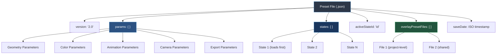

# Preset JSON Format

Documentation for SpaceFlow preset file structure.

---

## File Location

Preset files are stored in `config/presets/` and registered in `config/presets/manifest.json`.

---

## File Structure

### Version 2.0 Format (Current)



```json
{
  "version": "2.0",
  "params": { /* Application parameters */ },
  "states": [ /* State configurations */ ],
  "activeStateId": "state_id_here",
  "overlayPresetFiles": [ /* Available overlay files */ ],
  "saveDate": "2026-03-20T10:30:00.000Z"
}
```

### Top-Level Fields

| Field | Type | Required | Description |
|-------|------|----------|-------------|
| `version` | string | Yes | Format version (currently "2.0") |
| `params` | object | Yes | Current application parameters |
| `states` | array | No | Array of saved state configurations (order matters) |
| `activeStateId` | string | No | ID of currently active state |
| `overlayPresetFiles` | array | No | **[Project-level]** List of available overlay preset filenames (shared across all states) |
| `saveDate` | string | No | ISO timestamp of file creation |

**Note on `states` array order:**
- When loading a preset for the first time, the **first state** in the array is loaded automatically.
- State order can be modified by users via drag-and-drop in the UI.
- Modified order persists in localStorage and is preserved on page refresh.

**Note on project-level vs state-level fields:**
- `overlayPresetFiles` is stored at the **project level** (top-level of preset file)
- It is **NOT** saved within individual states
- All states in a preset share the same overlay preset files list

---

## Parameters Object

### Geometry Parameters

```json
{
  "segmentLength": 120,        // Length of each zigzag segment (10-500)
  "lineThickness": 26.8,       // Width of ribbons (1-200)
  "emitterRotation": 222,      // Rotation angle in degrees (0-360)
  "geometryScale": 158,        // Scale factor percentage (1-500)
  "fadeDuration": 1            // Fade in/out duration in seconds (0-10)
}
```

### Color Parameters

```json
{
  "palettes": [
    [
      { "rgb": [224, 211, 188], "role": "line" },
      { "rgb": [0, 0, 0], "role": "background" },
      { "rgb": [180, 180, 180], "role": "line" },
      { "rgb": [33, 33, 33], "role": "none" }
    ]
  ],
  "activePaletteIndex": 0,           // Active palette (0-3)
  "colorTransitionDuration": 16,     // Color transition time in seconds
  "colorSlotZOffset": 90,            // Z-offset per color slot (prevents z-fighting)
  "colorRandomSeed": 1               // Seed for deterministic color selection (1-9999)
}
```

**Color Roles:**
- `"line"` — Active drawing color
- `"background"` — Canvas background color
- `"none"` — Inactive (not used for rendering)

**Note:** Each palette contains exactly 4 color slots. Multiple colors can have the "line" role.

### Animation Parameters

```json
{
  "emitRate": 1.1,              // Lines emitted per second (0.1-10)
  "speed": 69,                  // Movement speed percentage (1-500)
  "ambientSpeedMaster": 100     // Global speed multiplier percentage (1-500)
}
```

### Modulation Parameters

```json
{
  "randomThickness": true,      // Enable thickness randomization
  "randomSpeed": false,         // Enable speed randomization
  "thicknessRangeMin": 10,      // Minimum thickness when randomized
  "thicknessRangeMax": 200,     // Maximum thickness when randomized
  "speedRangeMin": 50,          // Minimum speed when randomized
  "speedRangeMax": 150          // Maximum speed when randomized
}
```

### Camera Parameters

```json
{
  "fov": 99.01,                 // Field of view in degrees (1-179)
  "near": 0.01,                 // Near clipping plane
  "far": 5000,                 // Far clipping plane
  "cameraRotationX": -2.53,     // Vertical rotation in radians
  "cameraRotationY": -0.06,     // Horizontal rotation in radians
  "cameraDistance": 600,        // Zoom distance (50-5000)
  "cameraOffsetX": 316,         // Horizontal pan offset
  "cameraOffsetY": -425         // Vertical pan offset
}
```

### State Auto-Trigger Parameters

```json
{
  "autoTriggerStates": false,   // Enable automatic state transitions
  "autoTriggerFrequency": 25,   // Seconds between transitions (5-240)
  "stateTransitionDuration": 12 // Transition duration in seconds
}
```

### Stereoscopic Parameters

```json
{
  "stereoscopicMode": false,    // Enable VR/3D stereo rendering
  "eyeSeparation": 30           // Distance between left/right cameras
}
```

### Framebuffer Parameters

```json
{
  "framebufferMode": false,     // Enable fixed-resolution rendering
  "framebufferPreset": "1080x1080",
  "framebufferWidth": 1080,
  "framebufferHeight": 1080,
  "canvasBorderVisible": false, // Show/hide canvas border
  "canvasBorderColor": "#adff2f" // Border color in hex format
}
```

### Export Parameters

```json
{
  "videoDuration": 10,          // Video recording duration in seconds
  "videoFPS": 30,               // Video frames per second
  "videoFormat": "webm",        // Video format ("webm" or "gif" only)
  "depthInvert": false          // Invert depth map (white=far, black=near)
}
```

**Note:** MP4 format is not supported in browsers due to codec licensing. Only WebM and GIF are available. To convert WebM to MP4, use **Shutter Encoder** (https://github.com/paulpacifico/shutter-encoder) — a free, professional converter with GPU acceleration.

### Overlay Parameters

```json
{
  "overlayImageSrc": null,      // Base64 image data or null
  "overlayPresetFile": null,    // Filename of selected preset overlay
  "overlayCustomFilename": null, // Name of custom uploaded overlay file
  "overlayCustomImageSrc": null, // Source data URL of custom uploaded overlay
  "overlayVisible": false,      // Show/hide overlay
  "overlayAutoFit": false,      // Automatically fit overlay to canvas dimensions
  "overlayScale": 32,           // Overlay size percentage (1-200)
  "overlayOpacity": 100,        // Overlay transparency (0-100)
  "overlayX": 50,               // Horizontal position percentage (0-100)
  "overlayY": 50                // Vertical position percentage (0-100)
}
```

---

## States Array

Each state contains:

```json
{
  "id": "state_1773371830542_jrv4aki30",
  "name": "Simple",
  "timestamp": 1773371830543,
  "params": { /* Subset of parameters that change between states */ },
  "camera": {
    "rotationX": -3.195,
    "rotationY": 3.130,
    "distance": 1926.056,
    "offsetX": -26,
    "offsetY": -39
  },
  "metadata": {
    "version": "1.0"
  }
}
```

### State Fields

| Field | Type | Description |
|-------|------|-------------|
| `id` | string | Unique identifier (auto-generated) |
| `name` | string | User-defined state name |
| `timestamp` | number | Unix timestamp of creation |
| `params` | object | Parameters specific to this state |
| `camera` | object | Camera configuration snapshot |
| `metadata` | object | Additional state metadata |

**Note:** State `params` typically contain only geometry, color, modulation, and camera parameters. Global settings like framebuffer mode are not state-specific.

**Not included in states:**
- `overlayPresetFiles` — Project-level only (shared across all states)
- Global export settings (videoDuration, videoFPS, videoFormat)
- Framebuffer settings (framebufferMode, framebufferWidth, framebufferHeight)
- System settings (autoTriggerStates, autoTriggerFrequency)

---

## Manifest File

`config/presets/manifest.json` registers available presets:

```json
{
  "presets": [
    {
      "filename": "zigmap_init.json",
      "name": "zigmap_init",
      "type": "Init"
    },
    {
      "filename": "zigmap_horizon3.json",
      "name": "zigmap_horizon3",
      "type": "Preset"
    }
  ]
}
```

---

## Best Practices

### Parameter Ranges

- Keep `near` above 0.01 to prevent rendering issues
- Keep `far` below 5000 for performance
- Use `colorSlotZOffset` between 10-100 to prevent z-fighting

### Color Palettes

- Always include exactly one `"background"` color per palette
- Include at least one `"line"` color per palette
- Use `"none"` for inactive slots

### File Naming

- Use lowercase alphanumeric characters and underscores
- Pattern: `zigmap_descriptive_name.json`
- Keep names under 32 characters

### Performance

- Lower `emitRate` and `speed` for smoother performance
- Reduce `geometryScale` if rendering is slow
- Disable `stereoscopicMode` when not needed

---

## Loading Presets

Presets can be loaded:

1. **At startup** — `zigmap_init.json` loads on first run
2. **Via URL** — `index.html?preset=filename` (without .json extension)
3. **Via welcome page** — Click preset buttons
4. **Via file upload** — Drag and drop or use file picker

---

## Validation

The application validates loaded presets:

- Missing parameters fall back to defaults from `js/config/defaults.js`
- Invalid color values default to white/black
- Out-of-range numbers are clamped to valid ranges
- Corrupted palette structures are replaced with default palettes

---

## Version History

### Version 2.0 (Current)
- Introduced state management
- Added `states` and `activeStateId` fields
- Supports multiple named configurations per file

### Version 1.0 (Legacy)
- Single parameter set per file
- No state management
- Still supported for backward compatibility
