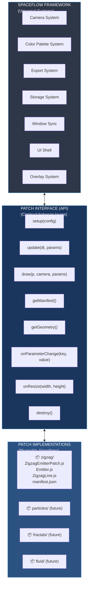
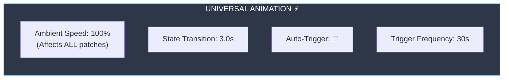
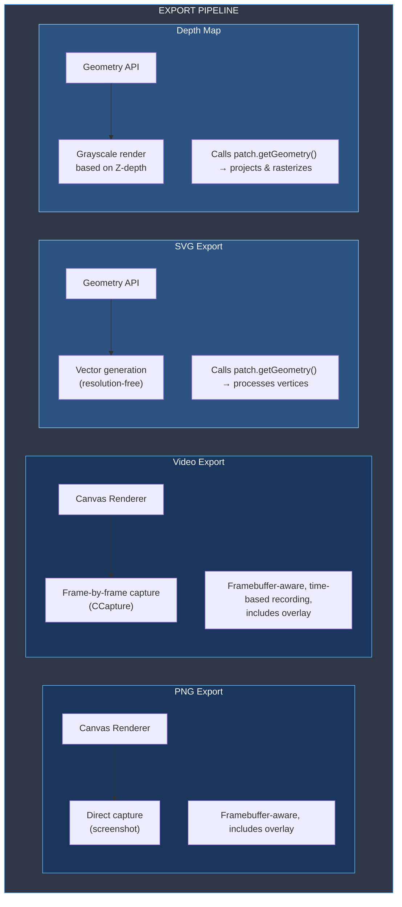

# SpaceFlow — Complete Architecture Strategy
**From Monolithic App to Modular Framework**

**Created:** May 24-25, 2026  
**Status:** Master Architecture Document  
**Version:** 1.0

---

## ⚠️ CRITICAL REQUIREMENT: SVG Export is NON-NEGOTIABLE

**SVG export is the #1 priority** — it must work flawlessly in all phases:

- 🚨 **Core professional feature** — used in production workflows (Illustrator, Inkscape)
- 🚨 **Resolution-independent vectors** — essential for print and editing
- 🚨 **Zero tolerance for breakage** — any update that breaks SVG export must be reverted

**Rule:** Test SVG export after every architectural change. If broken, revert immediately.

---

## Executive Summary

**SpaceFlow** transforms ZigMap26 from a monolithic zigzag generator into a modular framework for real-time 3D generative art. This document defines the complete architecture for achieving this vision **while guaranteeing SVG export functionality is fully preserved**.

### Core Innovation

**Manifest-Driven Patch System**: Patches define their parameters once in a JSON manifest, and everything else (UI generation, storage, validation, state management) happens automatically at the framework level.

### Key Benefits

- 🔌 **Extensibility**: Load different visual algorithms as pluggable patches
- 🎨 **Reusability**: Camera, colors, export work with ANY patch
- 📋 **Simplicity**: Adding a parameter = one JSON entry
- 🎭 **States**: Complete snapshots work across different patches
- 🎛️ **Scalability**: UI adapts from 3 to 100+ parameters automatically
- 🚀 **Future-Ready**: Architecture supports future layer system for VJ workflows

---

## Table of Contents

### Part I: Vision & Architecture
1. [Vision](#1-vision)
2. [Three-Layer Architecture](#2-three-layer-architecture)
3. [Property Hierarchy](#3-property-hierarchy)

### Part II: Core Systems
4. [Universal Systems](#4-universal-systems)
5. [Patch System](#5-patch-system)
   - 5a. [SVG Export from Patches: Complete Flow](#5a-svg-export-from-patches-complete-flow)
6. [State Management](#6-state-management)
   - 6a. [Dynamic Parameter Storage for Arbitrary Patches](#6a-dynamic-parameter-storage-for-arbitrary-patches)

### Part III: Dynamic Parameters
7. [Parameter Manifest](#7-parameter-manifest)
8. [Parameter Types](#8-parameter-types)
9. [Dynamic UI Generation](#9-dynamic-ui-generation)
   - [How Manifest Defines UI Structure](#how-manifest-defines-ui-structure-)

### Part IV: User Interface
10. [UI Layout Strategy](#10-ui-layout-strategy)
11. [Visual Hierarchy](#11-visual-hierarchy)
12. [Advanced UI Features](#12-advanced-ui-features)

### Part V: Implementation
13. [Implementation Roadmap](#13-implementation-roadmap)
14. [File Structure](#14-file-structure)
15. [Migration Strategy](#15-migration-strategy)
    - [Preset File Compatibility](#preset-file-compatibility-matrix)
    - [Legacy Patch Wrapper](#legacy-patch-wrapper)
    - [Parameter Name Compatibility](#parameter-name-compatibility)
    - [Zero-Disruption Migration](#summary-zero-disruption-migration)
16. [Code Examples](#16-code-examples)

---

# Part I: Vision & Architecture

## 1. Vision

### The Transformation

```
ZigMap26 (Current)          SpaceFlow (Future)
===================         ==================
Monolithic app         →    Modular framework
Zigzag-specific        →    Patch-agnostic
Hard-coded UI          →    Auto-generated UI
Manual parameter wiring →   Manifest-driven
Single algorithm       →    Pluggable patches
```

### What SpaceFlow Provides (Framework)

- **Camera System**: 3D navigation, projection, transitions
- **Color Palette System**: 4×4 palettes, transitions, deterministic RNG
- **Export System**: PNG, SVG, Video, depth maps
- **Storage System**: localStorage, JSON presets, state management
- **Window Sync**: Multi-window coordination for displays
- **UI Shell**: Dynamic parameter generation, adaptive layouts
- **Overlay System**: Branding, logo positioning

### What Patches Provide (Pluggable)

- **Visual Algorithm**: Geometry generation, animation logic
- **Parameters**: Patch-specific controls (size, speed, count, etc.)
- **Behavior**: Update logic, physics, emission patterns
- **Manifest**: Parameter definitions, categories, metadata

### Use Cases

**Today:**
- Creative tool for zigzag patterns
- Live performance visuals
- Export for social media, print

**Tomorrow:**
- Framework for ANY generative algorithm
- Particle systems, fractals, fluid dynamics
- Community-contributed patches
- VJ tool with layered patches (future)

---

## 2. Three-Layer Architecture



### Layer Responsibilities

#### Layer 1: Framework (Universal)
- Provides services used by all patches
- Manages application lifecycle
- Handles UI shell generation
- Coordinates storage and sync
- **Manages State Management system** (save/load/transition)
- **Controls state sequencer and auto-trigger**
- **Orchestrates parameter interpolation during transitions**

#### Layer 2: Patch Interface (Contract)
- Defines what framework expects from patches
- Defines what patches can expect from framework
- **Specifies how patches declare parameters** (via `getManifest()`)
- **Defines parameter manifest structure** (types, categories, validation)
- Ensures patches are interchangeable
- Enables future extensibility

#### Layer 3: Patches (Implementations)
- Self-contained visual algorithms
- Define their own parameters via manifest
- Implement standard interface methods
- Can be developed independently
- **Manage internal animation state** (particles, buffers, physics)
- **React to parameter values** (which may be mid-transition)
- **Do NOT control state transitions** (framework handles)

---

## 3. Property Hierarchy

### Complete Hierarchy

```mermaid
graph TB
    App["SpaceFlow Application"]
    
    App --> Framework["Framework Configuration"]
    Framework --> PatchName["Current Patch Name"]
    Framework --> StateID["Active State ID"]
    Framework --> UIMode["UI Layout Mode"]
    
    App --> Universal["Universal Properties<br/>(Framework-level)"]
    
    Universal --> Camera["🎥 Camera"]
    Camera --> Cam1["fov, near, far"]
    Camera --> Cam2["distance, rotationX, rotationY, rotationZ"]
    Camera --> Cam3["offsetX, offsetY"]
    
    Universal --> Colors["🎨 Colors"]
    Colors --> Col1["palettes[4][4]"]
    Colors --> Col2["activePaletteIndex"]
    Colors --> Col3["colorTransitionDuration"]
    
    Universal --> Anim["⚡ Animation (Global)"]
    Anim --> An1["ambientSpeedMaster"]
    Anim --> An2["stateTransitionDuration"]
    Anim --> An3["autoTriggerStates"]
    Anim --> An4["autoTriggerFrequency"]
    
    Universal --> ExportSys["📤 Export"]
    ExportSys --> Ex1["framebufferMode, width, height, preset"]
    ExportSys --> Ex2["canvasBorderVisible, canvasBorderColor"]
    ExportSys --> Ex3["videoDuration, videoFPS, videoFormat"]
    
    Universal --> OverlaySys["🖼️ Overlay"]
    OverlaySys --> Ov1["visible, source (preset/custom)"]
    OverlaySys --> Ov2["scale, opacity, x, y"]
    OverlaySys --> Ov3["autoFit"]
    
    App --> Patch["Patch Properties<br/>(Patch-specific)"]
    
    Patch --> Geo["📐 Geometry (Zigzag example)"]
    Geo --> G1["segmentLength"]
    Geo --> G2["lineThickness"]
    Geo --> G3["emitterRotation"]
    Geo --> G4["geometryScale"]
    Geo --> G5["colorSlotZOffset"]
    
    Patch --> Behav["🎬 Behavior"]
    Behav --> B1["emitRate"]
    Behav --> B2["speed"]
    Behav --> B3["direction (if applicable)"]
    
    Patch --> Mod["📊 Modulation"]
    Mod --> M1["randomThickness, thicknessRangeMin/Max"]
    Mod --> M2["randomSpeed, speedRangeMin/Max"]
    
    Patch --> Custom["🎛️ Custom Categories"]
    Custom --> C1["(defined by patch manifest)"]
    
    style App fill:#2d3748,stroke:#4299e1,color:#fff
    style Universal fill:#1a365d,stroke:#63b3ed,color:#fff
    style Patch fill:#2c5282,stroke:#90cdf4,color:#fff
    style Framework fill:#22543d,stroke:#68d391,color:#fff
```



### Property Organization Rules

1. **Universal Properties** exist in ALL patches (camera, colors, export)
2. **Patch Properties** are specific to the loaded patch
3. **Categories** group related parameters (geometry, behavior, etc.)
4. **Subcategories** allow deeper nesting within categories
5. **Scope** determines if property is "universal" or "patch"

---

# Part II: Core Systems

## 4. Universal Systems

### 🎥 Camera System

**Purpose**: 3D navigation shared by all patches

**Properties:**
```javascript
{
  fov: 60,                    // Field of view (degrees)
  near: 0.01,                 // Near clipping plane
  far: 5000,                  // Far clipping plane
  distance: 600,              // Distance from origin
  rotationX: 0.5,             // Pitch (radians)
  rotationY: 0.3,             // Yaw (radians)
  rotationZ: 0,               // Roll (radians)
  offsetX: 0,                 // Pan horizontal
  offsetY: 0,                 // Pan vertical
  projection: 'perspective'   // 'perspective' or 'orthographic'
}
```

**Why Universal:**
- All 3D patches need camera controls
- Consistent navigation across patches
- State transitions include camera animation

**Framework Responsibilities:**
- Provide camera object to patches via `draw(p, camera, params)`
- Handle smooth camera transitions
- Manage stereoscopic mode (dual cameras)

**Patch Responsibilities:**
- Read camera properties (read-only)
- Do NOT modify camera directly

---

### 🎨 Color Palette System

**Purpose**: Consistent color management across all patches

**Properties:**
```javascript
{
  palettes: [                    // 4 palettes
    [                            // Palette 1: 4 colors
      { r: 255, g: 255, b: 255, role: "line" },
      { r: 200, g: 200, b: 200, role: "line" },
      { r: 150, g: 150, b: 150, role: "line" },
      { r: 0, g: 0, b: 0, role: "background" }
    ],
    // ... 3 more palettes
  ],
  activePaletteIndex: 0,         // Currently selected palette (0-3)
  colorTransitionDuration: 3.0   // Palette switch animation time (seconds)
}
```

**Why Universal:**
- Provides visual consistency
- Keyboard shortcuts (1-4) to switch palettes work everywhere
- State changes include color transitions

**Framework Responsibilities:**
- Manage 4 palettes with 4 colors each
- Provide color selection API to patches
- Handle smooth color transitions

**Patch Responsibilities:**
- Request colors from framework: `SpaceFlow.colorSystem.getColor(slotIndex)`
- Handle per-line color transitions internally (patch animation)
- Do NOT manipulate palettes directly

---

### ⚡ Animation (Global Time Control)

**Purpose**: Master timing controls affecting all patches

**Properties:**
```javascript
{
  ambientSpeedMaster: 100,          // Global speed multiplier (%) — scales time for ALL patches
  stateTransitionDuration: 3.0,     // State change animation time (seconds)
  autoTriggerStates: false,         // Auto-cycle through states
  autoTriggerFrequency: 30          // Time between state changes (seconds)
}
```

**Why Universal:**
- `ambientSpeedMaster` is a **global time scaling factor** that affects ALL patches
- State transitions apply to all properties (camera, geometry, colors, parameters)
- Auto-trigger is application-level behavior

---

#### 🔑 How `ambientSpeedMaster` Controls Patch Timing

**Framework Implementation:**

```javascript
class SketchFactory {
  draw() {
    // 1. Calculate raw time delta
    const rawDt = deltaTime / 1000; // Convert ms to seconds
    
    // 2. Apply global time scaling
    const scaledDt = rawDt * (SpaceFlow.params.ambientSpeedMaster / 100);
    
    // 3. Pass scaled time to patch
    SpaceFlow.currentPatch.update(scaledDt, SpaceFlow.params);
    
    // All patches receive the same scaled time delta
    // If ambientSpeedMaster = 100 → normal speed (1x)
    // If ambientSpeedMaster = 50  → half speed (0.5x)
    // If ambientSpeedMaster = 200 → double speed (2x)
  }
}
```

**Patch receives scaled time:**

```javascript
class ZigzagEmitterPatch {
  update(dt, params) {
    // dt is already scaled by ambientSpeedMaster
    // Patch doesn't need to know about the scaling factor
    
    this.emitter.update(dt);  // Emission timing scales automatically
    
    for (const line of this.lines) {
      line.update(dt);  // Animation speed scales automatically
    }
  }
}
```

**Result:**
- ✅ User adjusts ONE slider (`ambientSpeedMaster`) to control speed of ALL animations
- ✅ Works with zigzag patch, particle systems, fractals, ANY patch
- ✅ Patches don't need special code — they just use the `dt` parameter
- ✅ Frame-independent animation is maintained (animation speed remains consistent across different frame rates)

**UI Control:**


**Key Insight:** `ambientSpeedMaster` is **NOT a patch parameter**. It's a framework-level time multiplier that scales the `dt` value before it reaches patches. This means:
- Patches never access `params.ambientSpeedMaster` directly
- Framework handles all time scaling transparently
- Adding new patches requires no special timing code

---

### 📤 Export System

**Purpose**: Generate outputs from any patch

**Properties:**
```javascript
{
  framebufferMode: false,           // Lock to fixed resolution
  framebufferWidth: 1920,
  framebufferHeight: 1080,
  framebufferPreset: "1920x1080",
  canvasBorderVisible: false,
  canvasBorderColor: "#adff2f",
  videoDuration: 10,                // Video recording length (seconds)
  videoFPS: 60,
  videoFormat: "webm"               // "webm" or "gif"
}
```

**Framebuffer Mode:**
When `framebufferMode` is enabled, the canvas renders at the specified fixed resolution (`framebufferWidth` × `framebufferHeight`) regardless of window size. This setting affects:
- PNG exports (captures at framebuffer resolution)
- Video exports (records at framebuffer resolution)
- SVG exports (not affected, resolution-independent)
- Depth map exports (uses framebuffer resolution)

**Why Universal:**
- All patches need export capabilities
- Resolution settings apply at canvas level
- Video recording is framework-level

---

#### Export Pipeline Architecture

SpaceFlow provides **four export formats**, each using a different pipeline:



---

#### 1. PNG Export (Canvas-Based)

**Method**: Direct canvas capture

**Process:**
1. Framework captures current canvas pixels
2. Applies overlay if enabled (composite operation)
3. Converts to PNG via `canvas.toDataURL()`
4. Triggers download

**Patch Requirements:**
- ✅ None — works automatically with any rendering
- ✅ Patches just need to implement `draw()`

**Characteristics:**
- Resolution-dependent
- Includes overlays
- Fast and simple
- Perfect pixel accuracy of what's on screen
- **Framebuffer-aware**: Respects fixed resolution settings when framebuffer mode is enabled

**Framework Implementation:**
```javascript
// In PNGExporter.js
function exportPNG(framework) {
  const canvas = framework.getCanvas();
  const overlay = framework.getOverlay();
  
  // Composite canvas + overlay
  const composited = compositeWithOverlay(canvas, overlay);
  
  // Convert to PNG
  const dataURL = composited.toDataURL('image/png');
  downloadFile(dataURL, `spaceflow-${timestamp()}.png`);
}
```

**Status**: ✅ Works with ANY patch automatically

---

#### 2. Video Export (Canvas-Based)

**Method**: Frame-by-frame canvas capture using CCapture.js

**Process:**
1. Framework starts recording loop
2. For each frame:
   - Render patch via `draw()`
   - Capture canvas pixels
   - Apply overlay
   - Add frame to video encoder
3. After duration completes, encode and download

**Patch Requirements:**
- ✅ None — works automatically
- ✅ Patches implement time-based animation in `update(dt)`

**Characteristics:**
- Time-based recording
- Includes overlays
- Configurable FPS and duration
- WebM or GIF output
- **Framebuffer-aware**: Respects fixed resolution settings when framebuffer mode is enabled

**Framework Implementation:**
```javascript
// In VideoRecorder.js
function startRecording(framework, duration, fps) {
  const capturer = new CCapture({
    format: framework.params.videoFormat,
    framerate: fps
  });
  
  capturer.start();
  
  let elapsed = 0;
  const frameInterval = 1 / fps;
  
  const recordLoop = () => {
    framework.patch.update(frameInterval);
    framework.patch.draw(framework.p, framework.camera, framework.params);
    
    // Apply overlay
    if (framework.overlay.visible) {
      framework.drawOverlay();
    }
    
    capturer.capture(framework.canvas);
    elapsed += frameInterval;
    
    if (elapsed < duration) {
      requestAnimationFrame(recordLoop);
    } else {
      capturer.stop();
      capturer.save();
    }
  };
  
  recordLoop();
}
```

**Status**: ✅ Works with ANY patch automatically

---

#### 3. SVG Export (Geometry-Based) 🚨 ABSOLUTELY CRITICAL — NON-NEGOTIABLE 🚨

**Method**: Vector generation from 3D geometry

**⚠️ WHY SVG EXPORT IS ABSOLUTELY CRITICAL AND MUST NEVER BE BROKEN:**

**Professional Requirements:**
- **Resolution-independent** — Scale infinitely without quality loss (ESSENTIAL for print)
- **Editable** — Open in Illustrator, Inkscape, etc. (REQUIRED for production workflows)
- **Precise** — Exact mathematical representations (CRITICAL for accuracy)
- **Small files** — Efficient for sharing and archiving
- **Print-ready** — Professional output quality (NON-NEGOTIABLE)

**Business Impact:**
- Used in professional creative workflows
- Core feature users depend on
- Competitive advantage over raster-only tools
- Cannot be temporarily unavailable during migration

**MANDATE:** Any architectural change that compromises SVG export is unacceptable and must be redesigned.

**Process:**
1. Framework calls `patch.getGeometry()`
2. Patch returns array of geometric primitives (lines, ribbons, shapes)
3. Framework projects 3D coordinates → 2D screen space
4. Framework generates SVG elements (`<polygon>`, `<path>`, etc.)
5. Framework applies colors, opacity, transformations
6. Download as `.svg` file

**Patch Requirements:**
- ✅ Implement `getGeometry()` method
- ✅ Return geometry in standardized format (see below)
- ✅ Include vertex positions, colors, opacity

**Critical Implementation Details:**

**getGeometry() Contract:**
```javascript
class ZigzagPatch {
  getGeometry() {
    return {
      type: 'ribbons',           // Type hint for framework
      units: 'world',             // Coordinate space
      items: [
        {
          type: 'ribbon',
          vertices: [             // Centerline vertices in 3D
            { x: 100, y: 200, z: 50 },
            { x: 150, y: 180, z: 45 },
            // ... more vertices
          ],
          thickness: 24,          // Width of ribbon
          color: { r: 255, g: 200, b: 100 },
          opacity: 0.95,
          zOffset: 0              // Layering depth
        },
        // ... more ribbons
      ],
      metadata: {
        bounds: { minX, maxX, minY, maxY, minZ, maxZ },
        count: 150,
        patch: 'zigzag-emitter-v1'
      }
    };
  }
}
```

**Geometry Format Specification:**

**Supported Primitive Types:**
- `ribbon` — Thick line with width (centerline + thickness)
- `polygon` — Closed shape with vertices
- `polyline` — Open path
- `circle` — Center + radius
- `ellipse` — Center + radii + rotation

**Ribbon Format (most common):**
```javascript
{
  type: 'ribbon',
  vertices: [           // Centerline in 3D world space
    { x, y, z },
    // ... 
  ],
  thickness: number,    // Width of ribbon in world units
  color: { r, g, b },   // RGB values (0-255)
  opacity: number,      // 0.0 - 1.0
  zOffset: number       // Z-layer for rendering order
}
```

**Framework SVG Generation:**
```javascript
// In SVGExporter.js
function exportSVG(framework) {
  // 1. Get geometry from patch
  const geometry = framework.patch.getGeometry();
  
  // 2. Create SVG document
  const svg = createSVGElement('svg', {
    width: framework.W,
    height: framework.H,
    viewBox: `0 0 ${framework.W} ${framework.H}`
  });
  
  // 3. Add background
  addBackground(svg, framework.getBackgroundColor());
  
  // 4. Process each geometric item
  geometry.items.forEach(item => {
    if (item.type === 'ribbon') {
      // Build ribbon sides from centerline
      const { leftSide, rightSide } = expandRibbon(
        item.vertices,
        item.thickness / 2
      );
      
      // Project 3D → 2D
      const leftProjected = leftSide.map(v => 
        project3Dto2D(v, framework.camera)
      );
      const rightProjected = rightSide.map(v => 
        project3Dto2D(v, framework.camera)
      );
      
      // Create SVG polygon
      const polygon = createSVGElement('polygon', {
        points: [...leftProjected, ...rightProjected.reverse()]
          .map(p => `${p.x},${p.y}`).join(' '),
        fill: `rgb(${item.color.r},${item.color.g},${item.color.b})`,
        'fill-opacity': item.opacity,
        stroke: 'none'
      });
      
      svg.appendChild(polygon);
    }
    // Handle other primitive types...
  });
  
  // 5. Download
  downloadSVG(svg, `spaceflow-${timestamp()}.svg`);
}
```

**Projection Pipeline (Framework Provides):**
```javascript
function project3Dto2D(vertex, camera) {
  // 1. Apply geometry scale
  let { x, y, z } = scaleVertex(vertex, params.geometryScale);
  
  // 2. Apply rotations (emitter + camera)
  ({ x, y, z } = rotateZ(x, y, z, params.emitterRotation));
  ({ x, y, z } = rotateY(x, y, z, camera.rotationY));
  ({ x, y, z } = rotateX(x, y, z, camera.rotationX));
  
  // 3. Transform to camera space
  const viewX = x - camera.offsetX;
  const viewY = y - camera.offsetY;
  const viewZ = z - camera.distance;
  
  // 4. Frustum culling
  if (viewZ >= -camera.near || viewZ <= -camera.far) {
    return null; // Outside view
  }
  
  // 5. Perspective projection
  const fovScale = (canvasHeight / 2) / Math.tan(camera.fov / 2);
  const scale = fovScale / -viewZ;
  const screenX = viewX * scale + canvasWidth / 2;
  const screenY = viewY * scale + canvasHeight / 2;
  
  return { x: screenX, y: screenY };
}
```

**Migration Strategy for Zigzag Patch:**
```javascript
// Current: Direct access to emitter.lines
function exportSVG(ZM) {
  ZM.emitterInstance.lines.forEach(line => {
    const verts = line._buildVertices();
    // ... process
  });
}

// Future: Patch provides geometry
class ZigzagPatch {
  getGeometry() {
    return {
      type: 'ribbons',
      items: this.emitter.lines
        .filter(line => line._alpha() > 0)
        .map(line => ({
          type: 'ribbon',
          vertices: line._buildVertices(),
          thickness: line.lineThickness,
          color: { r: line.currentColor[0], g: line.currentColor[1], b: line.currentColor[2] },
          opacity: line._alpha(),
          zOffset: line.zOffset
        }))
    };
  }
}
```

**Status**: ✅ Fully preserves current SVG functionality  
**Requirement**: Patches MUST implement `getGeometry()`  
**Priority**: 🚨 HIGHEST

---

#### 4. Depth Map Export (Geometry-Based)

**Method**: Grayscale rendering based on Z-depth

**Process:**
1. Framework calls `patch.getGeometry()`
2. Framework projects geometry to screen space
3. Framework scans for min/max depth values
4. Framework rasterizes polygons as grayscale (near=white, far=black)
5. Download as PNG

**Patch Requirements:**
- ✅ Same `getGeometry()` as SVG export
- ✅ Z-coordinates must be meaningful

**Characteristics:**
- Used for displacement mapping
- Useful for 3D reconstruction
- Matches SVG export perspective exactly

**Status**: ✅ Works automatically if `getGeometry()` implemented

---

#### Export System Summary

| Format | Method | Patch Requirement | Overlay | Resolution | Framebuffer-Aware | Current Status | Priority |
|--------|--------|------------------|---------|------------|-------------------|----------------|----------|
| **PNG** | Canvas capture | None (automatic) | ✅ Yes | Fixed | ✅ Yes | ✅ Works always | Normal |
| **Video** | Canvas recording | None (automatic) | ✅ Yes | Fixed | ✅ Yes | ✅ Works always | Normal |
| **SVG** | Geometry API | `getGeometry()` | ❌ No | Infinite | N/A | ⚠️ Requires implementation | 🚨 **CRITICAL** |
| **Depth** | Geometry API | `getGeometry()` | ❌ No | Fixed | ✅ Yes | ⚠️ Requires implementation | High |

**Key Points:**
- Canvas-based exports (PNG, Video) work with **ANY** patch automatically
- Both PNG and Video respect framebuffer mode for fixed-resolution exports
- Geometry-based exports (SVG, Depth) require patches to implement `getGeometry()`
- Framework handles projection math; patches provide 3D geometry
- SVG export is **fully preserved** with cleaner architecture (patches define geometry, framework handles export)

---

### 🖼️ Overlay System

**Purpose**: Add branding/logos over rendered output

**Properties:**
```javascript
{
  visible: false,
  source: "preset",                 // "preset" or "custom"
  presetFile: "Logo.json",
  customFilename: "",
  customImageSrc: "",               // Base64 data URL
  autoFit: true,
  scale: 100,                       // Size (%)
  opacity: 100,                     // Transparency (%)
  x: 50,                            // Horizontal position (%)
  y: 50                             // Vertical position (%)
}
```

**Why Universal:**
- Overlay applies to final composited output
- Independent of patch rendering
- Same overlay system works with all patches

---

## 5. Patch System

### Patch Interface Contract

Every patch **MUST** implement these methods:

```javascript
export class PatchInterface {
  /**
   * Called once when patch is loaded
   * @param {Object} config - { p5Instance, width, height, params }
   */
  setup(config) {}
  
  /**
   * Called every frame to update state
   * @param {Number} dt - Delta time in seconds
   * @param {Object} params - Current parameter values
   */
  update(dt, params) {}
  
  /**
   * Called every frame to render
   * @param {p5} p - p5.js instance
   * @param {Camera} camera - Current camera state
   * @param {Object} params - Current parameter values
   */
  draw(p, camera, params) {}
  
  /**
   * Returns patch metadata and parameter definitions
   * 🔑 THIS IS HOW PATCHES DECLARE PARAMETERS TO THE FRAMEWORK
   * @returns {Object} Manifest with name, version, parameters
   *                   Return null to use external manifest.json instead
   */
  getManifest() {
    return {
      name: "Patch Name",
      version: "1.0.0",
      description: "What this patch does",
      author: "Your name",
      parameters: [ /* parameter definitions */ ],
      categories: [ /* category definitions */ ]
    }
  }
  
  /**
   * Returns geometry for export (SVG, depth map)
   * 🚨 CRITICAL FOR SVG EXPORT — MUST IMPLEMENT
   * @returns {Object} { type, items: [...], metadata: {...} }
   */
  getGeometry() {
    return {
      type: 'ribbons',           // Geometry type hint
      items: [],                  // Array of geometric primitives
      metadata: {}                // Optional metadata
    }
  }
  
  /**
   * Called when a parameter changes (optional optimization)
   * @param {String} key - Parameter key
   * @param {*} value - New value
   */
  onParameterChange(key, value) {}
  
  /**
   * Called when canvas is resized
   * @param {Number} width - New width
   * @param {Number} height - New height
   */
  onResize(width, height) {}
  
  /**
   * Called when patch is about to be unloaded
   * Use for cleanup (stop animations, free memory)
   */
  destroy() {}
}
```

### Required vs Optional Methods

**✅ REQUIRED** — Every patch must implement:
- `setup(config)` — Initialize patch
- `update(dt, params)` — Update animation state
- `draw(p, camera, params)` — Render visuals
- `getManifest()` — Declare parameter definitions (return manifest object OR null for external file)
- `getGeometry()` — 🚨 **CRITICAL** Export geometry for SVG/depth (return `{type, items: [], metadata: {}}`)

**🔘 OPTIONAL** — Implement if needed:
- `onParameterChange(key, value)` — React to specific parameter changes (optimization)
- `onResize(width, height)` — Handle canvas resize
- `destroy()` — Clean up resources when patch unloads

**⚠️ Note on SVG Export:**
While `getGeometry()` is listed as required, patches that don't implement it will still work for PNG/Video exports. However, **SVG export will be disabled** for that patch. This is acceptable for prototypes, but production patches should support full export capabilities.

**Key Point on getManifest():**
- Can return manifest object inline ⭐ **RECOMMENDED** (Option 2: self-contained, single source of truth)
- Can return `null` to use external `manifest.json` file (Option 1: separation of concerns, alternative)
- Framework automatically handles both approaches

### What Patches Get From Framework

1. **Camera State** — Position, rotation, FOV (via `draw()` parameter)
2. **Color API** — Access to current palette colors
3. **Canvas Dimensions** — Width, height, pixel density
4. **Time Delta** — Consistent dt for frame-independent animation
5. **Parameter Values** — Current values from UI/states (may be mid-transition, interpolated by framework)
6. **Export Requests** — Framework calls `getGeometry()` when exporting

### What Patches Provide To Framework

1. **Manifest** — Parameter definitions, categories, metadata (via `getManifest()` or external `manifest.json`)
   - **This is the PRIMARY interface** for parameter declaration
   - Tells framework: what parameters exist, their types, defaults, ranges, UI layout
   - Framework auto-generates UI, validation, storage, sync from this
2. **Rendering** — Via `draw(p, camera, params)` method
3. **Animation** — Via `update(dt, params)` method
4. **Geometry** — For export via `getGeometry()`
5. **Lifecycle Hooks** — Setup, resize, destroy

### Forbidden Dependencies

Patches **MUST NOT**:
- ❌ Access global namespace directly (no `ZigMap26` or `SpaceFlow` global)
- ❌ Modify camera parameters (read-only)
- ❌ Manipulate window sync
- ❌ Change color palettes directly
- ❌ Access DOM (framework manages UI)
- ❌ Manage application states (framework handles State Management system)
- ❌ Control state transitions (framework orchestrates)

Patches **CAN**:
- ✅ Create internal classes/utilities
- ✅ Use p5.js drawing functions
- ✅ Access their own parameters (read-only)
- ✅ Manage internal animation state (particle positions, line buffers, physics, etc.)
- ✅ React smoothly to parameter changes
- ✅ Import shared utilities

---

## 5a. SVG Export from Patches: Complete Flow 🚨

### THE CRITICAL QUESTION: How do patches export SVG?

This is **THE MOST IMPORTANT** architectural question because SVG export is NON-NEGOTIABLE. Here's the complete answer:

---

### The Complete SVG Export Pipeline

```mermaid
sequenceDiagram
    participant User
    participant Framework as Framework (SVGExporter.js)
    participant Patch as Patch (e.g. ZigzagPatch)
    participant Output as SVG File
    
    User->>Framework: Click "Export SVG"
    
    Framework->>Patch: 📞 CALL patch.getGeometry()
    
    alt Patch implements getGeometry()
        Patch->>Patch: 🎨 Collect geometry data
        Note over Patch: Return {type, items[]}<br/>with vertices, colors,<br/>thickness, opacity
        Patch-->>Framework: Return geometry object
        
        Framework->>Framework: 🔄 PROCESS GEOMETRY
        Note over Framework: Apply scale, rotation<br/>Transform to camera space<br/>Frustum culling<br/>Perspective projection
        
        Framework->>Framework: 🎨 GENERATE SVG
        Note over Framework: Expand ribbons<br/>Project to 2D<br/>Create polygons/paths<br/>Apply colors & opacity
        
        Framework->>Output: 💾 Download SVG file
        Output-->>User: ✅ SVG exported
        
    else Patch missing getGeometry()
        Framework->>Framework: ⚠️ ERROR
        Note over Framework: Show error toast<br/>Log warning<br/>ABORT export
        Framework-->>User: ❌ SVG disabled for this patch
    end
    
    style Framework fill:#2d3748,stroke:#4299e1,color:#fff
    style Patch fill:#2c5282,stroke:#90cdf4,color:#fff
```
│         └─ Create <polygon> element                     │
│       else if item.type === 'polygon':                  │
│         └─ Create <polygon> directly                    │
│       // ... other types                                │
│                                                          │
│  5. 📦 CREATE SVG DOCUMENT                               │
│     ├─ Create <svg> root element                        │
│     ├─ Add background rectangle                         │
│     ├─ Append all polygons/paths                        │
│     └─ Set viewBox and dimensions                       │
│                                                          │
│  6. 💾 DOWNLOAD FILE                                     │
│     └─ Save as spaceflow-[timestamp].svg                │
└─────────────────────────────────────────────────────────┘
```

---

### What Patches MUST Provide

**MANDATORY IMPLEMENTATION:**

```javascript
class MyCustomPatch {
  // ... setup(), update(), draw() ...
  
  /**
   * 🚨 CRITICAL: This method is REQUIRED for SVG export
   * Framework calls this when user clicks "Export SVG"
   */
  getGeometry() {
    // 1. Collect all visible geometry from your patch's internal state
    const visibleItems = this.collectVisibleGeometry();
    
    // 2. Convert to standardized format
    return {
      type: 'ribbons',           // Or 'polygons', 'mixed', etc.
      items: visibleItems.map(item => ({
        type: 'ribbon',          // Primitive type
        vertices: item.get3DVertices(),  // Array of {x, y, z}
        thickness: item.width,   // For ribbons
        color: {                 // RGB 0-255
          r: item.color[0],
          g: item.color[1],
          b: item.color[2]
        },
        opacity: item.alpha      // 0.0 - 1.0
      })),
      metadata: {
        count: visibleItems.length,
        bounds: this.calculateBounds()
      }
    };
  }
}
```

---

### Geometry Format Contract

**Supported Primitive Types:**

#### 1. Ribbon (Thick Line)
```javascript
{
  type: 'ribbon',
  vertices: [           // Centerline in 3D world coordinates
    { x: 100, y: 200, z: 50 },
    { x: 150, y: 180, z: 45 },
    { x: 200, y: 190, z: 40 }
  ],
  thickness: 24,        // Width in world units
  color: { r: 255, g: 200, b: 100 },
  opacity: 0.95
}
```
Framework will:
- Expand centerline to left/right edges using `thickness/2`
- Project to 2D screen space
- Create `<polygon>` with all edge points

#### 2. Polygon (Closed Shape)
```javascript
{
  type: 'polygon',
  vertices: [           // Already expanded vertices (outline)
    { x: 100, y: 100, z: 0 },
    { x: 200, y: 100, z: 0 },
    { x: 150, y: 200, z: 0 }
  ],
  color: { r: 100, g: 150, b: 255 },
  opacity: 1.0
}
```
Framework will:
- Project vertices directly to 2D
- Create `<polygon>` element

#### 3. Polyline (Open Path)
```javascript
{
  type: 'polyline',
  vertices: [ /* ... */ ],
  strokeWidth: 2,
  strokeColor: { r: 255, g: 0, b: 0 },
  opacity: 0.8
}
```
Framework will:
- Project vertices
- Create `<polyline>` with stroke

#### 4. Circle
```javascript
{
  type: 'circle',
  center: { x: 0, y: 0, z: 0 },
  radius: 50,
  color: { r: 255, g: 100, b: 100 },
  opacity: 0.5
}
```
Framework will:
- Project center point
- Scale radius based on perspective
- Create `<circle>` element

---

### What Framework Provides (Automatically)

**You DON'T need to handle:**

❌ **Coordinate Projection** — Framework projects 3D → 2D
- Applies geometry scale
- Applies emitter rotation
- Applies camera rotations (X, Y axes)
- Applies perspective projection
- Handles camera offsets and distance

❌ **SVG Generation** — Framework creates SVG elements
- Creates `<svg>` root element
- Generates `<polygon>`, `<path>`, `<circle>` elements
- Sets `fill`, `stroke`, `opacity` attributes
- Handles proper XML namespaces

❌ **File Download** — Framework handles file I/O
- Serializes SVG to string
- Creates blob
- Triggers download with filename

❌ **Error Handling** — Framework manages edge cases
- Checks if patch implements `getGeometry()`
- Validates geometry format
- Handles empty geometry gracefully
- Shows user-friendly error messages

---

### Migration Example: Current ZigMap26 → Future SpaceFlow

**Current (Monolithic):**
```javascript
// SVGExporter.js directly accesses emitter
function exportSVG(ZM) {
  ZM.emitterInstance.lines.forEach(line => {
    const vertices = line._buildVertices();
    // ... build ribbon sides
    // ... project to screen
    // ... create SVG polygon
  });
}
```
**Problem:** Tightly coupled to Emitter/ZigzagLine classes

---

**Future (Modular):**

```javascript
// ZigzagPatch.js implements interface
class ZigzagEmitterPatch {
  getGeometry() {
    return {
      type: 'ribbons',
      items: this.emitter.lines
        .filter(line => line.isVisible())  // Only visible lines
        .map(line => ({
          type: 'ribbon',
          vertices: line.getCenterlineVertices(),
          thickness: line.lineThickness,
          color: {
            r: line.currentColor[0],
            g: line.currentColor[1],
            b: line.currentColor[2]
          },
          opacity: line.getAlpha(),
          zOffset: line.zOffset
        }))
    };
  }
}

// SVGExporter.js is generic
function exportSVG(framework) {
  const geometry = framework.currentPatch.getGeometry();
  
  if (!geometry) {
    showError('This patch does not support SVG export');
    return;
  }
  
  // Process geometry (works for ANY patch)
  geometry.items.forEach(item => {
    const projected = projectGeometry(item, framework.camera);
    const svgElement = createSVGElement(item.type, projected);
    svg.appendChild(svgElement);
  });
  
  downloadSVG(svg);
}
```
**Benefit:** Works with zigzag, particles, fractals, ANY future patch!

---

### What Happens If Patch Doesn't Implement getGeometry()?

**Framework behavior:**

```javascript
function exportSVG(framework) {
  // Try to get geometry
  const geometry = framework.currentPatch.getGeometry?.();
  
  if (!geometry || !geometry.items || geometry.items.length === 0) {
    // SVG export NOT available for this patch
    console.warn(`Patch "${framework.currentPatch.name}" does not implement getGeometry()`);
    showToast('SVG export not available for this patch', 'error');
    
    // Disable SVG export button in UI
    document.getElementById('export-svg-btn').disabled = true;
    document.getElementById('export-svg-btn').title = 'This patch does not support SVG export';
    
    return;  // Abort export
  }
  
  // Proceed with export...
}
```

**Result:**
- ✅ PNG/Video exports still work (canvas-based)
- ❌ SVG export button disabled
- 💬 User gets clear message
- 🔧 Developer gets console warning

**Policy:** While not every patch MUST support SVG, the framework makes it easy. Patches that don't support it lose a key professional feature.

---

### Testing SVG Export Implementation

**Checklist for new patches:**

```javascript
// ✅ Step 1: Implement getGeometry()
class MyPatch {
  getGeometry() {
    return {
      type: 'ribbons',
      items: [ /* ... */ ]
    };
  }
}

// ✅ Step 2: Test in console
const geometry = myPatch.getGeometry();
console.log('Geometry items:', geometry.items.length);
console.log('First item:', geometry.items[0]);

// ✅ Step 3: Verify structure
geometry.items.forEach(item => {
  assert(item.type, 'Item must have type');
  assert(item.vertices, 'Item must have vertices');
  assert(item.vertices.every(v => v.x !== undefined), 'Vertices must have x');
  assert(item.color, 'Item must have color');
});

// ✅ Step 4: Test SVG export in app
// Click "Export SVG" button
// Verify downloaded file opens in Illustrator/Inkscape
// Check: Are all shapes visible?
// Check: Are colors correct?
// Check: Is perspective correct?

// ✅ Step 5: Test edge cases
// - Export with 0 items (should show graceful error)
// - Export during state transition
// - Export with extreme camera angles
```

---

### Summary: Patch → SVG Responsibilities

| Task | Patch Responsibility | Framework Responsibility |
|------|---------------------|-------------------------|
| **1. Implement method** | ✅ Provide `getGeometry()` | ❌ Just call it |
| **2. Collect geometry** | ✅ Gather visible items | ❌ N/A |
| **3. Format data** | ✅ Return standardized format | ✅ Validate format |
| **4. Filter invisible** | ✅ Only visible items | ❌ N/A |
| **5. Provide 3D coords** | ✅ World space vertices | ❌ N/A |
| **6. Apply rotations** | ❌ Raw vertices only | ✅ All transformations |
| **7. Project to 2D** | ❌ Framework handles | ✅ Full projection |
| **8. Generate SVG** | ❌ Just data | ✅ Create elements |
| **9. Download file** | ❌ Just data | ✅ File I/O |
| **10. Error handling** | ❌ Just data | ✅ Validation & messages |

**Key Principle:** Patches provide **WHAT to draw** (geometry), Framework handles **HOW to draw it** (SVG generation).

---

## 6. State Management

**🏛️ STATE MANAGEMENT IS FRAMEWORK-LEVEL**

The **Framework** (not patches) manages the entire State Management system:
- Saving states (capturing all parameters)
- Loading states (restoring parameters)
- States list UI (display, reorder, rename)
- States player (auto-trigger, transitions)
- Orchestrating transitions between states
- Parameter value interpolation during transitions

**Patches only:**
- Receive current parameter values (which may be mid-transition)
- React to parameter changes smoothly
- Manage their internal animation state (particles, buffers, etc.)
- Do NOT control when/how states change

### What is a State?

A **State** is a complete snapshot of SpaceFlow at a moment in time:
- All parameter values (universal + patch-specific)
- Camera position and settings
- Active color palette
- Patch identification
- Metadata (name, description, timestamp)

### Why States Matter

States enable:
- 🎬 **Live Performance**: Switch between looks instantly
- 🎨 **Creative Exploration**: Save experiments, compare variations
- 🔄 **Auto-Transitions**: Cycle through states with smooth animations
- 📦 **Presets**: Share configurations with others
- ⏱️ **Timeline**: Navigate history (undo/redo)
- 🎯 **Reproducibility**: Exact recreation of a moment

### State JSON Structure

```json
{
  "id": "state-001",
  "name": "Smooth Ambient",
  "description": "Gentle flowing ribbons with soft colors",
  "timestamp": "2026-05-24T10:30:00Z",
  "version": "1.0.0",
  
  "patch": {
    "name": "zigzag",
    "version": "1.0.0"
  },
  
  "universal": {
    "camera": {
      "fov": 60,
      "distance": 600,
      "rotationX": 0.5,
      "rotationY": 0.3,
      "offsetX": 0,
      "offsetY": 0
    },
    "colors": {
      "activePaletteIndex": 0,
      "transitionDuration": 3.0,
      "palettes": [ /* 4 palettes */ ]
    },
    "animation": {
      "ambientSpeedMaster": 100,
      "stateTransitionDuration": 3.0
    },
    "export": { /* export settings */ },
    "overlay": { /* overlay settings */ }
  },
  
  "patch": {
    "geometry": {
      "segmentLength": 50,
      "lineThickness": 20,
      "geometryScale": 100
    },
    "behavior": {
      "emitRate": 2.0,
      "speed": 100
    },
    "modulation": {
      "randomThickness": false,
      "randomSpeed": false
    }
  }
}
```

### State Transitions

**Framework Responsibility:**
The framework orchestrates all state transitions:
1. User triggers state change (click, auto-trigger, keyboard)
2. Framework loads target state parameters
3. Framework interpolates values over transition duration
4. Framework passes interpolated values to patch via `update(dt, params)`
5. Patch renders based on current parameter values

**Patch Responsibility:**
Patches simply respond to the parameter values they receive:
- Parameters might be mid-transition (interpolated values)
- Patch doesn't know or care if a state transition is happening
- Patch just renders using current values

Different property types transition differently:

#### ✅ Smooth Transitions (Interpolated)
- Camera: Position, rotation, FOV smoothly interpolate
- Geometry: Size, scale smoothly interpolate
- Behavior: Speed, rate smoothly interpolate
- Modulation: Range values smoothly interpolate

**Formula:** `newValue = lerp(oldValue, targetValue, easing(progress))`

**Easing Options:**
- `linear` — Constant speed
- `ease-in-out` — Slow start and end (default)
- `ease-in` — Slow start, fast end
- `ease-out` — Fast start, slow end

#### ⚡ Instant Transitions (No Interpolation)
- Export: Framebuffer mode
- Overlay: Image source
- Behavior: Direction (discrete choices)
- Modulation: Boolean flags

#### 🎨 Special: Color Transitions
Colors use their own duration (`colorTransitionDuration`):

```javascript
colorProgress = elapsed / colorTransitionDuration;
newColor = lerpColor(oldColor, targetColor, colorProgress);
```

**📋 Summary: Who Does What in State Transitions**

| Responsibility | Framework | Patch |
|----------------|-----------|-------|
| Save state | ✅ Yes (captures all params) | ❌ No |
| Load state | ✅ Yes (restores params) | ❌ No |
| Trigger transition | ✅ Yes (user/auto-trigger) | ❌ No |
| Interpolate values | ✅ Yes (lerp between states) | ❌ No |
| States UI/player | ✅ Yes (list, rename, reorder) | ❌ No |
| Receive parameters | ❌ No | ✅ Yes (via `update(dt, params)`) |
| Render visuals | ❌ No | ✅ Yes (using current params) |
| Manage internal state | ❌ No | ✅ Yes (particles, buffers, physics) |

**Key Point:** Patches are **stateless** from the application's perspective. They receive parameters and render. They don't know or care about the State Management system.

### Cross-Patch States

**Question:** What happens when loading a **Zigzag state** while **Particle patch** is active?

**Answer:** Graceful degradation

```javascript
function loadState(state, currentPatch) {
  // Always load universal properties
  applyUniversalProperties(state.universal);
  
  if (state.patch.name === currentPatch.name) {
    // Same patch: Load everything
    applyPatchProperties(state.patch);
  } else {
    // Different patch: Load only universal
    console.warn(`State was created with ${state.patch.name}, patch properties ignored.`);
  }
}
```

**Result:**
- ✅ Camera position transfers
- ✅ Color palette transfers
- ✅ Export settings transfer
- ❌ Patch-specific params ignored
- 💬 User gets warning about compatibility

---

## 6a. Dynamic Parameter Storage for Arbitrary Patches 🔑

### THE CRITICAL CONCERN: How do we save/load states for patches with arbitrary parameters?

This is a **fundamental architectural requirement**. Each patch defines different parameters, and the framework must handle ANY parameter set without hardcoding.

---

### The Problem Illustrated

**Current Zigzag Patch:**
```json
{
  "segmentLength": 120,
  "lineThickness": 26.8,
  "emitterRotation": 222,
  "geometryScale": 158
}
```

**Future Particle Patch:**
```json
{
  "particleCount": 1000,
  "gravity": 9.8,
  "windSpeed": 15,
  "attractorStrength": 0.5
}
```

**Future Fractal Patch:**
```json
{
  "iterations": 5,
  "branchAngle": 45,
  "lengthRatio": 0.67,
  "colorCycle": 360
}
```

**Question:** How does one preset format handle all these different parameter sets?

---

### The Solution: Manifest-Driven Dynamic Storage

**Key Insight:** The **patch manifest defines what to save**. The framework doesn't need to know parameter names in advance.

---

### Version 3.0 Preset Format (Multi-Patch)

```json
{
  "version": "3.0",
  "metadata": {
    "appName": "SpaceFlow",
    "appVersion": "1.0.0",
    "createdAt": "2026-05-25T14:30:00.000Z",
    "author": "ddelcourt"
  },
  
  "activePatch": "zigzag-emitter",
  
  "universal": {
    "camera": { /* universal camera params */ },
    "palette": { /* universal palette params */ },
    "stateManagement": { /* universal state params */ },
    "framebuffer": { /* universal framebuffer params */ },
    "stereoscopic": { /* universal stereo params */ },
    "overlay": { /* universal overlay params */ },
    "export": { /* universal export params */ }
  },
  
  "patches": {
    "zigzag-emitter": {
      "version": "1.0.0",
      "parameters": {
        "segmentLength": 120,
        "lineThickness": 26.8,
        "emitterRotation": 222,
        "geometryScale": 158,
        "fadeDuration": 1,
        "emitRate": 1.1,
        "speed": 69,
        "randomThickness": true,
        "randomSpeed": false,
        "thicknessRangeMin": 10,
        "thicknessRangeMax": 200,
        "speedRangeMin": 50,
        "speedRangeMax": 150
      }
    },
    
    "particle-system": {
      "version": "1.0.0",
      "parameters": {
        "particleCount": 500,
        "gravity": 9.8,
        "windSpeed": 15,
        "attractorStrength": 0.5,
        "particleSize": 3,
        "trailLength": 20
      }
    }
    
    // More patches can be added as needed
  },
  
  "states": [
    {
      "id": "state_1773371830542_jrv4aki30",
      "name": "Gentle Flow",
      "timestamp": 1773371830543,
      "patchName": "zigzag-emitter",
      "patchVersion": "1.0.0",
      
      "universal": {
        "camera": {
          "rotationX": -3.195,
          "rotationY": 3.130,
          "distance": 1926.056,
          "offsetX": -26,
          "offsetY": -39
        },
        "palette": {
          "activeIndex": 0
        }
      },
      
      "patch": {
        "segmentLength": 85,
        "lineThickness": 18.5,
        "emitterRotation": 180,
        "geometryScale": 120,
        "fadeDuration": 1.5,
        "emitRate": 0.8,
        "speed": 55
      }
    },
    
    {
      "id": "state_1773371834789_xyz9def",
      "name": "Particle Storm",
      "timestamp": 1773371834789,
      "patchName": "particle-system",
      "patchVersion": "1.0.0",
      
      "universal": {
        "camera": {
          "rotationX": 0.5,
          "rotationY": 1.2,
          "distance": 1500,
          "offsetX": 0,
          "offsetY": 0
        },
        "palette": {
          "activeIndex": 1
        }
      },
      
      "patch": {
        "particleCount": 800,
        "gravity": 15,
        "windSpeed": 25,
        "attractorStrength": 0.8
      }
    }
  ],
  
  "activeStateId": "state_1773371830542_jrv4aki30"
}
```

**Key Features:**
1. **Multi-patch storage** — One preset can contain parameters for multiple patches
2. **Active patch indicator** — `activePatch` tells which patch to load
3. **Patch-specific sections** — `patches` object contains params for each patch type
4. **State patch identity** — Each state stores `patchName` and `patchVersion`
5. **Arbitrary parameters** — Framework doesn't hardcode parameter names

---

### How Framework Handles Arbitrary Parameters

**1. Saving State (Capture Current Parameters):**

```javascript
class StateManager {
  captureCurrentState(name) {
    // Get current patch
    const patch = SpaceFlow.currentPatch;
    const manifest = patch.getManifest();
    
    // Extract parameter definitions from manifest
    const patchParams = {};
    manifest.parameters.forEach(paramDef => {
      if (paramDef.scope === 'patch') {
        // Dynamically read current value (ANY parameter name)
        patchParams[paramDef.key] = SpaceFlow.params[paramDef.key];
      }
    });
    
    // Extract universal parameters (framework knows these)
    const universalParams = this.extractUniversalParams();
    
    return {
      id: this.generateStateId(),
      name: name,
      timestamp: Date.now(),
      patchName: patch.name,
      patchVersion: patch.version,
      universal: universalParams,
      patch: patchParams  // ← Arbitrary parameters from manifest
    };
  }
}
```

**2. Loading State (Apply Arbitrary Parameters):**

```javascript
class StateManager {
  loadState(state) {
    // Always apply universal parameters (framework knows structure)
    this.applyUniversalParams(state.universal);
    
    // Check if state matches current patch
    const currentPatch = SpaceFlow.currentPatch;
    
    if (state.patchName !== currentPatch.name) {
      // Different patch - can't load patch-specific params
      showToast(`State "${state.name}" was created with ${state.patchName}. Only camera and colors applied.`, 'warning');
      return;
    }
    
    if (state.patchVersion !== currentPatch.version) {
      // Same patch, different version - attempt with warning
      console.warn(`State version mismatch: ${state.patchVersion} → ${currentPatch.version}`);
    }
    
    // Apply patch-specific parameters dynamically
    Object.keys(state.patch).forEach(paramKey => {
      // No hardcoded parameter names - just apply whatever's there
      SpaceFlow.params[paramKey] = state.patch[paramKey];
    });
    
    // Notify patch of parameter changes (if it wants to react)
    if (currentPatch.onParameterChange) {
      Object.keys(state.patch).forEach(paramKey => {
        currentPatch.onParameterChange(paramKey, state.patch[paramKey]);
      });
    }
    
    // Trigger UI update
    DynamicUI.syncWithParams(SpaceFlow.params);
  }
}
```

**3. Saving Preset (Store All Patch Parameters):**

```javascript
class PresetManager {
  savePreset(filename) {
    const patch = SpaceFlow.currentPatch;
    const manifest = patch.getManifest();
    
    // Extract current parameters from manifest
    const patchParameters = {};
    manifest.parameters.forEach(paramDef => {
      if (paramDef.scope === 'patch') {
        patchParameters[paramDef.key] = SpaceFlow.params[paramDef.key];
      }
    });
    
    const preset = {
      version: "3.0",
      metadata: {
        appName: "SpaceFlow",
        appVersion: SpaceFlow.version,
        createdAt: new Date().toISOString()
      },
      activePatch: patch.name,
      universal: this.extractUniversalParams(),
      patches: {
        [patch.name]: {
          version: patch.version,
          parameters: patchParameters  // ← Arbitrary params from manifest
        }
      },
      states: SpaceFlow.stateManager.states,
      activeStateId: SpaceFlow.stateManager.activeStateId
    };
    
    // Save to file
    this.downloadJSON(filename, preset);
  }
}
```

**4. Loading Preset (Restore Arbitrary Parameters):**

```javascript
class PresetManager {
  async loadPreset(presetData) {
    // Detect version and migrate if needed
    if (presetData.version === "2.0") {
      presetData = this.migrateFromV2(presetData);
    }
    
    // Get active patch name
    const patchName = presetData.activePatch;
    
    // Load patch (if not already loaded)
    if (SpaceFlow.currentPatch?.name !== patchName) {
      await PatchLoader.load(patchName);
    }
    
    // Apply universal parameters
    this.applyUniversalParams(presetData.universal);
    
    // Apply patch-specific parameters
    const patchData = presetData.patches[patchName];
    if (patchData && patchData.parameters) {
      // Dynamically apply ALL parameters (no hardcoding)
      Object.keys(patchData.parameters).forEach(paramKey => {
        SpaceFlow.params[paramKey] = patchData.parameters[paramKey];
      });
    }
    
    // Load states
    SpaceFlow.stateManager.states = presetData.states || [];
    SpaceFlow.stateManager.activeStateId = presetData.activeStateId;
    
    // Load first state if no active state
    if (!presetData.activeStateId && presetData.states.length > 0) {
      SpaceFlow.stateManager.loadState(presetData.states[0].id);
    }
    
    // Regenerate UI from patch manifest
    DynamicUI.generate(SpaceFlow.currentPatch.getManifest(), SpaceFlow.params);
  }
}
```

---

### Multi-Patch Preset Support

**A preset can store parameters for MULTIPLE patches:**

```json
{
  "version": "3.0",
  "activePatch": "zigzag-emitter",
  
  "patches": {
    "zigzag-emitter": {
      "version": "1.0.0",
      "parameters": {
        "segmentLength": 120,
        "lineThickness": 26.8
        /* ... zigzag params */
      }
    },
    
    "particle-system": {
      "version": "1.0.0",
      "parameters": {
        "particleCount": 500,
        "gravity": 9.8
        /* ... particle params */
      }
    },
    
    "fractal-tree": {
      "version": "1.0.0",
      "parameters": {
        "iterations": 5,
        "branchAngle": 45
        /* ... fractal params */
      }
    }
  },
  
  "states": [
    { "patchName": "zigzag-emitter", /* ... */ },
    { "patchName": "particle-system", /* ... */ },
    { "patchName": "zigzag-emitter", /* ... */ },
    { "patchName": "fractal-tree", /* ... */ }
  ]
}
```

**Benefits:**
- ✅ User can switch patches without losing previous patch settings
- ✅ States can reference different patches
- ✅ One preset becomes a "project file" with multiple configurations

**When switching patches:**
```javascript
async function switchPatch(newPatchName) {
  // Save current patch parameters
  const currentParams = captureCurrentPatchParams();
  presetData.patches[SpaceFlow.currentPatch.name].parameters = currentParams;
  
  // Load new patch
  await PatchLoader.load(newPatchName);
  
  // Restore parameters for new patch (if stored)
  const storedParams = presetData.patches[newPatchName]?.parameters;
  if (storedParams) {
    applyPatchParams(storedParams);
  } else {
    // Use defaults from new patch manifest
    applyDefaultParams(SpaceFlow.currentPatch.getManifest());
  }
}
```

---

### Handling Parameter Schema Evolution

**What if a patch adds new parameters in v2.0?**

```javascript
// Patch v1.0 manifest
{
  "parameters": [
    { "key": "particleCount", "default": 100 },
    { "key": "gravity", "default": 10 }
  ]
}

// Patch v2.0 manifest (added turbulence)
{
  "parameters": [
    { "key": "particleCount", "default": 100 },
    { "key": "gravity", "default": 10 },
    { "key": "turbulence", "default": 5 }  // ← NEW
  ]
}

// Old preset (created with v1.0)
{
  "patches": {
    "particle-system": {
      "version": "1.0.0",
      "parameters": {
        "particleCount": 150,
        "gravity": 15
        // ← Missing turbulence
      }
    }
  }
}
```

**Framework handles gracefully:**

```javascript
function applyPatchParams(manifest, storedParams) {
  // Start with defaults from current manifest
  const params = {};
  manifest.parameters.forEach(paramDef => {
    params[paramDef.key] = paramDef.default;
  });
  
  // Override with stored values (if they exist)
  Object.keys(storedParams).forEach(key => {
    if (params.hasOwnProperty(key)) {
      params[key] = storedParams[key];
    } else {
      console.warn(`Parameter "${key}" no longer exists in ${manifest.name} v${manifest.version}`);
    }
  });
  
  // Result: turbulence = 5 (default), others = stored values
  return params;
}
```

---

### Framework Contract: Parameter Agnostic

**CRITICAL PRINCIPLE:** The framework NEVER hardcodes patch parameter names.

**❌ BAD (Hardcoded):**
```javascript
function saveState() {
  return {
    segmentLength: params.segmentLength,
    lineThickness: params.lineThickness,
    emitterRotation: params.emitterRotation
    // ... hardcoded zigzag params
  };
}
```

**✅ GOOD (Dynamic):**
```javascript
function saveState() {
  const manifest = currentPatch.getManifest();
  const patchParams = {};
  
  manifest.parameters.forEach(paramDef => {
    if (paramDef.scope === 'patch') {
      patchParams[paramDef.key] = params[paramDef.key];
    }
  });
  
  return patchParams;  // Works for ANY patch
}
```

**This means:**
- ✅ Framework works with zigzag patch
- ✅ Framework works with particle patch
- ✅ Framework works with ANY future patch
- ✅ No framework code changes needed when adding new patches

---

### UI Generation from Arbitrary Parameters

**When switching patches, UI rebuilds dynamically:**

```javascript
async function loadPatch(patchName) {
  // 1. Load patch code
  const patch = await PatchLoader.load(patchName);
  
  // 2. Get manifest
  const manifest = patch.getManifest();
  
  // 3. Clear old UI
  DynamicUI.clear();
  
  // 4. Generate new UI from manifest
  DynamicUI.generate(manifest, currentParams);
  
  // Result: UI shows parameters specific to this patch
  // - Zigzag patch → shows segmentLength, lineThickness, etc.
  // - Particle patch → shows particleCount, gravity, etc.
  // - Framework doesn't care - it just reads manifest
}
```

---

### Summary: Storage is Manifest-Driven

| Aspect | Traditional Approach | SpaceFlow Approach |
|--------|---------------------|-------------------|
| **Parameter definition** | Hardcoded in framework | Defined in patch manifest |
| **Preset format** | Fixed schema | Dynamic schema per patch |
| **Adding new params** | Update framework code | Update patch manifest only |
| **Switching patches** | Not supported | Seamless (stores/restores per-patch) |
| **State compatibility** | Implicit | Explicit (stores patch name/version) |
| **UI generation** | Manual HTML | Auto-generated from manifest |
| **Parameter storage** | Hardcoded keys | Dynamic iteration over manifest |
| **Future extensibility** | Requires refactoring | Works with any patch |

**Key Insight:** By making the manifest the **source of truth**, the framework becomes **parameter-agnostic**. It can store, load, and manage parameters for ANY patch without knowing their names in advance.

Your new patches with arbitrary parameters will work seamlessly! The framework just reads the manifest and stores whatever parameters you define. 🎯

---


# Part III: Dynamic Parameters

## 7. Parameter Manifest

### The Problem

**Current (ZigMap26):**
- Add parameter to `defaults.js`
- Create HTML control in `index.html`
- Wire event handler in `UIController.js`
- Update storage logic
- Test everything

**Result:** Adding 1 parameter = touching 4+ files

### The Solution

**Future (SpaceFlow):**
- Add parameter to `manifest.json`
- Everything else automatic

**Result:** Adding 1 parameter = 1 JSON entry

---

### How Patches Declare Parameters

**The Parameter Declaration Flow:**

```
┌─────────────────────────────────────────────────────────┐
│                    PATCH (Layer 3)                       │
│                                                          │
│  Option 1: External File        Option 2: Inline ⭐      │
│  (Alternative)                  (Recommended)            │
│  ┌──────────────────┐           ┌──────────────────┐   │
│  │  manifest.json   │           │  getManifest() { │   │
│  │  {               │           │    return {      │   │
│  │    parameters: […]│           │      params: […] │   │
│  │  }               │           │    }             │   │
│  └──────────────────┘           │  }               │   │
│         │                        └──────────────────┘   │
│         │                                 │              │
│         └────────────┬────────────────────┘              │
│                      │                                   │
│                      ▼                                   │
│              📤 PUBLICATION                              │
└──────────────────────┼───────────────────────────────────┘
                       │
                       ▼
┌─────────────────────────────────────────────────────────┐
│              FRAMEWORK (Layer 1)                         │
│                                                          │
│  1. 📥 Read Manifest                                     │
│     ├─ Call patch.getManifest()                         │
│     └─ Fallback to manifest.json if null                │
│                                                          │
│  2. ✓ Validate Structure                                │
│     ├─ Required fields present?                         │
│     ├─ Types valid? Ranges correct?                     │
│     └─ Categories referenced exist?                     │
│                                                          │
│  3. 🎛️ Generate UI                                       │
│     ├─ Create sliders, checkboxes, dropdowns            │
│     ├─ Group by categories                              │
│     └─ Wire event listeners                             │
│                                                          │
│  4. 💾 Setup Storage                                     │
│     ├─ Extract default values                           │
│     ├─ Initialize SpaceFlow.params                      │
│     └─ Enable state save/load                           │
│                                                          │
│  5. 🔄 Enable Sync                                       │
│     ├─ Broadcast to display windows                     │
│     └─ Handle multi-window coordination                 │
│                                                          │
│  6. 📤 Enable Export                                     │
│     └─ Include parameters in JSON                       │
│                                                          │
│  ALL AUTOMATIC — Patch does nothing more!               │
└─────────────────────────────────────────────────────────┘
```

Patches have **two options** for exposing their parameter definitions to the framework:

#### Option 1: External Manifest File (Alternative)

**Structure:**
```
patches/
  zigzag/
    ├── ZigzagEmitterPatch.js
    ├── Emitter.js
    ├── ZigzagLine.js
    └── manifest.json          ← Parameter definitions here
```

**In patch class:**
```javascript
export class ZigzagEmitterPatch {
  // ... setup(), update(), draw() ...
  
  getManifest() {
    // Framework loads manifest.json automatically
    // Patch just returns reference or lets framework handle it
    return null; // Framework uses external file
  }
}
```

**Advantages:**
- ✅ Clean separation: logic vs. configuration
- ✅ Easy to edit without touching code
- ✅ Can be hot-reloaded during development
- ✅ Easier for non-programmers to adjust parameters

**Disadvantages:**
- ⚠️ Two files to maintain (code + manifest)
- ⚠️ External dependency (manifest.json must exist)
- ⚠️ Less portable (need to distribute multiple files)

#### Option 2: Inline Method ⭐ **RECOMMENDED**

**Complete example with inline manifest:**

> **Note:** This manifest defines **patch-specific parameters only** (`scope: "patch"`). Universal parameters like `ambientSpeedMaster`, camera controls, palettes, export settings, etc. are defined by the framework and work with ALL patches. Patches only define parameters specific to their own functionality.

```javascript
// patches/zigzag/ZigzagEmitterPatch.js
export class ZigzagEmitterPatch {
  
  /**
   * 🔑 Declare parameters to framework via inline manifest
   * 
   * This manifest defines ONLY patch-specific parameters.
   * Universal parameters (camera, colors, ambientSpeedMaster, export, etc.)
   * are managed by the framework and available to all patches.
   */
  getManifest() {
    return {
      name: "Zigzag Emitter",
      version: "1.0.0",
      description: "Animated zigzag ribbons in 3D space with modulation",
      author: "ddelcourt",
      category: "generative",
      tags: ["3d", "ribbons", "animated", "generative"],
      
      parameters: [
        // ─────────────────────────────────────────────
        // GEOMETRY
        // ─────────────────────────────────────────────
        {
          key: "segmentLength",
          label: "Segment Length",
          description: "Height of each zigzag segment",
          type: "slider",
          scope: "patch",
          category: "geometry",
          subcategory: "shape",
          min: 5,
          max: 200,
          default: 50,
          step: 1,
          unit: "px",
          order: 1
        },
        {
          key: "lineThickness",
          label: "Line Thickness",
          description: "Width of the zigzag ribbon",
          type: "slider",
          scope: "patch",
          category: "geometry",
          subcategory: "shape",
          min: 1,
          max: 100,
          default: 24,
          step: 0.1,
          unit: "px",
          order: 2
        },
        {
          key: "emitterRotation",
          label: "Emitter Rotation",
          description: "Rotation angle of emission point",
          type: "slider",
          scope: "patch",
          category: "geometry",
          subcategory: "transform",
          min: 0,
          max: 360,
          default: 0,
          step: 1,
          unit: "°",
          order: 3
        },
        {
          key: "geometryScale",
          label: "Geometry Scale",
          description: "Overall scale multiplier for all geometry",
          type: "slider",
          scope: "patch",
          category: "geometry",
          subcategory: "transform",
          min: 10,
          max: 300,
          default: 100,
          step: 1,
          unit: "%",
          order: 4
        },
        
        // ─────────────────────────────────────────────
        // BEHAVIOR
        // ─────────────────────────────────────────────
        {
          key: "emitRate",
          label: "Emit Rate",
          description: "Number of lines emitted per second",
          type: "slider",
          scope: "patch",
          category: "behavior",
          min: 0.1,
          max: 10,
          default: 2.0,
          step: 0.1,
          unit: "lines/s",
          order: 1
        },
        {
          key: "speed",
          label: "Speed",
          description: "Animation speed for line progression",
          type: "slider",
          scope: "patch",
          category: "behavior",
          min: 10,
          max: 500,
          default: 100,
          step: 1,
          unit: "px/s",
          order: 2
        },
        {
          key: "fadeDuration",
          label: "Fade Duration",
          description: "Time for lines to fade out",
          type: "slider",
          scope: "patch",
          category: "behavior",
          min: 0.1,
          max: 5,
          default: 1.0,
          step: 0.1,
          unit: "s",
          order: 3
        },
        
        // ─────────────────────────────────────────────
        // MODULATION
        // ─────────────────────────────────────────────
        {
          key: "randomThickness",
          label: "Random Thickness",
          description: "Enable thickness variation per line",
          type: "checkbox",
          scope: "patch",
          category: "modulation",
          default: false,
          order: 1,
          enablesParameters: ["thicknessRangeMin", "thicknessRangeMax"]
        },
        {
          key: "thicknessRangeMin",
          label: "Min Thickness",
          description: "Minimum thickness for random variation",
          type: "slider",
          scope: "patch",
          category: "modulation",
          min: 10,
          max: 100,
          default: 50,
          step: 1,
          unit: "%",
          order: 2,
          dependsOn: "randomThickness",
          visibleWhen: { "randomThickness": true }
        },
        {
          key: "thicknessRangeMax",
          label: "Max Thickness",
          description: "Maximum thickness for random variation",
          type: "slider",
          scope: "patch",
          category: "modulation",
          min: 100,
          max: 300,
          default: 150,
          step: 1,
          unit: "%",
          order: 3,
          dependsOn: "randomThickness",
          visibleWhen: { "randomThickness": true }
        },
        {
          key: "randomSpeed",
          label: "Random Speed",
          description: "Enable speed variation per line",
          type: "checkbox",
          scope: "patch",
          category: "modulation",
          default: false,
          order: 4,
          enablesParameters: ["speedRangeMin", "speedRangeMax"]
        },
        {
          key: "speedRangeMin",
          label: "Min Speed",
          description: "Minimum speed for random variation",
          type: "slider",
          scope: "patch",
          category: "modulation",
          min: 10,
          max: 100,
          default: 50,
          step: 1,
          unit: "%",
          order: 5,
          dependsOn: "randomSpeed",
          visibleWhen: { "randomSpeed": true }
        },
        {
          key: "speedRangeMax",
          label: "Max Speed",
          description: "Maximum speed for random variation",
          type: "slider",
          scope: "patch",
          category: "modulation",
          min: 100,
          max: 300,
          default: 200,
          step: 1,
          unit: "%",
          order: 6,
          dependsOn: "randomSpeed",
          visibleWhen: { "randomSpeed": true }
        }
      ],
      
      categories: [
        {
          id: "geometry",
          label: "Geometry",
          icon: "📐",
          scope: "patch",
          order: 1,
          collapsible: true,
          defaultCollapsed: false,
          transitionable: true,
          subcategories: [
            { id: "shape", label: "Shape", order: 1 },
            { id: "transform", label: "Transform", order: 2 }
          ]
        },
        {
          id: "behavior",
          label: "Behavior",
          icon: "🎬",
          scope: "patch",
          order: 2,
          collapsible: true,
          defaultCollapsed: false,
          transitionable: true
        },
        {
          id: "modulation",
          label: "Modulation",
          icon: "📊",
          scope: "patch",
          order: 3,
          collapsible: true,
          defaultCollapsed: true,
          transitionable: false
        }
      ]
    };
  }
  
  /**
   * Setup patch instance
   */
  setup(p, camera, params) {
    this.p = p;
    this.camera = camera;
    this.params = params; // Reference to SpaceFlow.params
    
    // Initialize patch-specific objects
    this.emitter = new Emitter(params);
    this.lines = [];
  }
  
  /**
   * Update animation state
   */
  update(dt, params) {
    // Update emitter with current parameter values
    this.emitter.update(dt);
    
    // Update all active lines
    for (let i = this.lines.length - 1; i >= 0; i--) {
      this.lines[i].update(dt);
      
      // Remove dead lines
      if (this.lines[i].isDead()) {
        this.lines.splice(i, 1);
      }
    }
  }
  
  /**
   * Draw current frame
   */
  draw(p, camera, params) {
    for (const line of this.lines) {
      line.draw(p, camera);
    }
  }
  
  /**
   * Export geometry for SVG/Depth export
   */
  getGeometry() {
    return {
      type: "ribbons",
      ribbons: this.lines.map(line => ({
        vertices: line.getVertices(),
        color: line.color,
        thickness: line.thickness,
        opacity: line.opacity
      }))
    };
  }
  
  /**
   * Optional: React to parameter changes
   */
  onParameterChange(key, value) {
    // Patch can optionally respond to specific parameter changes
    if (key === "emitterRotation") {
      this.emitter.setRotation(value);
    }
  }
  
  /**
   * Cleanup on patch unload
   */
  destroy() {
    this.lines = [];
    this.emitter = null;
  }
}
```

**Generated UI from this inline manifest:**

```
┌─────────────────────────────────────────────┐
│ PATCH: Zigzag Emitter v1.0.0                │
│ Animated zigzag ribbons in 3D space         │
├─────────────────────────────────────────────┤
│                                             │
│ ▼ GEOMETRY 📐                               │
│   Shape:                                    │
│     Segment Length    [50 px       ]        │
│     Line Thickness    [24 px       ]        │
│                                             │
│   Transform:                                │
│     Emitter Rotation  [0°          ]        │
│     Geometry Scale    [100%        ]        │
│                                             │
│ ▼ BEHAVIOR 🎬                               │
│   Emit Rate           [2.0 lines/s ]        │
│   Speed               [100 px/s    ]        │
│   Fade Duration       [1.0 s       ]        │
│                                             │
│ ▶ MODULATION 📊 — 6 controls                │
│                                             │
└─────────────────────────────────────────────┘
```

**When user expands MODULATION and checks "Random Thickness":**

```
▼ MODULATION 📊
  Random Thickness      ☑️
  Min Thickness         [50%        ]  ← Now visible
  Max Thickness         [150%       ]  ← Now visible
  
  Random Speed          ☐
```

**Advantages:**
- ✅ **Everything in one file** — Single source of truth
- ✅ **No external dependencies** — Patch is self-contained
- ✅ **Version control friendly** — All changes in one commit
- ✅ **Easier debugging** — All code and config together
- ✅ **Can generate parameters dynamically** — Useful for procedural patches
- ✅ **Better for distribution** — One file to share
- ✅ **Immediate validation** — IDE can catch typos in manifest
- ✅ **Better code organization** — Clear separation within the same file

**Disadvantages:**
- ⚠️ Large manifest makes file longer (but still manageable with code folding)
- ⚠️ Can't hot-reload manifest without reloading patch code

**Best Practice:**
Use inline manifests for production patches. The benefits of self-containment and version control far outweigh the minor inconvenience of a longer file. Modern editors handle this well with code folding.

**🔑 Key Architectural Note:**

Notice that the inline manifest does **NOT include `ambientSpeedMaster`**. This is intentional!

**Why?**
- `ambientSpeedMaster` is a **universal framework parameter**, not a patch parameter
- It controls timing for ALL patches via the `dt` parameter passed to `update(dt, params)`
- Framework scales time delta BEFORE passing it to patches:
  ```javascript
  const scaledDt = rawDt * (ambientSpeedMaster / 100);
  patch.update(scaledDt, params);  // Patch receives scaled time
  ```
- Patches never need to know about `ambientSpeedMaster` — they just use the `dt` they receive

**Result:**
- ✅ User controls speed of ALL patches with ONE slider
- ✅ Adding new patches requires no timing code
- ✅ Consistent timing behavior across entire application

---

### Publication Lifecycle

**1. Patch Registration**
```javascript
// Framework discovers patch
const patch = new ZigzagEmitterPatch();

// Framework requests manifest
const manifest = patch.getManifest();

// If null, framework looks for external manifest.json
if (!manifest) {
  manifest = await fetch('patches/zigzag/manifest.json').then(r => r.json());
}
```

**2. Manifest Validation**
```javascript
// Framework validates structure
ParameterManager.validate(manifest);
// ✓ All required fields present?
// ✓ Parameter types valid?
// ✓ Min < max for sliders?
// ✓ Default within range?
// ✓ Categories referenced exist?
```

**3. Default Value Extraction**
```javascript
// Framework extracts defaults
const defaults = ParameterManager.extractDefaults(manifest);
// → { segmentLength: 50, speed: 100, ... }

// Merge with universal parameters
SpaceFlow.params = {
  ...universalDefaults,  // Camera, palette, etc.
  ...defaults            // Patch-specific
};
```

**4. UI Generation**
```javascript
// Framework generates UI controls
DynamicUI.generate(manifest, SpaceFlow.params);
// → Creates sliders, checkboxes, dropdowns
// → Grouped by categories
// → Event listeners wired automatically
```

**5. Parameter Updates**
```javascript
// User changes slider
slider.addEventListener('input', (e) => {
  const key = 'segmentLength';
  const value = parseFloat(e.target.value);
  
  // Framework validates
  if (ParameterManager.validate(key, value)) {
    // Update global params
    SpaceFlow.params[key] = value;
    
    // Notify patch (optional callback)
    patch.onParameterChange?.(key, value);
    
    // Auto-save state (if enabled)
    StateManager.autoSave();
    
    // Broadcast to display windows
    WindowSync.broadcastParameter(key, value);
  }
});
```

**Summary: Framework Responsibilities**

| Step | Framework Action | Patch Action |
|------|------------------|--------------|
| 1. Load | Call `patch.getManifest()` | Return manifest or `null` |
| 2. Fallback | Load external `manifest.json` if needed | Provide external file |
| 3. Validate | Check structure, types, ranges | Define valid manifest |
| 4. Extract | Get default values | Specify defaults |
| 5. Merge | Combine with universal params | Use `this.params` reference |
| 6. Generate | Build UI controls dynamically | Nothing (automatic) |
| 7. Wire | Connect event listeners | Nothing (automatic) |
| 8. Update | Manage parameter changes | Optionally react via `onParameterChange()` |
| 9. Store | Save/load states | Nothing (automatic) |
| 10. Sync | Broadcast to display windows | Nothing (automatic) |

**Key Insight:** Patches **declare their interface**, framework **consumes the manifest**. Once a patch declares its manifest, the framework handles everything else.

---

### Complete Manifest Structure

```json
{
  "name": "Zigzag Emitter",
  "version": "1.0.0",
  "description": "Animated zigzag ribbons in 3D space",
  "author": "ddelcourt",
  "category": "generative",
  "tags": ["3d", "ribbons", "animated"],
  
  "parameters": [
    {
      "key": "segmentLength",
      "label": "Segment Length",
      "description": "Height of each zigzag segment",
      "type": "slider",
      "scope": "patch",
      "category": "geometry",
      "subcategory": "shape",
      "min": 5,
      "max": 200,
      "default": 50,
      "step": 1,
      "unit": "px",
      "transition": {
        "interpolate": true,
        "easing": "ease-in-out",
        "triggerRegeneration": true
      },
      "validationRules": {
        "min": 5,
        "max": 200
      }
    },
    {
      "key": "randomThickness",
      "label": "Random Thickness",
      "description": "Enable thickness variation per line",
      "type": "checkbox",
      "scope": "patch",
      "category": "modulation",
      "default": false,
      "enablesParameters": ["thicknessRangeMin", "thicknessRangeMax"]
    },
    {
      "key": "thicknessRangeMin",
      "label": "Min Thickness",
      "type": "slider",
      "scope": "patch",
      "category": "modulation",
      "min": 10,
      "max": 100,
      "default": 50,
      "step": 1,
      "unit": "%",
      "dependsOn": "randomThickness",
      "visibleWhen": { "randomThickness": true }
    }
  ],
  
  "categories": [
    {
      "id": "geometry",
      "label": "Geometry",
      "icon": "📐",
      "scope": "patch",
      "order": 1,
      "collapsible": true,
      "defaultCollapsed": false,
      "transitionable": true,
      "subcategories": [
        { "id": "shape", "label": "Shape", "order": 1 },
        { "id": "transform", "label": "Transform", "order": 2 }
      ]
    },
    {
      "id": "behavior",
      "label": "Behavior",
      "icon": "🎬",
      "scope": "patch",
      "order": 2,
      "transitionable": true
    }
  ]
}
```

### Required Fields

Every parameter MUST have:
- `key` — Unique identifier
- `label` — Human-readable name
- `type` — Control type
- `default` — Default value
- `category` — UI grouping
- `scope` — "universal" or "patch"

### Optional Fields

- `description` — Tooltip text
- `unit` — Display unit (px, %, degrees)
- `min`, `max`, `step` — For numeric types
- `options` — For dropdown/radio
- `validationRules` — Custom validation
- `dependsOn` — Parent parameter
- `visibleWhen` — Conditional visibility
- `enablesParameters` — Child parameters
- `transition` — How to animate changes

---

## 8. Parameter Types

### 1. Slider (Numeric Range)

**Use case:** Numeric value with min/max bounds

```json
{
  "key": "speed",
  "label": "Speed",
  "type": "slider",
  "min": 10,
  "max": 500,
  "default": 100,
  "step": 1,
  "unit": "px/s"
}
```

**Generates:**
```html
<div class="param-control">
  <label>
    Speed
    <span class="param-value">100 px/s</span>
  </label>
  <input type="range" min="10" max="500" value="100" step="1">
</div>
```

---

### 2. Checkbox (Boolean Toggle)

**Use case:** On/off switches

```json
{
  "key": "randomSpeed",
  "label": "Random Speed",
  "type": "checkbox",
  "default": false,
  "enablesParameters": ["speedRangeMin", "speedRangeMax"]
}
```

**Generates:**
```html
<div class="param-control">
  <label>
    <input type="checkbox">
    Random Speed
  </label>
</div>
```

---

### 3. Dropdown (Select One)

**Use case:** Choosing from predefined options

```json
{
  "key": "blendMode",
  "label": "Blend Mode",
  "type": "dropdown",
  "default": "normal",
  "options": [
    { "value": "normal", "label": "Normal" },
    { "value": "add", "label": "Additive" },
    { "value": "multiply", "label": "Multiply" }
  ]
}
```

---

### 4. Number Input (Precise Values)

**Use case:** Large ranges, precise decimals

```json
{
  "key": "particleCount",
  "label": "Particle Count",
  "type": "number",
  "min": 1,
  "max": 100000,
  "default": 1000,
  "step": 100
}
```

---

### 5. Radio Buttons (Select One, Visible)

**Use case:** Small set of mutually exclusive options

```json
{
  "key": "direction",
  "label": "Direction",
  "type": "radio",
  "default": "up",
  "options": [
    { "value": "up", "label": "↑ Up" },
    { "value": "down", "label": "↓ Down" }
  ]
}
```

---

### 6. Range (Min/Max Pair)

**Use case:** Define a range with both endpoints

```json
{
  "key": "sizeRange",
  "label": "Size Range",
  "type": "range",
  "min": 1,
  "max": 100,
  "default": { "min": 20, "max": 80 },
  "step": 1,
  "unit": "px"
}
```

---

### 7. Color Picker

**Use case:** Custom colors (beyond palette system)

```json
{
  "key": "accentColor",
  "label": "Accent Color",
  "type": "color",
  "default": "#ff0000"
}
```

---

### 8. Text Input

**Use case:** Labels, expressions, custom formulas

```json
{
  "key": "equationX",
  "label": "X Equation",
  "type": "text",
  "default": "cos(t) * 100",
  "placeholder": "Enter math expression"
}
```

---

### 9. Button (Trigger Action)

**Use case:** Execute patch-specific actions

```json
{
  "key": "regenerate",
  "label": "Regenerate All",
  "type": "button",
  "action": "regenerateGeometry",
  "icon": "🔄"
}
```

---

### 10. Separator (Visual Grouping)

**Use case:** Add visual breaks

```json
{
  "type": "separator",
  "label": "Advanced Settings"
}
```

---

## 9. Dynamic UI Generation

### The Pipeline

```
1. Patch loaded
      ↓
2. Framework reads manifest.json
      ↓
3. ParameterManager validates & stores defaults
      ↓
4. DynamicUI generates HTML controls
      ↓
5. User interacts with control
      ↓
6. Event listener captures change
      ↓
7. ParameterManager validates new value
      ↓
8. SpaceFlow.params updated
      ↓
9. Patch.onParameterChange() called
      ↓
10. UI synced (value displays updated)
      ↓
11. StateManager auto-saves (if enabled)
      ↓
12. WindowSync broadcasts to displays
      ↓
13. Export includes parameter in JSON
```

### DynamicUI Class (Simplified)

```javascript
export class DynamicUI {
  constructor(containerElement) {
    this.container = containerElement;
    this.controls = new Map();
  }
  
  /**
   * Generate UI from patch manifest
   */
  generate(manifest, currentValues) {
    this.clear();
    
    // Group parameters by category
    const paramsByCategory = this._groupByCategory(manifest.parameters);
    
    // Create category sections
    for (const category of manifest.categories) {
      const params = paramsByCategory.get(category.id) || [];
      const section = this._createCategorySection(category);
      
      for (const param of params) {
        const control = this._createControl(param, currentValues);
        section.appendChild(control);
        this.controls.set(param.key, control);
      }
      
      this.container.appendChild(section);
    }
    
    this._setupEventListeners();
  }
  
  /**
   * Create control based on parameter type
   */
  _createControl(param, currentValues) {
    const value = currentValues[param.key] ?? param.default;
    
    switch (param.type) {
      case 'slider':
        return this._createSlider(param, value);
      case 'checkbox':
        return this._createCheckbox(param, value);
      case 'dropdown':
        return this._createDropdown(param, value);
      // ... other types
    }
  }
}
```

### Key Features

1. **Automatic Generation**: UI creates itself from manifest
2. **Validation**: Built-in range checking, type validation
3. **Dependencies**: Show/hide parameters based on conditions
4. **Search**: Find parameters quickly (for complex patches)
5. **Persistence**: Auto-save on changes
6. **Sync**: Multi-window coordination

---

### How Manifest Defines UI Structure 🎛️

**THE KEY QUESTION:** How does the manifest translate into actual control panes?

**THE ANSWER:** Categories define panes, parameters define controls within panes.

---

#### Manifest → UI Mapping

**1. Categories Array = UI Panes**

```json
{
  "categories": [
    {
      "id": "geometry",
      "label": "Geometry",
      "icon": "📐",
      "scope": "patch",
      "order": 1,
      "collapsible": true,
      "defaultCollapsed": false
    },
    {
      "id": "behavior",
      "label": "Behavior",
      "icon": "🎬",
      "scope": "patch",
      "order": 2,
      "collapsible": true,
      "defaultCollapsed": false
    },
    {
      "id": "modulation",
      "label": "Modulation",
      "icon": "📊",
      "scope": "patch",
      "order": 3,
      "collapsible": true,
      "defaultCollapsed": true
    }
  ]
}
```

**Generates:**

```
┌─────────────────────────────────────┐
│ PATCH: Zigzag Emitter               │
├─────────────────────────────────────┤
│                                     │
│ ▼ GEOMETRY 📐                       │ ← category with order=1
│   [controls appear here]            │
│                                     │
│ ▼ BEHAVIOR 🎬                       │ ← category with order=2
│   [controls appear here]            │
│                                     │
│ ▶ MODULATION 📊                     │ ← category with order=3, collapsed
│                                     │
└─────────────────────────────────────┘
```

**Key Properties:**

| Manifest Property | UI Effect | Example |
|------------------|-----------|---------|
| `label` | Section header text | "Geometry" |
| `icon` | Visual indicator | 📐 |
| `order` | Display sequence (ascending) | 1, 2, 3... |
| `collapsible` | Can user collapse? | ▼/▶ toggle |
| `defaultCollapsed` | Initial state | Open or closed |
| `scope` | Universal or Patch | "patch" |

---

#### 2. Parameters Reference Categories

```json
{
  "parameters": [
    {
      "key": "segmentLength",
      "label": "Segment Length",
      "type": "slider",
      "category": "geometry",  // ← Goes in GEOMETRY pane
      "default": 50
    },
    {
      "key": "lineThickness",
      "label": "Line Thickness",
      "type": "slider",
      "category": "geometry",  // ← Goes in GEOMETRY pane
      "default": 20
    },
    {
      "key": "emitRate",
      "label": "Emit Rate",
      "type": "slider",
      "category": "behavior",  // ← Goes in BEHAVIOR pane
      "default": 2.0
    },
    {
      "key": "speed",
      "label": "Speed",
      "type": "slider",
      "category": "behavior",  // ← Goes in BEHAVIOR pane
      "default": 100
    }
  ]
}
```

**Generates:**

```
▼ GEOMETRY 📐
  Segment Length    [50        ]
  Line Thickness    [20        ]

▼ BEHAVIOR 🎬
  Emit Rate         [2.0       ]
  Speed             [100       ]
```

---

#### 3. Complete Example: Manifest → UI

**Manifest:**

```json
{
  "name": "Simple Particle System",
  "version": "1.0.0",
  
  "parameters": [
    {
      "key": "particleCount",
      "label": "Particle Count",
      "type": "slider",
      "category": "particles",
      "min": 10,
      "max": 1000,
      "default": 200,
      "unit": ""
    },
    {
      "key": "particleSize",
      "label": "Particle Size",
      "type": "slider",
      "category": "particles",
      "min": 1,
      "max": 20,
      "default": 5,
      "unit": "px"
    },
    {
      "key": "gravity",
      "label": "Gravity",
      "type": "slider",
      "category": "physics",
      "min": 0,
      "max": 50,
      "default": 10,
      "unit": ""
    },
    {
      "key": "friction",
      "label": "Friction",
      "type": "slider",
      "category": "physics",
      "min": 0,
      "max": 1,
      "default": 0.95,
      "step": 0.01,
      "unit": ""
    },
    {
      "key": "trailsEnabled",
      "label": "Show Trails",
      "type": "checkbox",
      "category": "rendering",
      "default": true
    },
    {
      "key": "trailLength",
      "label": "Trail Length",
      "type": "slider",
      "category": "rendering",
      "min": 5,
      "max": 50,
      "default": 20,
      "unit": "frames",
      "dependsOn": "trailsEnabled",
      "visibleWhen": { "trailsEnabled": true }
    }
  ],
  
  "categories": [
    {
      "id": "particles",
      "label": "Particles",
      "icon": "✨",
      "scope": "patch",
      "order": 1,
      "collapsible": true,
      "defaultCollapsed": false
    },
    {
      "id": "physics",
      "label": "Physics",
      "icon": "⚛️",
      "scope": "patch",
      "order": 2,
      "collapsible": true,
      "defaultCollapsed": false
    },
    {
      "id": "rendering",
      "label": "Rendering",
      "icon": "🎨",
      "scope": "patch",
      "order": 3,
      "collapsible": true,
      "defaultCollapsed": true
    }
  ]
}
```

**Generated UI:**

```
┌───────────────────────────────────────────┐
│ PATCH: Simple Particle System             │
├───────────────────────────────────────────┤
│                                           │
│ ▼ PARTICLES ✨                            │
│   Particle Count    [200       ]          │
│   Particle Size     [5 px      ]          │
│                                           │
│ ▼ PHYSICS ⚛️                              │
│   Gravity           [10        ]          │
│   Friction          [0.95      ]          │
│                                           │
│ ▶ RENDERING 🎨 — 2 controls               │
│                                           │
└───────────────────────────────────────────┘
```

**When user expands "RENDERING" section:**

```
▼ RENDERING 🎨
  Show Trails         ☑️
  Trail Length        [20 frames ]
```

**When user unchecks "Show Trails":**

```
▼ RENDERING 🎨
  Show Trails         ☐
  // Trail Length disappears (visibleWhen condition)
```

---

#### 4. Subcategories (Nested Panes)

**For complex patches with many parameters, subcategories provide deeper organization:**

```json
{
  "categories": [
    {
      "id": "geometry",
      "label": "Geometry",
      "icon": "📐",
      "scope": "patch",
      "order": 1,
      "collapsible": true,
      "defaultCollapsed": false,
      "subcategories": [
        {
          "id": "shape",
          "label": "Shape",
          "order": 1
        },
        {
          "id": "transform",
          "label": "Transform",
          "order": 2
        }
      ]
    }
  ],
  
  "parameters": [
    {
      "key": "segmentLength",
      "category": "geometry",
      "subcategory": "shape"  // ← Goes in Geometry > Shape
    },
    {
      "key": "emitterRotation",
      "category": "geometry",
      "subcategory": "transform"  // ← Goes in Geometry > Transform
    }
  ]
}
```

**Generated UI:**

```
▼ GEOMETRY 📐
  
  Shape:
    Segment Length      [50        ]
    Thickness           [20        ]
  
  Transform:
    Emitter Rotation    [180°      ]
    Geometry Scale      [100%      ]
```

---

#### 5. Framework Implementation

**How DynamicUI generates panes from manifest:**

```javascript
class DynamicUI {
  generate(manifest, currentValues) {
    this.clear();
    
    // 1. Sort categories by order
    const sortedCategories = [...manifest.categories].sort((a, b) => a.order - b.order);
    
    // 2. Group parameters by category
    const paramsByCategory = new Map();
    manifest.parameters.forEach(param => {
      if (!paramsByCategory.has(param.category)) {
        paramsByCategory.set(param.category, []);
      }
      paramsByCategory.get(param.category).push(param);
    });
    
    // 3. Create each category pane
    for (const category of sortedCategories) {
      const pane = this._createCategoryPane(category);
      const params = paramsByCategory.get(category.id) || [];
      
      // 4. If subcategories exist, group parameters further
      if (category.subcategories) {
        const paramsBySubcategory = this._groupBySubcategory(params);
        
        for (const subcategory of category.subcategories) {
          const subPane = this._createSubcategoryPane(subcategory);
          const subParams = paramsBySubcategory.get(subcategory.id) || [];
          
          for (const param of subParams) {
            const control = this._createControl(param, currentValues);
            subPane.appendChild(control);
          }
          
          pane.body.appendChild(subPane);
        }
      } else {
        // 5. No subcategories: add controls directly
        for (const param of params) {
          const control = this._createControl(param, currentValues);
          pane.body.appendChild(control);
        }
      }
      
      // 6. Apply collapsed state
      if (category.defaultCollapsed) {
        pane.body.style.display = 'none';
        pane.toggle.classList.add('collapsed');
      }
      
      this.container.appendChild(pane.element);
    }
  }
  
  _createCategoryPane(category) {
    const pane = document.createElement('div');
    pane.className = `category-pane category-${category.scope}`;
    pane.dataset.categoryId = category.id;
    
    // Header
    const header = document.createElement('div');
    header.className = 'category-header';
    
    if (category.collapsible) {
      const toggle = document.createElement('span');
      toggle.className = 'collapse-toggle';
      toggle.textContent = '▼';
      header.appendChild(toggle);
      
      header.addEventListener('click', () => {
        const body = pane.querySelector('.category-body');
        const isCollapsed = body.style.display === 'none';
        body.style.display = isCollapsed ? 'block' : 'none';
        toggle.textContent = isCollapsed ? '▼' : '▶';
      });
    }
    
    const label = document.createElement('span');
    label.className = 'category-label';
    label.textContent = `${category.icon || ''} ${category.label}`;
    header.appendChild(label);
    
    // Body
    const body = document.createElement('div');
    body.className = 'category-body';
    
    pane.appendChild(header);
    pane.appendChild(body);
    
    return {
      element: pane,
      body: body,
      toggle: toggle
    };
  }
}
```

---

#### 6. Universal vs Patch Panes

**Universal categories (scope: "universal") render in a separate panel:**

```json
{
  "categories": [
    {
      "id": "camera",
      "label": "Camera",
      "icon": "🎥",
      "scope": "universal",  // ← Goes in Universal panel
      "order": 1
    },
    {
      "id": "geometry",
      "label": "Geometry",
      "icon": "📐",
      "scope": "patch",  // ← Goes in Patch panel
      "order": 1
    }
  ]
}
```

**Generated Layout (Moderate/Complex modes):**

```
┌─────────────────┬──────────────────────────┐
│ UNIVERSAL       │ PATCH: Zigzag Emitter    │
│                 │                          │
│ ▼ CAMERA 🎥     │ ▼ GEOMETRY 📐            │
│   (controls)    │   (controls)             │
│                 │                          │
└─────────────────┴──────────────────────────┘
```

---

#### 7. Summary: Manifest Properties Control UI

| Manifest Element | UI Effect | Examples |
|-----------------|-----------|----------|
| **categories array** | Defines panes | Geometry, Behavior, Physics |
| **category.order** | Pane sequence | 1, 2, 3... (ascending) |
| **category.label** | Pane title | "Geometry", "Particles" |
| **category.icon** | Pane icon | 📐, ✨, 🎬 |
| **category.collapsible** | User can collapse? | true/false |
| **category.defaultCollapsed** | Initial state | Open (false) or closed (true) |
| **category.scope** | Universal or Patch panel | "universal" / "patch" |
| **category.subcategories** | Nested sections | Shape, Transform |
| **parameter.category** | Which pane? | "geometry" |
| **parameter.subcategory** | Which nested section? | "shape" |
| **parameter.order** | Control sequence within pane | 1, 2, 3... |

**Key Insight:** The manifest is a **declarative UI definition**. You define WHAT you want (categories, parameters, structure), the framework handles HOW to render it.

**Result:** Adding a new parameter is ONE line in the manifest. The UI, storage, validation, and sync happen automatically. 🎯

---

# Part IV: User Interface

## 10. UI Layout Strategy

### The Challenge

SpaceFlow must work with:
- **Simple patches**: 3 parameters (Solid Color)
- **Moderate patches**: 25 parameters (Zigzag)
- **Complex patches**: 50+ parameters (Advanced Particle System)

**One size does NOT fit all.**

### Solution: Adaptive Layout

UI automatically adapts based on parameter count:

```javascript
function determineLayoutMode(parameterCount) {
  if (parameterCount < 15) return 'simple';
  if (parameterCount < 40) return 'moderate';
  return 'complex';
}
```

---

### 🟢 Simple Mode (< 15 parameters)

**Layout:** Single column, all expanded

```
┌─────────────────────────┐
│ SPACEFLOW            [×]│
├─────────────────────────┤
│                         │
│ CAMERA 🎥               │
│ FOV          [60    ]   │
│ Distance     [600   ]   │
│                         │
│ COLORS 🎨               │
│ Palette 1  [■][■][■][■]│
│                         │
│ ─────────────────────── │
│                         │
│ PATCH: Simple Effect    │
│ Size         [50    ]   │
│ Opacity      [100%  ]   │
│                         │
└─────────────────────────┘
```

**Characteristics:**
- No collapsing needed
- All controls visible
- Minimal scrolling
- Clean and simple

---

### 🟡 Moderate Mode (15-40 parameters)

**Layout:** Split panel (Universal | Patch)

```
┌──────────────────────────────────────────────────────┐
│ SPACEFLOW                                         [×]│
├────────────────────┬─────────────────────────────────┤
│ UNIVERSAL          │ PATCH: Zigzag Emitter           │
│                    │                                 │
│ ▼ CAMERA 🎥        │ ▼ GEOMETRY 📐                   │
│   FOV     [60  ]   │   Segment Length  [50       ]   │
│   Dist    [600 ]   │   Thickness       [20       ]   │
│                    │                                 │
│ ▼ COLORS 🎨        │ ▼ BEHAVIOR 🎬                   │
│   Pal [1▼]        │   Emit Rate       [2.0      ]   │
│                    │   Speed           [100      ]   │
│                    │                                 │
│ ▶ EXPORT 📤        │ ▶ MODULATION 📊 — 6 params      │
│                    │                                 │
└────────────────────┴─────────────────────────────────┘
```

**Characteristics:**
- Clear separation: universal | patch
- Both visible simultaneously
- Collapsible non-essential sections
- Most-used controls always visible

---

### 🔴 Complex Mode (40+ parameters)

**Layout:** Tabbed with search + filter

```
┌───────────────────────────────────────────────────────┐
│ SPACEFLOW                                          [×]│
├───────────────────────────────────────────────────────┤
│ [🌍 Universal] [🔧 Patch] [💾 States] [📤 Export]     │
├───────────────────────────────────────────────────────┤
│ 🔍 Search parameters...                        [Clear]│
│ Filter: [All ▼] [Essential] [Advanced]               │
├───────────────────────────────────────────────────────┤
│                                                       │
│ ▼ PARTICLES ✨ — Essential                            │
│   Count              [1000      ] ⭐                   │
│   Size               [5         ] ⭐                   │
│                                                       │
│ ▼ PHYSICS ⚛️ — Essential                              │
│   Gravity            [10        ] ⭐                   │
│   Friction           [0.95      ]                     │
│                                                       │
│ ▶ FORCES 💨 — 8 parameters                            │
│ ▶ RENDERING 🎨 — Advanced — 12 parameters             │
│ ▶ NOISE 🌊 — Advanced — 8 parameters                  │
│                                                       │
└───────────────────────────────────────────────────────┘
```

**Characteristics:**
- Tabbed interface reduces clutter
- Search for quick parameter location
- Essential vs Advanced filtering
- Favorite/starred parameters (⭐)
- Parameter count shown when collapsed

---

## 11. Visual Hierarchy

### Scope Indicators

```
🌍 Universal — Blue accent
   Controls that work across all patches

🔧 Patch — Orange accent
   Controls specific to current patch
```

### Category Icons

```
Universal:
🎥 Camera
🎨 Colors
⚡ Animation
📤 Export
🖼️ Overlay

Patch (examples):
📐 Geometry
🎬 Behavior
📊 Modulation
✨ Particles
⚛️ Physics
💨 Forces
🎛️ [Custom]
```

### Parameter Importance

```
⭐ Essential — Starred, always visible
📌 Pinned — User-pinned to top
🔒 Locked — Read-only
⚠️ Invalid — Out-of-range
🔗 Linked — Controlled by expression
```

### Indentation for Dependencies

```
Random Thickness       [✓]
└─ Thickness Min       [50%  ]  ← Indented, shows dependency
└─ Thickness Max       [150% ]  ← Indented, shows dependency
```

---

## 12. Advanced UI Features

### 1. Search & Filter

For patches with 30+ parameters:

```
User types "speed" in search:
  → Finds: Global Speed, Speed, Speed Min, Speed Max
  → Highlights matches
  → Collapses non-matching categories
```

### 2. Favorites System

```
Click ☆ → ⭐ to favorite

Favorites always appear at top:
┌─────────────────────────────┐
│ FAVORITES ⭐                 │
│ • Speed                     │
│ • Emit Rate                 │
│ • Camera Distance           │
└─────────────────────────────┘
```

### 3. Parameter Presets

Quick preset buttons at category level:

```
▼ BEHAVIOR 🎬
   Presets: [Slow] [Medium] [Fast]
   
   Emit Rate       [2.0    ]
   Speed           [100    ]
```

Clicking [Fast] sets multiple parameters at once.

### 4. Compare Mode

Compare two states side-by-side:

```
┌──────────────────┬──────────────────┐
│ State A          │ State B          │
├──────────────────┼──────────────────┤
│ Speed: 100       │ Speed: 200       │ ← Different
│ Emit: 2.0        │ Emit: 2.0        │
│ Thickness: 20    │ Thickness: 35    │ ← Different
└──────────────────┴──────────────────┘
```

### 5. Keyboard Navigation

```
Tab       — Next parameter
Shift+Tab — Previous parameter
↑/↓       — Increment/decrement value
Enter     — Edit text field
Esc       — Cancel edit
Space     — Toggle checkbox
/         — Focus search
?         — Show shortcuts
```

### 6. Parameter History

```
[Undo ↶] [Redo ↷]

Recent changes:
• Speed: 100 → 150 (2 sec ago)
• Emit Rate: 2.0 → 4.0 (10 sec ago)
```

---

# Part V: Implementation

## 13. Implementation Roadmap

### Phase 0: Preparation (Weeks 1-2)
**Goal:** Set up foundation without breaking anything

✅ **Actions:**
1. Create patch directory structure (`js/patches/`)
2. Write `PatchInterface.js` base class
3. Document current dependencies
4. Create abstraction layer (`SpaceFlow.patchAPI`)

**Deliverables:**
- Directory structure in place
- Interface specification document
- Dependency audit complete
- No breaking changes to existing code

---

### Phase 1: Extract Zigzag Patch (Weeks 3-4)
**Goal:** Move zigzag code to patch directory (still works the same)

✅ **Actions:**
1. Copy `Emitter.js` → `js/patches/zigzag/Emitter.js`
2. Copy `ZigzagLine.js` → `js/patches/zigzag/ZigzagLine.js`
3. Create `ZigzagEmitterPatch.js` wrapper
4. Create `manifest.json` with parameter definitions
5. Update imports in `main.js`

**Deliverables:**
- Zigzag patch in new location
- Manifest.json created
- All functionality working
- Tests pass

---

### Phase 2: Implement Patch Interface (Weeks 5-6)
**Goal:** Zigzag patch implements standard interface

✅ **Actions:**
1. Refactor `Emitter`/`ZigzagLine` to remove global dependencies
2. Create `ZigzagEmitterPatch` class implementing interface
3. Update `SketchFactory` to use patch instance
4. Pass dependencies via constructor

**Deliverables:**
- Zigzag patch fully implements interface
- No direct global access
- Dependency injection working
- Clean separation achieved

---

### Phase 3: Dynamic UI Generation (Weeks 7-8)
**Goal:** UI builds itself from patch manifest

✅ **Actions:**
1. Create `DynamicUI` class
2. Read manifest, generate HTML controls
3. Wire up event listeners
4. Separate universal UI from patch UI
5. Refactor `UIController`

**Deliverables:**
- DynamicUI class working
- Manifest-driven UI generation
- All controls functional
- State save/load works

---

### Phase 4: Patch Loading System (Weeks 9-10)
**Goal:** Load patches dynamically at runtime

✅ **Actions:**
1. Create `PatchLoader` class
2. Implement patch registry
3. Add patch switching UI
4. Handle smooth transitions between patches
5. Test with multiple patches

**Deliverables:**
- PatchLoader working
- Can switch patches dynamically
- State preservation across switches
- Error handling robust

---

### Phase 5: Polish & Test (Weeks 11-12)
**Goal:** Production-ready

✅ **Actions:**
1. Full regression testing
2. Performance benchmarking
3. Update all documentation
4. Create patch developer guide
5. Example patches

**Deliverables:**
- All tests passing
- Performance acceptable
- Documentation complete
- Developer guide ready

---

### Phase 6: Rename to SpaceFlow (Week 13)
**Goal:** Complete transformation

✅ **Actions:**
1. Global search/replace `ZigMap26` → `SpaceFlow`
2. Update `manifest.json`, `appInfo.json`
3. Update all documentation
4. Update branding (optional)

**Deliverables:**
- Rename complete
- All references updated
- Documentation current
- Ready for release

---

## 14. File Structure

### Current (ZigMap26)

```
js/
  ├── main.js
  ├── core/
  │   ├── Emitter.js             ← Patch-specific
  │   ├── ZigzagLine.js          ← Patch-specific
  │   ├── Camera.js              ← Universal
  │   ├── colorUtils.js          ← Universal
  │   └── Projection.js          ← Universal
  ├── config/
  │   ├── defaults.js            ← Mixed
  │   └── constants.js           ← Mixed
  └── [other systems]
```

### Future (SpaceFlow)

```
js/
  ├── main.js                     # Framework entry point
  │
  ├── framework/                  # NEW: Framework code
  │   ├── SpaceFlow.js            # Main framework class
  │   ├── ParameterManager.js     # Parameter system
  │   ├── DynamicUI.js            # UI generation
  │   └── PatchLoader.js          # Patch loading
  │
  ├── core/                       # Universal systems ONLY
  │   ├── Camera.js
  │   ├── colorUtils.js
  │   ├── Projection.js
  │   └── utils.js
  │
  ├── patches/                    # NEW: Patch system
  │   ├── PatchInterface.js       # Base interface
  │   ├── PatchLoader.js          # Loading system
  │   │
  │   └── zigzag/                 # Zigzag patch
  │       ├── ZigzagEmitterPatch.js
  │       ├── Emitter.js
  │       ├── ZigzagLine.js
  │       ├── manifest.json       # Parameter definitions
  │       └── README.md
  │
  ├── config/                     # Framework config
  │   ├── frameworkDefaults.js    # Universal params only
  │   └── constants.js            # Universal constants
  │
  ├── export/                     # Universal
  ├── input/                      # Universal
  ├── storage/                    # Universal
  ├── sync/                       # Universal
  │
  └── ui/                         # Framework UI
      └── UIController.js         # Manages universal + dynamic UI
```

---

## 15. Migration Strategy

### Backward Compatibility

**Dual API Support During Transition:**

```javascript
// OLD WAY (still works in Phases 0-2)
const thickness = ZigMap26.params.lineThickness;

// NEW WAY (works immediately)
const thickness = SpaceFlow.patchAPI.getParam('lineThickness');

// FUTURE (Phase 4+)
const thickness = params.lineThickness; // Passed to patch methods
```

### Export Functionality Preservation

**🚨 CRITICAL REQUIREMENT — HIGHEST PRIORITY:**

All export formats must continue working throughout migration, with **SVG export being absolutely non-negotiable and must NEVER be broken under any circumstances.**

**SVG Export Priority:**
- SVG export is **more important** than any architectural improvement
- If a change breaks SVG export, the change is **unacceptable**
- Migration phases cannot proceed without working SVG export
- This is **not negotiable** under any circumstances

**PNG & Video (Canvas-Based):**
- ✅ **No changes required** — work automatically with any patch
- ✅ Continue capturing canvas pixels as today
- ✅ **Framebuffer-aware** — respect fixed resolution settings when enabled
- ✅ Zero risk during migration

**SVG & Depth Map (Geometry-Based):**
- ⚠️ **Requires patch cooperation** — must implement `getGeometry()`
- ✅ **Framework handles all complexity** (projection, SVG generation)
- ✅ **Same quality and features** as current implementation

**Migration Steps for SVG Export:**

**Phase 1: Extract SVG Logic to Universal System**
```javascript
// Move from main.js to export/SVGExporter.js
class SVGExporter {
  export(geometry, camera, params) {
    // All projection math stays here
    // All SVG generation stays here
    // Framework-level, patch-agnostic
  }
}
```

**Phase 2: Create getGeometry() Interface**
```javascript
// Add to ZigzagLine and Emitter classes
class Emitter {
  getGeometry() {
    return {
      type: 'ribbons',
      items: this.lines
        .filter(line => line._alpha() > 0)
        .map(line => ({
          type: 'ribbon',
          vertices: line._buildVertices(),
          thickness: line.lineThickness,
          color: { 
            r: line.currentColor[0], 
            g: line.currentColor[1], 
            b: line.currentColor[2] 
          },
          opacity: line._alpha(),
          zOffset: line.zOffset
        }))
    };
  }
}
```

**Phase 3: Refactor Export Call**
```javascript
// OLD (current)
function exportSVG(ZM) {
  ZM.emitterInstance.lines.forEach(line => {
    // Direct access to internal state
  });
}

// NEW (SpaceFlow)
function exportSVG(framework) {
  const geometry = framework.patch.getGeometry();
  // Process standardized geometry
}
```

**SVG Export Testing (Required Each Phase):**
- Export SVG and verify pixel-perfect match with current version
- Test with different camera angles and color palettes
- Verify in vector editor (Illustrator/Inkscape)
- Compare file size, quality, colors, opacity, layering
- **GO/NO-GO:** If ANY test fails, phase cannot proceed

### State File Migration

**Automatic Conversion:**

SpaceFlow ensures **100% backward compatibility** with existing preset files. Here's how:

---

### Preset File Compatibility Matrix

| Preset Version | ZigMap26 (Current) | SpaceFlow (Future) | Action Required |
|----------------|--------------------|--------------------|-----------------|
| **2.0** (Current) | ✅ Works | ✅ Works (auto-migrated) | None — transparent |
| **3.0** (Future) | ❌ Won't load | ✅ Native format | Manual migration tool |

---

### Version 2.0 → SpaceFlow Compatibility

**Existing preset files (version 2.0) will work WITHOUT modification:**

```json
{
  "version": "2.0",
  "params": {
    "segmentLength": 120,
    "lineThickness": 26.8,
    "emitterRotation": 222,
    "geometryScale": 158,
    "fadeDuration": 1,
    "palettes": [ /* ... */ ],
    "activePaletteIndex": 0,
    "fov": 99.01,
    "cameraRotationX": -2.53,
    // ... all current parameters
  },
  "states": [ /* ... */ ],
  "activeStateId": "state_1773371830542_jrv4aki30"
}
```

**Framework loads this as:**

```javascript
// Auto-migration (simplified concept)
if (preset.version === "2.0") {
  const migratedPreset = {
    version: "3.0",
    metadata: { sourceVersion: "2.0", migratedAt: Date.now() },
    
    // Split parameters by scope (universal vs patch)
    universal: {
      camera: extractCameraParams(preset.params),
      palette: extractPaletteParams(preset.params),
      animation: extractAnimationParams(preset.params),
      export: extractExportParams(preset.params),
      // ... other universal systems
    },
    
    patch: {
      name: "zigzag-emitter",  // Auto-detected
      version: "1.0.0",
      parameters: extractPatchParams(preset.params)  // Zigzag-specific
    },
    
    states: migrateStates(preset.states),  // Migrate each state
    activeStateId: preset.activeStateId
  };
  
  // Load zigzag patch
  await PatchLoader.load('zigzag-emitter');
  
  // Apply migrated preset
  SpaceFlow.applyPreset(migratedPreset);
}
```

**Key Benefits:**
- ✅ **Zero user action required** — Old presets load automatically
- ✅ **Lossless migration** — All parameters preserved
- ✅ **Transparent process** — Users don't see migration happening
- ✅ **Backward compatible** — ZigMap26 functionality fully maintained

---

### Legacy Patch Wrapper

**Current monolithic code is wrapped as a patch:**

```javascript
// js/patches/zigzag-emitter/LegacyZigzagPatch.js

/**
 * Wrapper for existing ZigMap26 Zigzag code
 * Allows current implementation to work with SpaceFlow interface
 */
export class LegacyZigzagPatch {
  constructor() {
    this.name = "zigzag-emitter";
    this.version = "1.0.0";
    this.emitter = null;
  }
  
  setup(config) {
    // Import existing Emitter/ZigzagLine classes
    const { Emitter } = await import('../../core/Emitter.js');
    const { ZigzagLine } = await import('../../core/ZigzagLine.js');
    
    // Create emitter using existing code (ZERO changes needed)
    this.emitter = new Emitter({
      p: config.p5Instance,
      x: config.width / 2,
      y: config.height,
      params: config.params,
      noiseOffsetGetter: () => config.noiseOffset,
      canvasWidth: config.width,
      canvasHeight: config.height,
      getSpawnDistanceFn: config.getSpawnDistance,
      buildRibbonSidesFn: config.buildRibbonSides
    });
  }
  
  update(dt, params) {
    // Pass through to existing emitter (ZERO changes)
    this.emitter.update(dt);
  }
  
  draw(p, camera, params) {
    // Pass through to existing emitter (ZERO changes)
    this.emitter.draw(p);
  }
  
  getManifest() {
    // Return null to use external manifest.json
    // This contains parameter definitions extracted from defaults.js
    return null;
  }
  
  getGeometry() {
    // Adapter: convert existing internal format to SpaceFlow format
    return {
      type: 'ribbons',
      items: this.emitter.lines
        .filter(line => line._alpha() > 0)
        .map(line => ({
          type: 'ribbon',
          vertices: line._buildVertices(),
          thickness: line.lineThickness,
          color: {
            r: line.currentColor[0],
            g: line.currentColor[1],
            b: line.currentColor[2]
          },
          opacity: line._alpha(),
          zOffset: line.zOffset
        }))
    };
  }
  
  destroy() {
    if (this.emitter) {
      this.emitter.lines = [];
      this.emitter = null;
    }
  }
}
```

**Key insight:** Existing `Emitter` and `ZigzagLine` classes **don't need ANY changes**. The wrapper just calls them!

---

### Parameter Name Compatibility

**All existing parameter names preserved:**

| Current Name (v2.0) | SpaceFlow Scope | Still Valid? |
|---------------------|-----------------|--------------|
| `segmentLength` | patch | ✅ Yes |
| `lineThickness` | patch | ✅ Yes |
| `emitterRotation` | patch | ✅ Yes |
| `geometryScale` | patch | ✅ Yes |
| `fadeDuration` | patch | ✅ Yes |
| `emitRate` | patch | ✅ Yes |
| `speed` | patch | ✅ Yes |
| `randomThickness` | patch | ✅ Yes |
| `randomSpeed` | patch | ✅ Yes |
| `fov` | universal.camera | ✅ Yes |
| `cameraRotationX` | universal.camera | ✅ Yes |
| `palettes` | universal.palette | ✅ Yes |
| `activePaletteIndex` | universal.palette | ✅ Yes |
| `autoTriggerStates` | universal.stateManagement | ✅ Yes |
| `framebufferMode` | universal.framebuffer | ✅ Yes |
| `overlayImageSrc` | universal.overlay | ✅ Yes |

**Migration strategy:** Framework reads flat parameter list from v2.0, automatically reorganizes into scoped structure. Code accesses params the same way:

```javascript
// Both work:
const thickness = params.lineThickness;           // Direct access (works in both versions)
const thickness = params.patch.lineThickness;     // Scoped access (new style)

// Framework provides compatibility layer
```

---

### Migration Timeline

**Phase 1: Transparent Compatibility (Weeks 1-4)**
- ✅ Load v2.0 presets without modification
- ✅ Existing zigzag code wrapped as patch
- ✅ All features work identically
- ✅ Users see zero changes
- ✅ SVG export works perfectly

**Phase 2: Dual Format Support (Weeks 5-8)**
- ✅ Can load v2.0 OR v3.0 presets
- ✅ Save new presets as v3.0
- ✅ Existing presets still load as v2.0
- ✅ Manual migration tool available

**Phase 3: Encourage Migration (Weeks 9-12)**
- 💬 Prompt users to migrate old presets
- 🛠️ One-click migration button
- ✅ v2.0 still fully supported
- 📊 Track adoption rate

**Phase 4: Full SpaceFlow (Weeks 13+)**
- ✅ v3.0 is default format
- ✅ v2.0 still loads (backward compatibility forever)
- ✅ New patches only understand v3.0
- ✅ Zigzag patch refactored (but wrapper remains for v2.0 presets)

---

### User Experience During Migration

**Scenario 1: User loads existing preset**
```
1. User clicks "Load Preset" → selects Init.json (version 2.0)
2. Framework detects version 2.0
3. Framework auto-migrates to v3.0 in memory
4. Framework loads zigzag patch (legacy wrapper)
5. Everything works identically
6. User sees: "✓ Loaded Init (auto-upgraded from v2.0)"
```

**Scenario 2: User saves new preset**
```
1. User modifies parameters
2. User clicks "Save Preset"
3. Framework saves as version 3.0 format
4. New file includes patch metadata
5. File is future-proof for multi-patch support
```

**Scenario 3: User exports SVG**
```
1. User clicks "Export SVG"
2. Framework calls patch.getGeometry()
3. Legacy wrapper converts emitter.lines → standard format
4. Framework generates SVG (same projection code)
5. Result: IDENTICAL to current SVG exports
6. User sees no difference
```

---

### Breaking Changes Policy

**NEVER allowed:**
- ❌ Removing support for v2.0 presets
- ❌ Breaking SVG export
- ❌ Changing parameter names without aliases
- ❌ Removing existing features

**Allowed with deprecation notice:**
- ⚠️ Adding new optional fields
- ⚠️ Reorganizing internal structure (with compatibility layer)
- ⚠️ Adding new patch types

**Version compatibility guarantee:**
```javascript
// This MUST work forever:
fetch('config/presets/Init.json')  // Any version from 1.0+
  .then(r => r.json())
  .then(preset => SpaceFlow.loadPreset(preset))  // Auto-detects and migrates
  .then(() => console.log('Preset loaded successfully'));
```

---

### Testing Backward Compatibility

**Mandatory test suite:**

```javascript
describe('Preset Backward Compatibility', () => {
  test('Load v2.0 preset (Init.json)', async () => {
    const preset = await loadPreset('Init.json');
    expect(preset.version).toBe('2.0');
    
    const migrated = migrateToV3(preset);
    expect(migrated.version).toBe('3.0');
    expect(migrated.patch.name).toBe('zigzag-emitter');
    expect(migrated.patch.parameters.segmentLength).toBe(preset.params.segmentLength);
  });
  
  test('All v2.0 parameters map correctly', async () => {
    const preset = await loadPreset('Horizon26.json');
    const migrated = migrateToV3(preset);
    
    // Verify EVERY parameter mapped
    expect(migrated.patch.parameters).toBeDefined();
    expect(migrated.universal.camera).toBeDefined();
    expect(migrated.universal.palette).toBeDefined();
    
    // Verify values preserved
    expect(migrated.patch.parameters.lineThickness).toBe(preset.params.lineThickness);
    expect(migrated.universal.camera.fov).toBe(preset.params.fov);
  });
  
  test('Load and render with legacy patch wrapper', async () => {
    const preset = await loadPreset('GeekSpaceOne.json');
    const patch = await PatchLoader.load('zigzag-emitter');
    
    // Setup patch
    patch.setup({ params: preset.params, /* ... */ });
    
    // Simulate frame render
    patch.update(0.016, preset.params);
    patch.draw(p5Instance, camera, preset.params);
    
    // Should render without errors
    expect(patch.emitter).toBeDefined();
    expect(patch.emitter.lines.length).toBeGreaterThan(0);
  });
  
  test('SVG export with legacy patch', async () => {
    const preset = await loadPreset('FashionLedShow.json');
    const patch = await PatchLoader.load('zigzag-emitter');
    patch.setup({ params: preset.params, /* ... */ });
    
    // Get geometry
    const geometry = patch.getGeometry();
    
    expect(geometry.type).toBe('ribbons');
    expect(geometry.items).toBeInstanceOf(Array);
    expect(geometry.items[0].vertices).toBeDefined();
    
    // Export to SVG
    const svg = SVGExporter.export(geometry, camera, params);
    expect(svg).toContain('<svg');
    expect(svg).toContain('<polygon');
  });
  
  test('State transitions with v2.0 states', async () => {
    const preset = await loadPreset('TransitionUniverse.json');
    expect(preset.states).toBeDefined();
    expect(preset.states.length).toBeGreaterThan(1);
    
    // Load first state
    StateManager.load(preset.states[0].id);
    
    // Transition to second state
    StateManager.load(preset.states[1].id);
    
    // Should transition smoothly
    expect(camera.transition.isActive).toBe(true);
  });
});
```

---

### Summary: Zero-Disruption Migration

**✅ Users will NOT notice:**
- Existing presets load and work identically
- All features function the same
- SVG exports are pixel-perfect
- Performance is unchanged
- States and transitions work

**✅ Developers benefit from:**
- Cleaner code organization
- Easier to add new patches
- Better testing
- Future-proof architecture

**✅ Framework provides:**
- Automatic format detection
- Transparent migration
- Legacy wrapper for current code
- 100% backward compatibility

**Key principle:** Migration happens **behind the scenes**. The user experience is **seamless**.

---

```javascript
function migrateState(oldState) {
  // Detect old format
  if (oldState.params && !oldState.universal) {
    // Convert to new structured format
    const newState = {
      ...oldState,
      universal: categorizeUniversal(oldState.params),
      patch: categorizePatch(oldState.params)
    };
    
    // Keep old params for backward compat (temporary)
    newState.params = oldState.params;
    
    return newState;
  }
  
  // Already new format
  return oldState;
}
```

### Rollback Plan

If issues arise:
1. Keep old code in `_legacy/` folder
2. Feature flags for new vs old systems
3. Can revert per-system (UI, storage, etc.)
4. Comprehensive test suite catches regressions
5. **🚨 SVG EXPORT MUST NEVER BREAK — ABSOLUTE HIGHEST PRIORITY 🚨**

**SVG Export Protection:**
- Immediate rollback if SVG export breaks
- SVG export system has dedicated backup
- Can run old SVG export alongside new code if needed
- Zero tolerance for SVG export failures
- **Broken SVG export = CRITICAL BUG = Immediate fix required**

---

## 16. Code Examples

### Example: Simple Particle Patch

**Directory Structure:**
```
patches/particles/
  ├── ParticleSystemPatch.js
  ├── Particle.js
  ├── manifest.json
  └── README.md
```

**manifest.json:**
```json
{
  "name": "Particle System",
  "version": "1.0.0",
  "description": "Simple particle system with physics",
  "author": "SpaceFlow Team",
  
  "parameters": [
    {
      "key": "particleCount",
      "label": "Particle Count",
      "type": "slider",
      "scope": "patch",
      "category": "particles",
      "min": 10,
      "max": 1000,
      "default": 100,
      "step": 10
    },
    {
      "key": "particleSize",
      "label": "Particle Size",
      "type": "slider",
      "scope": "patch",
      "category": "particles",
      "min": 1,
      "max": 20,
      "default": 5,
      "step": 0.5,
      "unit": "px"
    },
    {
      "key": "gravity",
      "label": "Gravity",
      "type": "slider",
      "scope": "patch",
      "category": "physics",
      "min": -100,
      "max": 100,
      "default": 10,
      "step": 1,
      "unit": "px/s²"
    }
  ],
  
  "categories": [
    {
      "id": "particles",
      "label": "Particles",
      "icon": "✨",
      "scope": "patch",
      "order": 1
    },
    {
      "id": "physics",
      "label": "Physics",
      "icon": "⚛️",
      "scope": "patch",
      "order": 2
    }
  ]
}
```

**ParticleSystemPatch.js:**
```javascript
import { PatchInterface } from '../PatchInterface.js';
import { Particle } from './Particle.js';

export class ParticleSystemPatch extends PatchInterface {
  constructor() {
    super();
    this.particles = [];
  }
  
  setup({ p5Instance, width, height, params }) {
    this.p = p5Instance;
    this.width = width;
    this.height = height;
    
    // Create initial particles
    for (let i = 0; i < params.particleCount; i++) {
      this.particles.push(new Particle(
        this.p.random(width),
        this.p.random(height),
        params.particleSize
      ));
    }
  }
  
  update(dt, params) {
    // Apply gravity
    const gravityForce = params.gravity * dt;
    
    // Update each particle
    for (const particle of this.particles) {
      particle.applyForce(0, gravityForce);
      particle.update(dt);
      particle.wrap(this.width, this.height);
    }
    
    // Adjust particle count if changed
    while (this.particles.length < params.particleCount) {
      this.particles.push(new Particle(
        this.p.random(this.width),
        this.p.random(this.height),
        params.particleSize
      ));
    }
    while (this.particles.length > params.particleCount) {
      this.particles.pop();
    }
  }
  
  draw(p, camera, params) {
    // Get color from framework
    const color = SpaceFlow.colorSystem.getColor(0);
    
    p.fill(color.r, color.g, color.b);
    p.noStroke();
    
    for (const particle of this.particles) {
      particle.draw(p, params.particleSize);
    }
  }
  
  getManifest() {
    // Return the manifest (could also load from manifest.json)
    return require('./manifest.json');
  }
  
  getGeometry() {
    return {
      particles: this.particles.map(p => ({
        x: p.x,
        y: p.y,
        size: p.size
      })),
      metadata: {
        count: this.particles.length
      }
    };
  }
  
  onParameterChange(key, value) {
    // Optional: React to specific parameter changes
    if (key === 'particleCount') {
      console.log('Particle count changed to:', value);
    }
  }
  
  destroy() {
    // Cleanup
    this.particles = [];
  }
}
```

**Usage:**
```javascript
// Framework loads patch
const patch = await PatchLoader.load('particles');

// Framework reads manifest
const manifest = patch.getManifest();

// Framework generates UI automatically
dynamicUI.generate(manifest, SpaceFlow.params);

// User adjusts "Particle Count" slider
// → Event captured
// → Parameter validated
// → patch.onParameterChange('particleCount', 500) called
// → UI updated
// → State auto-saved
```

---

## Conclusion

This architecture transforms SpaceFlow from a monolithic application into a **modular, extensible framework** while maintaining backward compatibility and providing a clear migration path.

### Key Achievements

✅ **Separation of Concerns**: Framework vs patches clearly defined  
✅ **Single Source of Truth**: Manifest defines everything  
✅ **Automatic UI**: No manual coding required  
✅ **Scalable**: Works from 3 to 100+ parameters  
✅ **States**: Complete snapshots work across patches  
✅ **Future-Ready**: Architecture supports layers/VJ mode  
✅ **Export Preservation**: All formats (PNG, Video, SVG, Depth) fully preserved

### Export System Summary

| Export Type | Status | Patch Requirement | Priority |
|-------------|--------|-------------------|----------|
| **PNG** | ✅ Automatic | None | Normal |
| **Video** | ✅ Automatic | None | Normal |
| **SVG** | ✅ Preserved | `getGeometry()` | 🚨 **CRITICAL** |
| **Depth Map** | ✅ Preserved | `getGeometry()` | High |

**SVG Export:** Fully preserved with cleaner architecture. Patches provide geometry, framework handles export. Testing required after each migration phase.

### Next Steps

1. **Review & Refine**: Discuss any concerns or modifications
2. **Phase 0**: Set up directory structure, interfaces
3. **Phase 1**: Migrate export system, verify SVG works
4. **Phase 2**: Build dynamic parameter system
5. **Phase 3**: Wrap legacy zigzag code as patch
6. **Phase 4**: Generate UI from manifest
7. **Phase 5**: Full migration complete

**Testing Priority:** SVG export validation after every phase.

---

**The future of SpaceFlow is modular, extensible, and beautiful.** ✨

---

## Implementation Considerations

### Browser Compatibility
- **Supported:** Modern evergreen browsers (Chrome, Firefox, Safari, Edge)
- **Required:** ES6+ support, WebGL 1.0, Canvas API
- **Dependencies:** p5.js (v1.4+), CCapture.js
- **Not supported:** IE11, legacy mobile browsers

### Performance Limits
- **Parameters:** No hard limit, but UI becomes unwieldy beyond ~50 parameters per patch
- **Particles/Lines:** Tested up to 10,000 active elements (60fps on modern hardware)
- **State Transitions:** Smooth up to 100 parameters simultaneously
- **Recommendation:** Keep patches focused; split complex behaviors into multiple patches

### Security Considerations
- **Manifest validation:** Framework validates all manifest data to prevent injection
- **No eval():** Patches loaded as ES6 modules, no dynamic code execution
- **Sandboxing:** Patches cannot access global scope or DOM directly
- **User input:** All parameter values sanitized before storage

### Common Pitfalls & Debugging

**For Patch Developers:**
1. **Forgetting `getGeometry()`** → SVG export won't work (console warning shown)
2. **Direct global access** → Use dependency injection via constructor
3. **Stateful patches** → Keep animation state internal, react to parameter changes
4. **Memory leaks** → Always implement `destroy()` to clean up resources

**For Framework Migration:**
1. **Test SVG export first** → This is the #1 priority after every change
2. **Maintain flat parameter access** → `params.lineThickness` must work (backward compat)
3. **Version mismatches** → Framework handles gracefully with console warnings
4. **Race conditions** → PatchLoader ensures only one patch loads at a time

### Developer Onboarding
1. Read this document (SPACEFLOW-ARCHITECTURE.md)
2. Study the zigzag patch as reference implementation
3. Copy patch template from `patches/zigzag/`
4. Start with inline manifest (Option 2 - recommended)
5. Test frequently with SVG export
6. Use browser DevTools console for `getGeometry()` debugging

### API Versioning Strategy
- **Patch Interface:** Semantic versioning (currently 1.0.0)
- **Breaking changes:** Major version bump, deprecation warnings for 1 release cycle
- **Backward compatibility:** Framework maintains support for previous major version
- **Manifest format:** Versioned separately (`manifestVersion` field in future)

---

*Document Status: Complete & Ready for Implementation*  
*Last Updated: May 25, 2026*  
*Export Pipeline: Fully Documented & Preserved*
