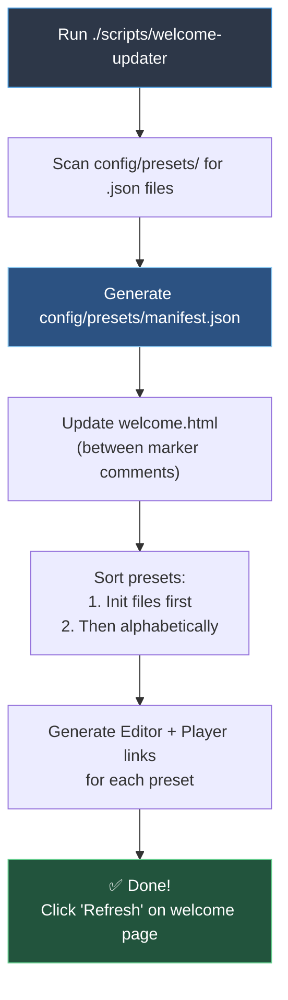

# Update Preset List



## Usage

Run the script to automatically update the welcome page with all presets found in `config/presets/`:

```bash
./scripts/welcome-updater
```

## Function

The script:
- Scans `config/presets/` directory for `.json` files
- Generates `config/presets/manifest.json` with preset metadata
- Updates `welcome.html` between marker comments
- Sorts presets with init files first, then alphabetically
- Generates both Editor and Player links for each preset

## Adding New Presets

1. Save your preset file to `config/presets/filename.json`
2. Run `./scripts/welcome-updater`
3. Click "Refresh" button on welcome page (or reload page)

## Dynamic Loading

The welcome page includes a **Refresh** button that reloads the preset list from `manifest.json` without requiring a page reload.

**Workflow:**
1. Add preset file to `config/presets/`
2. Run `./scripts/welcome-updater` (generates manifest)
3. Click "Refresh" button on welcome page

## Markers

Do not remove these HTML comments from `welcome.html`:
```html
<!-- PRESETS_START -->
<!-- PRESETS_END -->
```

The script replaces all content between these markers.

---

See [scripts/README.md](scripts/README.md) for all available scripts.
