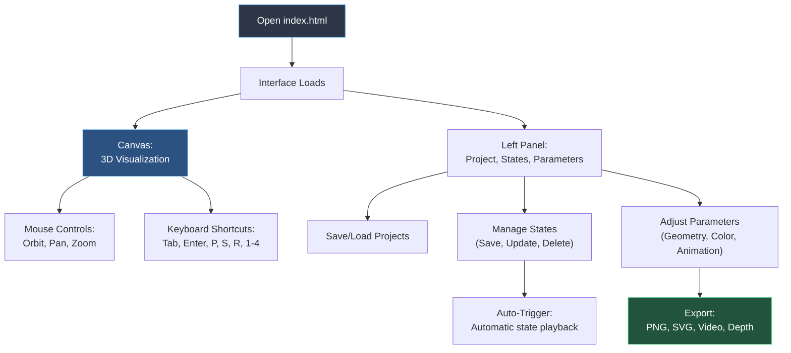

# ZigMap Emitter — User manual

---

## Getting started

1. Open `index.html` in a web browser.
2. The animation starts.
3. Interact with the mouse.
4. Adjust parameters in the left panel.
5. Export to images or videos.

---

## Mouse controls

| Action | Control |
|--------|----------|
| Rotate the view (orbit) | Left-click + drag |
| Pan the view (2D offset) | Right-click + drag |
| Z-rotation (roll scene) | Middle-click + drag horizontally |
| Zoom | Mouse wheel |

Mouse controls are active only when the cursor is on the animation area, not on the control panel.

**Control details:**
- **Orbit** (left-click): Rotates camera around scene center on X/Y axes
- **Pan** (right-click): Moves camera view in 2D without changing orbit angle  
- **Z-rotation** (middle-click): Rolls entire scene around Z-axis
- **Zoom** (wheel): Changes camera distance from scene center

---

## Keyboard shortcuts

| Key | Action |
|--------|--------|
| Tab | Hide / show control panel |
| Enter | Fullscreen |
| P | Export PNG (includes overlay) |
| S | Export SVG (vector only) |
| R | Reset camera |
| 0 | Reset zoom |
| 1 – 4 | Select color palette |
| y | Toggle stereoscopic view |
| Ctrl+S (⌘+S) | Save project |

PNG exports automatically include the overlay if active. Video recording is available from the Export section UI.

---

## Main controls (left panel)

### Project

- **Save**: downloads the complete project (states and camera positions) to a JSON file.
- **Load**: opens a previously saved project.

At first launch, a starter project with example states loads automatically.

---

### States

States are complete snapshots of parameters. They allow memorizing and recalling different configurations.

- **State list**: displays all saved states.
- Clicking a state in the list loads it with an animated transition.
- **Save**: saves the current configuration as a new state.
- **Update**: overwrites the selected state with the current configuration.
- **Delete**: removes the selected state.
- **Rename**: double-click on a state name to edit it (or use the rename button ✎).
- **Reorder**: drag and drop states using the ⋮⋮ handle on the left side.

**State order and initialization:**
- State order is preserved in localStorage across sessions.
- When loading a preset JSON file, the **first state** in the list loads automatically.
- When refreshing the page or returning to the app, the **last active state** loads automatically.

**Transition controls**
- **State Transition** (0–30 s): duration of transition between states.
- **Color Transition** (0–30 s): duration of color palette transitions.

**Auto-Trigger**
Check Auto-Trigger to automatically alternate between states. The Frequency slider (5–120 s) defines the interval. A shuffle algorithm ensures each state is visited once before repetition.

---

### Color palettes

Four distinct palettes, each with four color slots.

- Select a palette via buttons 1–4 at the top of the section or corresponding keys.
- Click a color picker to modify a hue.
- Assign a role to each color: **Line** (zigzag lines), **Background** (canvas background), or **None** (disabled).
- **Color Depth Separation**: Z-axis spacing between lines of different colors.
- **Color Random Seed** (1-9999): seed for deterministic color selection. All windows with the same seed will pick identical colors for new lines, ensuring perfect synchronization between the main window and display windows.

When changing palettes, existing lines transition smoothly to new colors.

---

### Rendering

Output resolution controls, applied to exports.

- **Framebuffer Resolution**: check to lock the canvas to a fixed resolution.
- **Preset**: quick selection among common resolutions (HD, 4K, Instagram formats).
- **Resolution**: manual entry of width and height in pixels.

---

### View

Camera and display settings.

- **Field of View**: camera field of view angle in degrees.
- **Clipping Planes**: near and far visibility range.
- **Stereoscopic View (VR)**: check for side-by-side VR mode.
- **Eye Separation**: distance between stereo cameras, active only in stereoscopic mode.

---

### Display Window

For multi-monitor presentations and installations, the **Open Display Window** button (in the Project section) opens synchronized secondary display windows. You can open multiple display windows—each receives a unique ID (display-1, display-2, display-3, etc.).

**Dual synchronization strategy:**

1. **State transitions** (efficient): When loading states or changing parameters via UI, a single transition command is broadcast. Display windows execute the same smooth transition locally. Result: Perfect sync with minimal bandwidth.

2. **Manual camera control** (real-time): During mouse interaction (orbit, pan, zoom, Z-rotation), camera positions are broadcast at 60fps for responsive real-time following.

**How it works:**
The main window broadcasts parameter changes and commands to display windows in real-time. Each window runs its own independent generative code using the same parameters, creating similar but not identical animations.

**Why displays differ slightly:**
The images on the main and secondary displays will be **visually similar but not pixel-perfect identical**. This is normal and expected:

- **Parameter synchronization**: The system syncs state parameters (colors, camera, geometry, etc.), not the actual pixels
- **Independent generation**: Each window generates its animation independently using the same rules but different random seeds
- **Timing variations**: Browser rendering cycles differ slightly between windows

**Advantages over image streaming:**
- Much lower bandwidth (parameters vs. video frames)
- Native GPU rendering on each display maintains smooth 60fps
- Each display runs at its optimal resolution independently
- Multiple displays can connect without performance degradation
- No video compression artifacts
- Intelligent synchronization: transition commands for smooth animations, real-time updates for manual control

**Bidirectional keyboard control**
Display windows support **remote keyboard control**, enabling you to operate the entire system from any display window. This is particularly useful for live performances where you're watching the projector output instead of the control window.

**Supported keys from display windows:**
- **Arrow keys** (← →): Navigate state history (previous/next state)
- **Space bar**: Play/pause auto-trigger
- **Number keys** (1–4): Select color palettes
- **Export keys**: P (PNG), S (SVG), D (Depth), V (Video), Ctrl+S/⌘+S (Save project)
- **Camera keys**: R (Reset camera), 0 (Reset zoom)

**Local-only keys (not forwarded):**
- **Enter / F / f**: Toggle fullscreen (each window controls its own fullscreen state)
- **Tab**: Toggle control panel visibility (main window only)
- **y**: Toggle stereoscopic mode (main window only)

**Command flow:**
1. Press a key in any display window
2. Command is forwarded to the main window
3. Main window executes the action
4. Main window broadcasts the result to all displays
5. All displays (including sender) sync to the new state

The main window always remains the single source of truth, ensuring consistent and predictable behavior across all displays.

This approach is ideal for live installations and multi-projector setups requiring high-quality synchronized animations.

---

### Geometry

- **Segment Length**: height of each zigzag segment.
- **Line Thickness**: width of zigzag ribbons.
- **Emitter Rotation**: rotates the entire emission pattern.
- **Geometry Scale**: global scaling of geometry.
- **Fade Duration**: duration of line fade in/out.

---

### Animation

- **Emit Rate**: frequency of line creation (lines per second).
- **Speed**: movement speed of lines in space.
- **Ambient Speed Master**: global speed multiplier.

---

### Modulations

- **Random Thickness**: check to apply random variation to line thickness.
- **Thickness Range**: min/max variation for random thickness.
- **Random Speed**: check to apply random variation to line speed.
- **Speed Range**: min/max variation for random speed.

---

### Overlay

Static images overlaid on top of the animation for branding, watermarks, or design elements.

**Preset overlays**
- **Preset dropdown**: select from pre-configured overlays in `assets/overlays/` folder.
- Instant loading of Base64-encoded images.

**Custom images**
- **Load Custom Image button**: import PNG, JPG, or SVG files.
- Recommendation: use PNG with transparency for logos.
- Overrides preset selection.

**Appearance controls**
- **Show Overlay**: checkbox to toggle visibility.
- **Scale** (10–200%): resize the overlay image.
- **Opacity** (0–100%): transparency level.
- **Position X/Y** (0–100%): place the image anywhere on screen.
- **Clear Image button**: remove current overlay.

**Export behavior**
Overlays are included in PNG and video exports. Overlays are excluded from SVG exports (vector only).

**Creating new presets**
Use the utility tool at `utilities/overlay-converter.html` to convert images to Base64 JSON format. Place JSON files in `assets/overlays/` folder and reload the application.

---

## Export

### PNG export
Press p or click Export PNG. Captures current frame as PNG image. Resolution matches current canvas size. Includes overlay if active. Automatic adjustment for high-resolution displays.

### SVG export
Press s or click Export SVG. Exports current frame as vectorsvg file. Resolution-independent format. Ideal for print or vector editing. Does not include overlay (vector only).

### Video recording
1. Set Duration (how many seconds).
2. Set Frame Rate (30 FPS is standard).
3. Click Record Video button.
4. Wait without interacting with the page.
5. Video downloads automatically when complete.

Includes overlay on every frame if active.

---

## Troubleshooting

**Nothing appears**
Check emit rate > 0. Adjust camera distance with scroll wheel.

**Too busy or cluttered**
Lower emit rate slider.

**Lines disappear**
Lines move out of view. This is normal.

**Cannot rotate camera**
Cursor must be on animation area, not control panel.

**Video does not download**
Wait longer. Large videos take time to process.

**Fullscreen does not exit**
Press Escape key.

**Overlay not showing**
Check Show Overlay is enabled. Verify opacity > 0%.

**State loads to wrong position**
Camera position is saved with each state. Click state again if needed.

**Cannot rename state**
Click directly on state name text.

**Keyboard shortcuts do not work**
Ensure state rename mode is not active. Shortcuts disabled while editing state names.

---

## Resolution and output sizes

**For fixed output size:**
1. Check Framebuffer Resolution.
2. Choose a Preset: 1920×1080 (HD), 1080×1080 (square), 3840×2160 (4K), 1080×1440 (portrait).
3. Export normally.

**For window size:**
Leave Framebuffer Resolution unchecked. Exports use browser window size.

---

**Settings automatically save in browser localStorage. Reload the page to find everything as it was left.**
