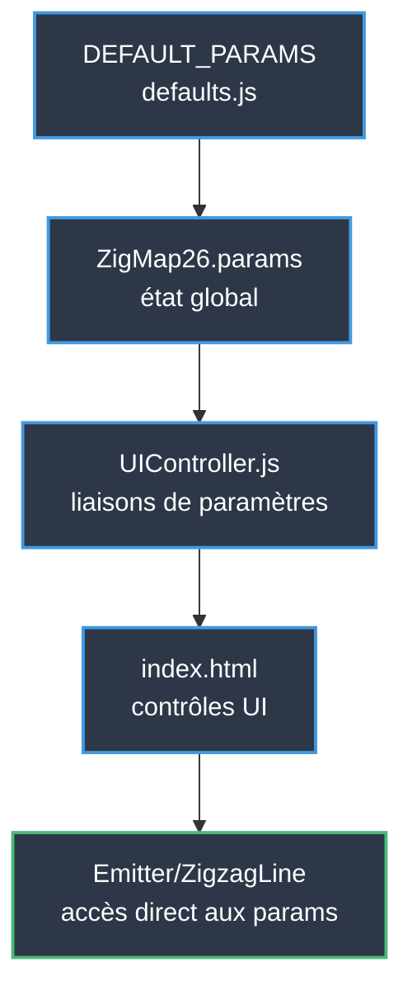
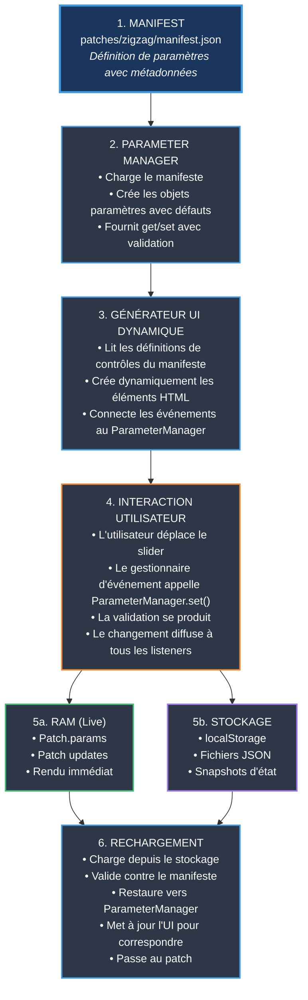
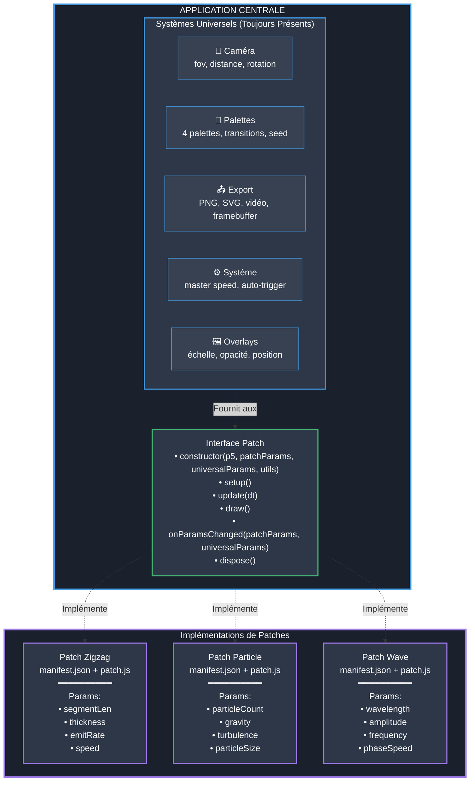

# Système de Patches — Guide Complet d'Architecture
**Découplage de l'Interface des Patches p5.js**

**Créé :** 19 mai 2026  
**Statut :** Phase de Planification — Guide de Stratégie & Implémentation

---

# Table des Matières

1. [Résumé Exécutif](#1-résumé-exécutif)
2. [Analyse de l'Architecture Actuelle](#2-analyse-de-larchitecture-actuelle)
3. [Principe Fondamental : Universel vs Spécifique au Patch](#3-principe-fondamental--universel-vs-spécifique-au-patch)
4. [Pipeline Complet de Paramètres](#4-pipeline-complet-de-paramètres)
5. [Architecture Proposée](#5-architecture-proposée)
6. [Stratégies d'Implémentation](#6-stratégies-dimplémentation)
7. [Détails de Conception Technique](#7-détails-de-conception-technique)
8. [Exemples de Code : Avant & Après](#8-exemples-de-code--avant--après)
9. [Stratégie de Migration](#9-stratégie-de-migration)
10. [Compatibilité Fenêtres Lecteur & Affichage](#10-compatibilité-fenêtres-lecteur--affichage)
11. [Calendrier d'Implémentation](#11-calendrier-dimplémentation)
12. [Critères de Succès & Prochaines Étapes](#12-critères-de-succès--prochaines-étapes)

---

# 1. Résumé Exécutif

## Vue d'Ensemble de l'Architecture
**Système de patches piloté par manifeste** où :
- Les patches définissent les paramètres dans `manifest.json`
- L'interface générée automatiquement depuis le manifeste
- Pipeline complet garanti : manifeste → UI → stockage → rechargement
- Caméra et palettes sont des **systèmes universels** (fonctionnent avec tous les patches)
- Seules géométrie/comportement/modulation sont spécifiques au patch

## Innovation Clé
Trois classes centrales gèrent tout :
1. **ParameterManager** — Hub central avec validation
2. **DynamicUI** — Génère les contrôles depuis le manifeste
3. **PatchStorage** — Sauvegarde/charge avec validation

**Ajoutez un paramètre au manifeste → Tout fonctionne automatiquement**

---

# 2. Analyse de l'Architecture Actuelle

## Flux d'Architecture



## Caractéristiques de Conception

- **Couche UI** : Contrôles définis en HTML avec liaisons manuelles
- **Couche Paramètres** : Les appels `wireSlider()` connectent l'UI à l'état
- **Couche Données** : `defaults.js` contient les définitions de paramètres
- **Couche Rendu** : Accès direct à l'objet paramètre
- **Extensibilité** : Les nouveaux patches nécessitent des mises à jour coordonnées sur plusieurs fichiers

---

# 3. Principe Fondamental : Universel vs Spécifique au Patch

## 🌍 Systèmes Universels (Toujours Identiques)

Ce sont des **fonctionnalités centrales** qui fonctionnent avec N'IMPORTE QUEL patch :

### 🎥 Système de Caméra
- FOV, plans de découpage near/far
- Position (distance, rotationX, rotationY, offsetX, offsetY)
- Calculs de matrice de projection
- **Pourquoi universel :** Tous les patches rendent en espace 3D

### 🎨 Système de Palette de Couleurs
- 4 palettes avec 4 couleurs chacune
- Rôles de couleur : `line`, `background`, `none`
- RNG déterministe pour sélection de couleur (avec seed)
- Transitions de couleur avec contrôle de durée
- **Pourquoi universel :** Fournit une cohérence visuelle

### 📤 Système d'Export
- Export PNG, SVG, Vidéo
- Paramètres de résolution framebuffer
- Rendu stéréoscopique (VR)
- Export de carte de profondeur
- **Pourquoi universel :** Capture le canvas indépendamment du patch

### ⚙️ Paramètres Système
- `ambientSpeedMaster` — Contrôle de vitesse globale
- `autoTriggerStates` — Transitions d'états automatiques
- `stateTransitionDuration` — Durée des transitions
- `colorTransitionDuration` — Durée des changements de couleur
- **Pourquoi universel :** Méta-contrôles affectant toute l'application

### 🖼️ Système d'Overlay
- Charger et positionner des images d'overlay
- Contrôles d'échelle, opacité, position
- **Pourquoi universel :** Couche visuelle sur n'importe quelle sortie

## 🔧 Paramètres Spécifiques au Patch (Uniques par Patch)

### 📐 Géométrie
Quelles formes/structures le patch crée :
- **Zigzag** : `segmentLength`, `lineThickness`, `emitterRotation`, `geometryScale`
- **Particle** : `particleCount`, `particleSize`, `particleShape`
- **Wave** : `wavelength`, `amplitude`, `gridResolution`

### 🎭 Comportement
Comment le patch s'anime :
- **Zigzag** : `emitRate`, `speed`, `fadeDuration`
- **Particle** : `gravity`, `turbulence`, `lifetime`
- **Wave** : `frequency`, `phaseSpeed`, `dampening`

### 🎚️ Modulation
Variations et aléatoire :
- **Zigzag** : `randomThickness`, `thicknessRange`, `randomSpeed`, `speedRange`
- **Particle** : `sizeVariation`, `velocitySpread`, `colorJitter`
- **Wave** : `noiseScale`, `distortionAmount`

---

# 4. Pipeline Complet de Paramètres

## La Question Critique
**Peut-on garantir le pipeline complet manifeste → UI → stockage → rechargement avec des paramètres arbitraires ?**

**Réponse : OUI.** Voici exactement comment.

## Le Flux de Données



## Les Garanties Clés

### 1. Sécurité de Type
```javascript
paramManager.set('lineThickness', 24);    // ✓ Valide (nombre)
paramManager.set('lineThickness', 'abc'); // ✗ Rejeté (pas un nombre)
paramManager.set('lineThickness', 150);   // ✗ Rejeté (> max: 100)
```

### 2. Intégrité du Stockage
```javascript
const loaded = { lineThickness: 500 };  // Invalide (max: 100)
storage.restore(loaded, manifest);       // Utilise la valeur par défaut à la place
```

### 3. Synchronisation UI
```javascript
paramManager.set('lineThickness', 50);
// → Le slider se déplace à 50
// → L'affichage montre "50"
// → Le patch reçoit la mise à jour
// → localStorage mis à jour
```

### 4. Câblage Live
```javascript
// L'utilisateur déplace le slider
// → L'événement onChange se déclenche
// → ParameterManager valide et met à jour
// → Tous les listeners notifiés :
//    • Le patch se met à jour
//    • Le stockage sauvegarde
//    • Les fenêtres d'affichage se synchronisent
//    • L'UI se met à jour
```

---

# 5. Architecture Proposée

## 5.1 Diagramme d'Architecture



## 5.2 Exemple de Manifeste de Patch

```json
{
  "id": "zigzag-emitter-v1",
  "name": "Zigzag Emitter",
  "version": "1.0.0",
  "author": "David Delcourt",
  "description": "Emits zigzag lines in 3D space",
  "entryPoint": "./patch.js",
  
  "parameters": {
    "geometry": {
      "label": "Geometry",
      "collapsed": false,
      "controls": [
        {
          "id": "lineThickness",
          "type": "slider",
          "label": "Thickness",
          "default": 24,
          "min": 1,
          "max": 100,
          "step": 0.1,
          "unit": "px"
        },
        {
          "id": "emitterRotation",
          "type": "slider",
          "label": "Emitter Rotation",
          "default": 0,
          "min": 0,
          "max": 360,
          "step": 1,
          "unit": "°"
        }
      ]
    },
    "behavior": {
      "label": "Behavior",
      "controls": [
        {
          "id": "emitRate",
          "type": "slider",
          "label": "Emit Rate",
          "default": 1.5,
          "min": 0.1,
          "max": 10,
          "step": 0.1,
          "unit": "lines/s"
        },
        {
          "id": "speed",
          "type": "slider",
          "label": "Speed",
          "default": 80,
          "min": -200,
          "max": 200,
          "step": 1,
          "unit": "px/s"
        }
      ]
    },
    "modulation": {
      "label": "Modulation",
      "controls": [
        {
          "id": "randomThickness",
          "type": "checkbox",
          "label": "Random Thickness",
          "default": false
        },
        {
          "id": "thicknessRange",
          "type": "range",
          "label": "Thickness Range",
          "default": [10, 200],
          "min": 0,
          "max": 500,
          "step": 1,
          "unit": "%",
          "dependsOn": "randomThickness",
          "enabledWhen": true
        }
      ]
    }
  },
  
  "usesSharedSystems": {
    "camera": true,
    "palettes": true,
    "export": true,
    "overlays": true
  }
}
```

**Note :** Caméra, palettes, export et overlays ne sont PAS dans le manifeste — ils sont universels !

## 5.3 Interface Patch

```javascript
// patches/[patchName]/patch.js
export class PatchRenderer {
  constructor(p5Instance, patchParams, universalParams, sharedUtils) {
    this.p = p5Instance;
    this.params = patchParams;        // VOS paramètres
    this.universal = universalParams; // Caméra, palettes, système
    this.utils = sharedUtils;         // Fonctions d'aide
  }
  
  setup() {
    // Initialiser les objets spécifiques au patch
  }
  
  update(dt) {
    // Mettre à jour l'état d'animation
  }
  
  draw() {
    // Rendre sur le canvas
    const bgColor = this.utils.getBackgroundColor(this.universal);
    this.p.background(bgColor);
    
    this.utils.camera.apply(this.p, this.universal);
    
    // Votre logique de rendu ici
  }
  
  onParamsChanged(changedPatchParams, changedUniversalParams) {
    // Réagir aux mises à jour de paramètres
  }
  
  onStateTransition(targetPatchParams, duration) {
    // Gérer les transitions fluides
  }
  
  dispose() {
    // Libérer les ressources
  }
}
```

## 5.4 Structure de Fichiers

```
patches/
  ├── manifest.json           ← Liste tous les patches disponibles
  ├── zigzag/
  │   ├── manifest.json       ← Définition du patch
  │   ├── patch.js            ← Logique de rendu
  │   └── presets/            ← Presets spécifiques au patch
  │       ├── Init.json
  │       └── DowntownAmbient.json
  └── particles/              ← Exemple de patch futur
      ├── manifest.json
      └── patch.js

js/
  ├── core/
  │   ├── PatchLoader.js      ← NOUVEAU : Charge et valide les patches
  │   ├── DynamicUI.js        ← NOUVEAU : Génère l'UI depuis le manifeste
  │   ├── ParameterManager.js ← NOUVEAU : Gère les paramètres
  │   ├── CameraSystem.js     ← EXTRAIT : Caméra universelle
  │   ├── PaletteSystem.js    ← EXTRAIT : Palettes universelles
  │   └── ... (fichiers existants)
  └── ui/
      └── UIController.js     ← MODIFIÉ : Utilise DynamicUI

config/
  └── universalDefaults.json  ← NOUVEAU : Caméra, palettes, paramètres système
```

---

# 6. Stratégies d'Implémentation

## Stratégie A : Système Dynamique Complet ⭐ **RECOMMANDÉ**

**Complexité :** Élevée  
**Flexibilité :** Maximale  
**Calendrier :** 3-4 semaines

### Avantages
- ✅ Découplage complet
- ✅ N'importe quel patch peut être chargé
- ✅ UI générée entièrement depuis le manifeste
- ✅ Facile de créer de nouveaux patches
- ✅ Pas de modifications de code pour nouveaux patches

### Inconvénients
- ⚠️ Effort de refactoring important
- ⚠️ Besoin de migrer les presets existants
- ⚠️ Débogage plus complexe
- ⚠️ Courbe d'apprentissage pour les créateurs de patches

### Étapes d'Implémentation
1. Créer le schéma de manifeste de patch et validateur
2. Construire `PatchLoader` pour charger et instancier les patches
3. Construire `DynamicUI` pour générer les contrôles depuis le manifeste
4. Construire `ParameterManager` pour gérer les paramètres
5. Migrer le code zigzag au format patch
6. Mettre à jour le système preset/state
7. Mettre à jour le système d'export
8. Tests et documentation

---

## Stratégie B : Système Hybride

**Complexité :** Moyenne  
**Flexibilité :** Élevée  
**Calendrier :** 2-3 semaines

### Description
Garder zigzag comme patch "intégré", ajouter un système de plugin pour nouveaux patches.

### Avantages
- ✅ Moins de refactoring
- ✅ Fonctionnalité existante inchangée
- ✅ Chemin de migration graduel

### Inconvénients
- ⚠️ Deux systèmes à maintenir (legacy + nouveau)
- ⚠️ Finalement besoin de migrer complètement
- ⚠️ Plus de dette technique

---

## Stratégie C : Basée sur Configuration

**Complexité :** Faible  
**Flexibilité :** Moyenne  
**Calendrier :** 1 semaine

### Description
Rendre les params configurables via JSON mais garder la plupart de la structure du code.

### Avantages
- ✅ Refactoring minimal
- ✅ Rapide à implémenter
- ✅ Facile à comprendre

### Inconvénients
- ⚠️ Nécessite toujours des modifications de code pour patches différents
- ⚠️ Pas vraiment découplé
- ⚠️ Limité aux patches avec structure similaire

---

# 7. Détails de Conception Technique

## 7.1 Parameter Manager (Système Central)

```javascript
// js/core/ParameterManager.js
class ParameterManager {
  constructor(manifest) {
    this.manifest = manifest;
    this.params = {};
    this.listeners = [];
    this.controlMap = new Map();
    this._initialize();
  }
  
  _initialize() {
    // Construire les objets paramètres depuis le manifeste avec les défauts
    for (const [groupId, groupDef] of Object.entries(this.manifest.parameters)) {
      for (const control of groupDef.controls) {
        this.params[control.id] = control.default;
        this.controlMap.set(control.id, control);
      }
    }
  }
  
  get(key) {
    return this.params[key];
  }
  
  set(key, value) {
    const control = this.controlMap.get(key);
    if (!control) {
      console.error(`Unknown parameter: ${key}`);
      return false;
    }
    
    // Valider contre les règles du manifeste
    if (!this._validate(control, value)) {
      console.error(`Invalid value for ${key}: ${value}`);
      return false;
    }
    
    const oldValue = this.params[key];
    this.params[key] = value;
    
    // Notifier tous les listeners
    this._notifyChange(key, value, oldValue);
    
    return true;
  }
  
  setAll(paramObject) {
    const changes = {};
    for (const [key, value] of Object.entries(paramObject)) {
      if (this.params.hasOwnProperty(key)) {
        const control = this.controlMap.get(key);
        if (control && this._validate(control, value)) {
          this.params[key] = value;
          changes[key] = value;
        }
      }
    }
    if (Object.keys(changes).length > 0) {
      this._notifyChange(null, changes, null);
    }
  }
  
  getAll() {
    return { ...this.params };
  }
  
  _validate(control, value) {
    switch (control.type) {
      case 'slider':
        return typeof value === 'number' && 
               value >= control.min && 
               value <= control.max;
      case 'checkbox':
        return typeof value === 'boolean';
      case 'range':
        return Array.isArray(value) && 
               value.length === 2 &&
               value[0] >= control.min && 
               value[1] <= control.max;
      default:
        return true;
    }
  }
  
  onChange(callback) {
    this.listeners.push(callback);
    return () => {
      const index = this.listeners.indexOf(callback);
      if (index > -1) this.listeners.splice(index, 1);
    };
  }
  
  _notifyChange(key, value, oldValue) {
    for (const listener of this.listeners) {
      listener(key, value, oldValue);
    }
  }
}
```

## 7.2 Générateur UI Dynamique

```javascript
// js/ui/DynamicUI.js
class DynamicUI {
  constructor(paramManager) {
    this.paramManager = paramManager;
  }
  
  render(manifest, containerElement) {
    containerElement.innerHTML = '';
    
    for (const [groupId, groupDef] of Object.entries(manifest.parameters)) {
      const section = this._createSection(groupDef.label, groupId);
      const sectionBody = section.querySelector('.section-body');
      
      for (const control of groupDef.controls) {
        const controlElement = this._createControl(control);
        sectionBody.appendChild(controlElement);
      }
      
      containerElement.appendChild(section);
    }
  }
  
  _createControl(control) {
    switch (control.type) {
      case 'slider':
        return this._createSlider(control);
      case 'checkbox':
        return this._createCheckbox(control);
      case 'range':
        return this._createRange(control);
      default:
        console.warn(`Unknown control type: ${control.type}`);
        return document.createElement('div');
    }
  }
  
  _createSlider(control) {
    const wrapper = document.createElement('div');
    wrapper.className = 'control-group';
    
    const label = document.createElement('label');
    label.textContent = control.label;
    if (control.unit) {
      label.innerHTML += ` <span style="color:#666">(${control.unit})</span>`;
    }
    
    const sliderRow = document.createElement('div');
    sliderRow.className = 'slider-row';
    
    const slider = document.createElement('input');
    slider.type = 'range';
    slider.id = control.id;
    slider.min = control.min;
    slider.max = control.max;
    slider.step = control.step;
    slider.value = this.paramManager.get(control.id);
    
    const display = document.createElement('span');
    display.className = 'value-display';
    display.id = `${control.id}-val`;
    display.textContent = this._formatValue(slider.value, control);
    
    // Connecter au ParameterManager
    slider.addEventListener('input', (e) => {
      const value = parseFloat(e.target.value);
      display.textContent = this._formatValue(value, control);
      this.paramManager.set(control.id, value);
    });
    
    sliderRow.appendChild(slider);
    sliderRow.appendChild(display);
    wrapper.appendChild(label);
    wrapper.appendChild(sliderRow);
    
    return wrapper;
  }
  
  _createCheckbox(control) {
    const wrapper = document.createElement('div');
    wrapper.className = 'control-group';
    
    const label = document.createElement('label');
    const checkbox = document.createElement('input');
    checkbox.type = 'checkbox';
    checkbox.id = control.id;
    checkbox.checked = this.paramManager.get(control.id);
    
    checkbox.addEventListener('change', (e) => {
      this.paramManager.set(control.id, e.target.checked);
    });
    
    label.appendChild(checkbox);
    label.appendChild(document.createTextNode(' ' + control.label));
    wrapper.appendChild(label);
    
    return wrapper;
  }
  
  _formatValue(value, control) {
    const decimals = control.step < 1 ? 1 : 0;
    return decimals > 0 ? value.toFixed(decimals) : value.toString();
  }
  
  syncFromParams() {
    for (const [key, value] of Object.entries(this.paramManager.params)) {
      const element = document.getElementById(key);
      if (!element) continue;
      
      const control = this.paramManager.controlMap.get(key);
      
      if (control.type === 'slider') {
        element.value = value;
        const display = document.getElementById(`${key}-val`);
        if (display) {
          display.textContent = this._formatValue(value, control);
        }
      } else if (control.type === 'checkbox') {
        element.checked = value;
      }
    }
  }
}
```

## 7.3 Système de Stockage

```javascript
// js/storage/PatchStorage.js
class PatchStorage {
  constructor(paramManager, universalParams) {
    this.paramManager = paramManager;
    this.universalParams = universalParams;
  }
  
  saveToLocal(patchId) {
    const data = {
      version: '3.0',
      patchId: patchId,
      timestamp: Date.now(),
      patchParams: this.paramManager.getAll(),
      universalParams: this.universalParams
    };
    
    try {
      localStorage.setItem('zigmap-autosave', JSON.stringify(data));
      return true;
    } catch (e) {
      console.error('Failed to save to localStorage:', e);
      return false;
    }
  }
  
  loadFromLocal() {
    try {
      const json = localStorage.getItem('zigmap-autosave');
      if (!json) return null;
      
      const data = JSON.parse(json);
      
      if (data.version !== '3.0') {
        console.warn('Old save format, attempting migration...');
        return this._migrate(data);
      }
      
      return data;
    } catch (e) {
      console.error('Failed to load from localStorage:', e);
      return null;
    }
  }
  
  exportToFile(filename, patchId, statesData = null) {
    const data = {
      version: '3.0',
      patchId: patchId,
      exportDate: new Date().toISOString(),
      patchParams: this.paramManager.getAll(),
      universalParams: this.universalParams,
      states: statesData
    };
    
    const blob = new Blob([JSON.stringify(data, null, 2)], {
      type: 'application/json'
    });
    
    const url = URL.createObjectURL(blob);
    const a = document.createElement('a');
    a.href = url;
    a.download = filename;
    a.click();
    URL.revokeObjectURL(url);
  }
  
  async loadFromFile(file) {
    return new Promise((resolve, reject) => {
      const reader = new FileReader();
      
      reader.onload = (e) => {
        try {
          const data = JSON.parse(e.target.result);
          
          if (!data.patchId || !data.patchParams) {
            reject(new Error('Invalid file format'));
            return;
          }
          
          resolve(data);
        } catch (err) {
          reject(err);
        }
      };
      
      reader.onerror = () => reject(reader.error);
      reader.readAsText(file);
    });
  }
  
  restore(data, manifest) {
    const validParams = {};
    
    for (const [key, value] of Object.entries(data.patchParams)) {
      const control = this.paramManager.controlMap.get(key);
      if (control) {
        if (this.paramManager._validate(control, value)) {
          validParams[key] = value;
        } else {
          console.warn(`Invalid value for ${key}, using default`);
        }
      } else {
        console.warn(`Parameter ${key} not in manifest, skipping`);
      }
    }
    
    this.paramManager.setAll(validParams);
    return validParams;
  }
}
```

## 7.4 Initialisation de l'Application

```javascript
// js/main.js
async function initializeApplication() {
  // 1. Charger le manifeste du patch
  const patchId = 'zigzag-emitter-v1';
  const manifest = await loadManifest(patchId);
  
  // 2. Créer ParameterManager depuis le manifeste
  const patchParamManager = new ParameterManager(manifest);
  
  // 3. Essayer de charger les paramètres sauvegardés
  const storage = new PatchStorage(patchParamManager, universalParams);
  const savedData = storage.loadFromLocal();
  
  if (savedData && savedData.patchId === patchId) {
    storage.restore(savedData, manifest);
  }
  
  // 4. Générer l'UI dynamiquement
  const dynamicUI = new DynamicUI(patchParamManager);
  const container = document.getElementById('patch-controls');
  dynamicUI.render(manifest, container);
  
  // 5. Instancier le patch avec les paramètres
  const patch = await loadPatch(
    patchId,
    p5Instance,
    patchParamManager.params,
    universalParams,
    sharedUtils
  );
  
  // 6. Connecter les changements de paramètres
  patchParamManager.onChange((key, value, oldValue) => {
    if (key === null) {
      patch.onParamsChanged(value, {});
    } else {
      patch.onParamsChanged({ [key]: value }, {});
    }
    
    storage.saveToLocal(patchId);
    
    if (windowSync) {
      windowSync.broadcastParamChanges({ [key]: value });
    }
  });
  
  return { patch, patchParamManager, storage, dynamicUI };
}
```

---

# 8. Exemples de Code : Avant & Après

## 8.1 Définition de Paramètre

### AVANT (defaults.js)
```javascript
export const DEFAULT_PARAMS = {
  // Codé en dur dans le noyau de l'application
  segmentLength: 120,
  lineThickness: 24,
  emitterRotation: 0,
  emitRate: 1.5,
  speed: 80,
  randomThickness: false,
  // ... 40+ autres paramètres
};
```

### APRÈS (patches/zigzag/manifest.json)
```json
{
  "id": "zigzag-emitter-v1",
  "parameters": {
    "geometry": {
      "controls": [
        {
          "id": "lineThickness",
          "type": "slider",
          "default": 24,
          "min": 1,
          "max": 100,
          "step": 0.1
        }
      ]
    }
  }
}
```

## 8.2 Liaison UI

### AVANT (UIController.js)
```javascript
function initializeAllControls(ZM) {
  // Chaque paramètre câblé manuellement
  wireSlider(ZM, 'thickness', 'thickness-val', 'lineThickness', 1, 'Thickness');
  wireSlider(ZM, 'emit-rate', 'emit-rate-val', 'emitRate', 1, 'Emit Rate');
  wireSlider(ZM, 'speed', 'speed-val', 'speed', 0, 'Speed');
  // ... 20+ autres appels wireSlider
}
```

### APRÈS (DynamicUI.js)
```javascript
class DynamicUI {
  render(manifest, container) {
    // Génère automatiquement tous les contrôles depuis le manifeste
    for (const [groupId, groupDef] of Object.entries(manifest.parameters)) {
      for (const control of groupDef.controls) {
        const element = this._createControl(control);
        container.appendChild(element);
      }
    }
  }
}
```

## 8.3 Format Preset

### AVANT
```json
{
  "version": "2.0",
  "params": {
    "segmentLength": 120,
    "lineThickness": 24,
    "fov": 60,
    "palettes": [ ... ]
  }
}
```

### APRÈS
```json
{
  "version": "3.0",
  "patchId": "zigzag-emitter-v1",
  "patchParams": {
    "segmentLength": 120,
    "lineThickness": 24
  },
  "camera": {
    "fov": 60,
    "distance": 600
  },
  "palettes": [ ... ]
}
```

---

# 9. Stratégie de Migration

## Phase 1 : Extraire les Systèmes Universels (Semaine 1)
1. Déplacer le code caméra vers `js/core/CameraSystem.js`
2. Déplacer le code palette vers `js/core/PaletteSystem.js`
3. Déplacer le code export vers `js/export/ExportSystem.js`
4. Tester que tout fonctionne encore

## Phase 2 : Construire le Système Central (Semaine 1)
1. Créer `ParameterManager.js`
2. Créer `DynamicUI.js`
3. Créer `PatchLoader.js`
4. Créer `PatchStorage.js`
5. Écrire des tests unitaires

## Phase 3 : Migrer Zigzag (Semaine 2)
1. Créer `patches/zigzag/manifest.json`
2. Extraire Emitter/ZigzagLine vers `patches/zigzag/patch.js`
3. Tester l'équivalence avec le système actuel
4. Mettre à jour tous les presets existants au format v3.0

## Phase 4 : Intégration (Semaine 2-3)
1. Mettre à jour main.js pour utiliser le nouveau système
2. Mettre à jour StateManager pour le support des patches
3. Mettre à jour le système d'export
4. Mettre à jour la synchronisation de fenêtres

## Phase 5 : Validation (Semaine 3-4)
1. Créer un second patch simple (particules ou cercles)
2. Tester le changement de patches
3. Benchmarks de performance
4. Corriger les cas limites

## Phase 6 : Documentation (Semaine 4)
1. Guide de création de patches
2. Référence de manifeste
3. Documentation API
4. Guide de migration

---

# 10. Compatibilité Fenêtres Lecteur & Affichage

## Vue d'Ensemble

L'application a deux modes de fenêtre additionnels qui doivent continuer à fonctionner avec le système de patches :

1. **player.html** — Lecteur autonome qui charge et affiche les presets JSON sans contrôles UI
2. **display.html** — Fenêtre secondaire qui se synchronise avec la fenêtre principale via l'API BroadcastChannel

Les deux nécessitent des mises à jour pour supporter le système de patches, mais la **fonctionnalité centrale reste la même**.

## Architecture Actuelle

### player.html
```javascript
// Importe directement DEFAULT_PARAMS et les classes centrales
import { DEFAULT_PARAMS } from './config/defaults.js';
import { Emitter } from './core/Emitter.js';
import { ZigzagLine } from './core/ZigzagLine.js';

// Charge le preset JSON → applique les params → rend
window.SpaceFlow = {
  params: { ...DEFAULT_PARAMS },
  emitterInstance: new Emitter()
};
```

### display.html
```javascript
// Se synchronise avec la fenêtre principale
import { DEFAULT_PARAMS } from './config/defaults.js';
const channel = new BroadcastChannel('zigmap26-sync');

channel.onmessage = (event) => {
  if (event.data.type === 'param-change') {
    ZM.params[event.data.key] = event.data.value;
  }
};
```

## Architecture Mise à Jour

### Changements Clés

1. **Les presets incluent maintenant `patchId`** — Le format JSON v3.0 nous dit quel patch charger
2. **PatchLoader remplace les imports directs** — Charge dynamiquement le bon patch
3. **Les messages de sync incluent `patchId`** — Les fenêtres d'affichage savent quel patch charger
4. **Rétrocompatible** — Les anciens presets v2.0 migrent automatiquement vers le patch zigzag

## Mises à Jour Fenêtre Lecteur

### Étape 1 : Ajouter le Support PatchLoader

```javascript
// js/player.js
import { PatchLoader } from './core/PatchLoader.js';
import { ParameterManager } from './core/ParameterManager.js';
import { universalDefaults } from './config/universalDefaults.json';

window.SpaceFlow = {
  // NOUVEAU : Système de patches
  patchId: null,
  patch: null,
  patchParamManager: null,
  
  // Params universels (caméra, palettes, système)
  universalParams: { ...universalDefaults },
  
  // Garder la structure existante
  camera: null,
  p5Instance: null,
  ...
};
```

### Étape 2 : Mettre à Jour le Chargement de Preset

```javascript
async function loadPreset(jsonData) {
  const ZM = window.SpaceFlow;
  
  // 1. Déterminer l'ID du patch (avec fallback pour presets legacy)
  const patchId = jsonData.patchId || 'zigzag-emitter-v1';
  console.log(`📦 Loading patch: ${patchId}`);
  
  // 2. Charger le manifeste du patch
  const manifest = await PatchLoader.loadManifest(patchId);
  
  // 3. Créer le gestionnaire de paramètres pour les params du patch
  const patchParamManager = new ParameterManager(manifest);
  
  // 4. Appliquer les paramètres du preset
  if (jsonData.version === '3.0') {
    // Nouveau format : structure séparée
    patchParamManager.setAll(jsonData.patchParams);
    
    ZM.universalParams = {
      ...ZM.universalParams,
      ...jsonData.camera,
      palettes: jsonData.palettes,
      ...jsonData.system
    };
  } else {
    // Format legacy : extraire et migrer
    const migrated = migratePresetToV3(jsonData, manifest);
    patchParamManager.setAll(migrated.patchParams);
    ZM.universalParams = migrated.universalParams;
  }
  
  // 5. Instancier le patch
  const patch = await PatchLoader.instantiate(
    patchId,
    ZM.p5Instance,
    patchParamManager.params,
    ZM.universalParams,
    { camera: ZM.camera, colorUtils, ... }
  );
  
  // 6. Stocker les références
  ZM.patchId = patchId;
  ZM.patch = patch;
  ZM.patchParamManager = patchParamManager;
  
  // 7. Initialiser le patch
  patch.setup();
  
  console.log('✅ Patch loaded successfully');
}
```

### Étape 3 : Mettre à Jour la Boucle de Rendu

```javascript
// Dans le sketch p5
function draw() {
  const ZM = window.SpaceFlow;
  
  if (!ZM.patch) return;
  
  // Laisser le patch gérer le rendu
  ZM.patch.update(deltaTime / 1000);
  ZM.patch.draw();
}
```

## Mises à Jour Fenêtre d'Affichage

### Étape 1 : Ajouter le Chargement de Patches

```javascript
// js/display.js
import { PatchLoader } from './core/PatchLoader.js';
import { ParameterManager } from './core/ParameterManager.js';

window.SpaceFlow = {
  displayId: urlParams.get('id') || 'display-unknown',
  patchId: null,
  patch: null,
  patchParamManager: null,
  universalParams: { ...universalDefaults },
  isDisplayMode: true,
  ...
};
```

### Étape 2 : Mettre à Jour le Gestionnaire de Sync

```javascript
// js/sync/WindowSync.js - Côté affichage
export function initializeDisplaySync(ZM) {
  const channel = new BroadcastChannel('zigmap26-sync');
  
  channel.onmessage = async (event) => {
    const { type, data } = event.data;
    
    switch (type) {
      case 'full-state':
        // La fenêtre principale a envoyé l'état complet
        await handleFullState(ZM, data);
        break;
        
      case 'patch-change':
        // La fenêtre principale a changé de patches
        await loadNewPatch(ZM, data.patchId, data.patchParams, data.universalParams);
        break;
        
      case 'param-change':
        // Un paramètre individuel a changé
        if (data.isPatchParam) {
          ZM.patchParamManager.set(data.key, data.value);
          ZM.patch.onParamsChanged({ [data.key]: data.value }, {});
        } else {
          // Param universel
          ZM.universalParams[data.key] = data.value;
          ZM.patch.onParamsChanged({}, { [data.key]: data.value });
        }
        break;
        
      case 'camera-update':
        // Sync caméra en temps réel
        Object.assign(ZM.camera, data);
        break;
    }
  };
  
  // Demander l'état initial depuis la fenêtre principale
  channel.postMessage({ type: 'display-ready', displayId: ZM.displayId });
}

async function handleFullState(ZM, data) {
  const { patchId, patchParams, universalParams } = data;
  
  // Charger le patch si différent ou premier chargement
  if (!ZM.patch || ZM.patchId !== patchId) {
    console.log(`🔄 Loading patch: ${patchId}`);
    await loadNewPatch(ZM, patchId, patchParams, universalParams);
  } else {
    // Même patch, juste mettre à jour les paramètres
    ZM.patchParamManager.setAll(patchParams);
    ZM.universalParams = universalParams;
    ZM.patch.onParamsChanged(patchParams, universalParams);
  }
  
  console.log('✅ Display synced with main window');
}

async function loadNewPatch(ZM, patchId, patchParams, universalParams) {
  // Disposer l'ancien patch
  if (ZM.patch) {
    ZM.patch.dispose();
  }
  
  // Charger le manifeste
  const manifest = await PatchLoader.loadManifest(patchId);
  
  // Créer le gestionnaire de paramètres
  const patchParamManager = new ParameterManager(manifest);
  patchParamManager.setAll(patchParams);
  
  // Instancier le patch
  const patch = await PatchLoader.instantiate(
    patchId,
    ZM.p5Instance,
    patchParamManager.params,
    universalParams,
    { camera: ZM.camera, colorUtils, ... }
  );
  
  // Stocker les références
  ZM.patchId = patchId;
  ZM.patch = patch;
  ZM.patchParamManager = patchParamManager;
  ZM.universalParams = universalParams;
  
  // Initialiser
  patch.setup();
}
```

### Étape 3 : Mettre à Jour l'Émetteur Sync Principal

```javascript
// js/sync/WindowSync.js - Côté principal
export function initializePrimarySync(ZM) {
  const channel = new BroadcastChannel('zigmap26-sync');
  
  // Envoyer l'état complet aux nouvelles fenêtres d'affichage
  function sendFullState() {
    channel.postMessage({
      type: 'full-state',
      data: {
        patchId: ZM.patchId,
        patchParams: ZM.patchParamManager.getAll(),
        universalParams: {
          camera: {
            fov: ZM.params.fov,
            near: ZM.params.near,
            far: ZM.params.far,
            distance: ZM.params.cameraDistance,
            rotationX: ZM.params.cameraRotationX,
            rotationY: ZM.params.cameraRotationY,
            offsetX: ZM.params.cameraOffsetX,
            offsetY: ZM.params.cameraOffsetY
          },
          palettes: ZM.params.palettes,
          activePaletteIndex: ZM.params.activePaletteIndex,
          system: {
            ambientSpeedMaster: ZM.params.ambientSpeedMaster,
            autoTriggerStates: ZM.params.autoTriggerStates,
            stateTransitionDuration: ZM.params.stateTransitionDuration,
            colorTransitionDuration: ZM.params.colorTransitionDuration
          },
          overlays: {
            overlayVisible: ZM.params.overlayVisible,
            overlayImageSrc: ZM.params.overlayImageSrc,
            overlayScale: ZM.params.overlayScale,
            overlayOpacity: ZM.params.overlayOpacity,
            overlayX: ZM.params.overlayX,
            overlayY: ZM.params.overlayY
          }
        }
      }
    });
  }
  
  // Écouter les messages display-ready
  channel.onmessage = (event) => {
    if (event.data.type === 'display-ready') {
      console.log(`🖥️ Display window connected: ${event.data.displayId}`);
      sendFullState();
    }
  };
  
  // Diffuser les changements de patches
  ZM.broadcastPatchChange = (newPatchId, patchParams, universalParams) => {
    channel.postMessage({
      type: 'patch-change',
      data: { patchId: newPatchId, patchParams, universalParams }
    });
  };
  
  // Diffuser les changements de paramètres
  ZM.broadcastParamChange = (key, value, isPatchParam) => {
    channel.postMessage({
      type: 'param-change',
      data: { key, value, isPatchParam }
    });
  };
  
  return { sendFullState, channel };
}
```

## Migration & Compatibilité

### Stratégie de Rétrocompatibilité

```javascript
// Migration automatique pour presets legacy
function migratePresetToV3(legacyPreset, manifest) {
  const patchParams = {};
  const universalParams = {
    camera: {},
    palettes: legacyPreset.params?.palettes || [],
    system: {}
  };
  
  // Extraire les paramètres du patch basés sur le manifeste
  for (const [groupId, groupDef] of Object.entries(manifest.parameters)) {
    for (const control of groupDef.controls) {
      if (legacyPreset.params?.[control.id] !== undefined) {
        patchParams[control.id] = legacyPreset.params[control.id];
      }
    }
  }
  
  // Extraire les paramètres universels
  const cameraKeys = ['fov', 'near', 'far', 'cameraDistance', 'cameraRotationX', 'cameraRotationY', 'cameraOffsetX', 'cameraOffsetY'];
  const systemKeys = ['ambientSpeedMaster', 'autoTriggerStates', 'stateTransitionDuration', 'colorTransitionDuration'];
  
  for (const key of cameraKeys) {
    if (legacyPreset.params?.[key] !== undefined) {
      universalParams.camera[key] = legacyPreset.params[key];
    }
  }
  
  for (const key of systemKeys) {
    if (legacyPreset.params?.[key] !== undefined) {
      universalParams.system[key] = legacyPreset.params[key];
    }
  }
  
  return { patchParams, universalParams };
}
```

### Scénarios de Test

1. **Le lecteur charge un ancien preset v2.0**
   - ✅ Pas de patchId → par défaut `'zigzag-emitter-v1'`
   - ✅ Appelle `migratePresetToV3()`
   - ✅ Charge le patch zigzag avec params migrés
   - ✅ Rend identiquement au système legacy

2. **Le lecteur charge un nouveau preset v3.0**
   - ✅ A un patchId → charge le patch spécifié
   - ✅ Applique les params séparés (patchParams + universalParams)
   - ✅ Rend selon l'implémentation du patch

3. **L'affichage se synchronise avec la fenêtre principale**
   - ✅ Reçoit `full-state` avec patchId
   - ✅ Charge le même patch que la fenêtre principale
   - ✅ Applique les mêmes paramètres
   - ✅ Rend en synchronisation

4. **La fenêtre principale change de patch**
   - ✅ Diffuse le message `patch-change`
   - ✅ Les fenêtres d'affichage disposent de l'ancien patch
   - ✅ Les fenêtres d'affichage chargent le nouveau patch
   - ✅ Toutes les fenêtres rendent le nouveau patch

5. **Synchronisation de paramètres en temps réel**
   - ✅ La principale change un param patch → les affichages se mettent à jour
   - ✅ La principale change un param universel → les affichages se mettent à jour
   - ✅ L'affichage envoie une commande souris → la principale applique → diffuse → tous les affichages se synchronisent

## Priorité d'Implémentation

### Phase 1 : Système Central (Semaine 1-2)
- Construire PatchLoader, ParameterManager, DynamicUI
- Migrer la fenêtre principale (index.html)
- Tester avec le patch zigzag

### Phase 2 : Support Lecteur (Semaine 3)
- Mettre à jour player.js pour utiliser PatchLoader
- Ajouter la fonction de migration pour presets legacy
- Tester avec la bibliothèque de presets existante
- Tester avec de nouveaux presets v3.0

### Phase 3 : Sync Affichage (Semaine 3)
- Mettre à jour display.js pour utiliser PatchLoader
- Mettre à jour WindowSync.js pour inclure patchId
- Ajouter le type de message patch-change
- Tester la synchronisation multi-fenêtre

### Phase 4 : Tests (Semaine 4)
- Tester le lecteur avec 10+ presets existants
- Tester la sync d'affichage avec changement de patches
- Tester le contrôle bidirectionnel souris/clavier
- Benchmarks de performance

## Décisions de Conception

### Question 1 : Changement de Patch dans le Lecteur ?
**Décision** : Le lecteur suit le patch du preset. Pas d'UI pour changer.
**Justification** : Le lecteur est pour distribution/présentation, pas édition.

### Question 2 : Indépendance des Affichages ?
**Décision** : Les affichages reflètent toujours le patch de la fenêtre principale.
**Justification** : Simplicité. La composition multi-patches est une fonctionnalité future.

### Question 3 : Stratégie de Fallback ?
**Décision** : Si le chargement du patch échoue, afficher un overlay d'erreur et bouton retry.
**Justification** : Feedback clair, dégradation gracieuse.

### Question 4 : Considérations de Performance ?
**Décision** : Les instances de patch sont légères, le chargement est asynchrone.
**Justification** : N'impacte pas le framerate, le chargement se produit entre les états.

## Avantages

✅ **Le lecteur reste autonome** — Pas de code UI nécessaire, juste PatchLoader  
✅ **La sync d'affichage est plus simple** — Juste ajouter patchId aux messages existants  
✅ **Rétrocompatible** — Les anciens presets fonctionnent avec migration automatique  
✅ **Pérenne** — Peut facilement ajouter la composition multi-patches plus tard  
✅ **Rendu cohérent** — Même code de patch sur toutes les fenêtres  

---

# 11. Calendrier d'Implémentation

## Option 1 : Rapide (1-2 semaines)
- Stratégie C (Basée sur configuration)
- Flexibilité limitée
- Gains rapides

## Option 2 : Standard (3-4 semaines) ⭐ RECOMMANDÉ
- Stratégie A (Dynamique complet)
- Solution complète
- Pérenne

## Option 3 : Complet (5-6 semaines)
- Stratégie A + Plusieurs patches d'exemple
- Documentation complète
- Outillage

## Déroulement Semaine par Semaine (Standard)

### Semaine 1 : Fondation
- Jours 1-2 : Extraire les systèmes universels
- Jours 3-4 : Construire ParameterManager & DynamicUI
- Jour 5 : Construire PatchLoader & PatchStorage

### Semaine 2 : Migration
- Jours 1-2 : Créer le manifeste zigzag
- Jours 3-4 : Extraire zigzag au format patch
- Jour 5 : Tester l'équivalence

### Semaine 3 : Intégration
- Jours 1-2 : Mettre à jour l'initialisation de l'app principale
- Jours 3-4 : Mettre à jour le système state/preset
- Jour 5 : Mettre à jour le système d'export

### Semaine 4 : Validation & Polish
- Jours 1-2 : Créer un second patch de test
- Jours 3-4 : Tests et corrections de bugs
- Jour 5 : Documentation

---

# 12. Critères de Succès & Prochaines Étapes

## Critères de Succès

Le système est réussi quand :

✅ Un nouveau patch peut être créé sans toucher au code central  
✅ L'UI est générée automatiquement depuis le manifeste  
✅ Tous les presets existants fonctionnent avec le patch zigzag migré  
✅ Les fonctions d'export fonctionnent identiquement  
✅ La performance est équivalente à l'implémentation actuelle  
✅ La documentation est claire pour les créateurs de patches  
✅ Un second patch de test valide l'architecture  

## La Garantie

**Vous pouvez ajouter N'IMPORTE QUEL paramètre au manifeste, et le pipeline entier fonctionne automatiquement :**

1. ✅ **Le manifeste définit les paramètres** → Schéma avec règles de validation
2. ✅ **UI générée dynamiquement** → Pas de contrôles codés en dur
3. ✅ **Câblage automatique** → Événements liés via ParameterManager
4. ✅ **Stockage validé** → Params chargés vérifiés contre le manifeste
5. ✅ **Mises à jour live** → Le changement se propage à tous les systèmes
6. ✅ **Type-safe** → La validation empêche les valeurs invalides
7. ✅ **Tolérant aux versions** → La migration gère les anciens formats

**Pas de modifications de code nécessaires. Mettez juste à jour le JSON.**

## Prochaines Étapes

1. **Réviser ce document** — Comprendre l'architecture complète
2. **Prendre des décisions** — Choisir stratégie et calendrier
3. **Construire une preuve de concept** — Exemple minimal de 2-3 jours
4. **Valider l'approche** — Tester avec un patch simple
5. **Commencer l'implémentation** — Phase par phase

## Questions Ouvertes

1. **Calendrier** : Quand avez-vous besoin que ce soit prêt ?
2. **Stratégie** : A (complète), B (hybride), ou C (simple) ?
3. **Portée** : MVP uniquement, ou inclure des patches d'exemple ?
4. **Changements cassants** : Acceptable si migration fournie ?
5. **Tests** : Manuels ou automatisés ?

---

**Statut :** ✅ Architecture Complète Définie — Prêt pour Décision & Implémentation

**Créé :** 19 mai 2026  
**Dernière Mise à Jour :** 19 mai 2026
