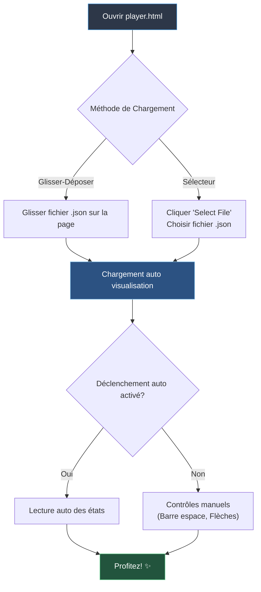

# Mode Lecteur SpaceFlow

## Aperçu

Le **Mode Lecteur** est une version minimale de SpaceFlow, conçue pour la distribution et permettant au public de profiter de vos créations sans la complexité de l'interface d'édition.

## Fonctionnalités

✨ **Chargement par Glisser-Déposer** — Il suffit de glisser un fichier preset `.json` sur le lecteur  
🎬 **Lecture Automatique** — Démarre automatiquement la lecture si le déclenchement automatique est activé  
⌨️ **Contrôles Clavier** — Utilisez la barre d'espace et les flèches pour contrôler la lecture  
📱 **Canvas Plein Écran** — Expérience de visualisation immersive et sans distraction  
🚫 **Pas d'Édition** — Interface épurée sans contrôles d'édition visibles  

---

## Mode d'Emploi

### Option 1 : Glisser-Déposer
1. Ouvrez `player.html` dans votre navigateur web
2. Glissez un fichier preset `.json` (créé avec l'Éditeur SpaceFlow) sur la page
3. La visualisation se chargera et démarrera automatiquement

### Option 2 : Sélecteur de Fichier
1. Ouvrez `player.html` dans votre navigateur web
2. Cliquez sur le bouton "Select File"
3. Choisissez un fichier preset `.json` depuis votre ordinateur
4. La visualisation se chargera et démarrera automatiquement

---

## Créer des Presets pour le Mode Lecteur

1. Ouvrez `index.html` (l'Éditeur principal ZigMap26)
2. Créez votre visualisation avec des états, couleurs et transitions
3. Activez **Auto-Trigger States** si vous souhaitez une lecture automatique
4. Cliquez sur **Enregistrer** dans la section Projet pour exporter un fichier `.json`
5. Partagez ce fichier `.json` avec votre public en même temps que `player.html`

---

## Raccourcis Clavier

| Touche | Action |
|--------|--------|
| **Barre d'espace** | Lecture / Pause du déclenchement automatique |
| **Flèche Gauche** | État précédent dans l'historique |
| **Flèche Droite** | Passer à l'état suivant |
| **ESC** | Sortir du plein écran (par défaut du navigateur) |

---

## Distribution

Pour partager votre travail avec d'autres :

1. **Incluez ces fichiers :**
   - `player.html`
   - `css/player.css`
   - Dossier `js/` (tous les fichiers .js et sous-dossiers)
   - Dossier `config/` (fichiers de configuration)
   - Votre fichier preset `.json`

2. **Hébergez en ligne** ou partagez comme un dossier

3. **Instructions pour les spectateurs :**
   - Ouvrez `player.html` dans un navigateur web moderne
   - Glissez le fichier `.json` fourni sur la page
   - Profitez !

---

## Détails Techniques

- **Pas de localStorage** — Le mode lecteur ne sauvegarde pas les paramètres
- **Pas de fonctions d'export** — Les spectateurs ne peuvent pas exporter en SVG/PNG/vidéo
- **Déclenchement automatique uniquement** — L'édition manuelle des états est désactivée
- **Dépendances minimales** — Ne nécessite que p5.js (chargé depuis le CDN)

---

## Compatibilité Navigateurs

- ✅ Chrome/Edge (recommandé)
- ✅ Firefox
- ✅ Safari

Nécessite un navigateur moderne avec support WebGL.

---

## Dépannage

**Erreur "Type de fichier invalide"**
- Assurez-vous de déposer un fichier `.json` créé avec l'Éditeur SpaceFlow
- Le fichier doit avoir l'extension `.json`

**La visualisation ne se charge pas**
- Vérifiez la console du navigateur pour les erreurs (F12)
- Assurez-vous que tous les fichiers sont dans la bonne structure de dossiers
- Essayez un autre fichier preset

**Le déclenchement automatique ne démarre pas**
- Le preset peut ne pas avoir le déclenchement automatique activé
- Essayez d'utiliser la barre d'espace pour démarrer manuellement la lecture
- Vérifiez que le preset contient plusieurs états

---

## Conseils de Performance

Pour de meilleures performances sur les appareils moins puissants :
- Réduisez le nombre de lignes dans vos presets
- Utilisez des durées de transition plus courtes
- Désactivez l'inversion de profondeur si non nécessaire
- Limitez le nombre d'états

---

Créé avec SpaceFlow v26 🎨
