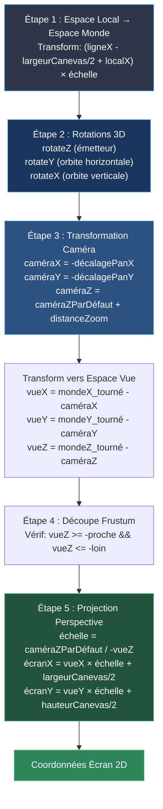

# Matrices de projection : conversion 3D WebGL vers 2D SVG

ddelcourt / mars 2026

---

## Table des matières

- [1. Le défi](#1-le-défi)
- [2. Le pipeline de transformation](#2-le-pipeline-de-transformation)
- [3. Implémentation](#3-implémentation)
- [4. Fondements mathématiques](#4-fondements-mathématiques)
- [5. Problèmes courants](#5-problèmes-courants)
- [6. Extension à d'autres projets](#6-extension-à-dautres-projets)
- [7. Références](#7-références)
- [8. Résumé](#8-résumé)

---

## 1. Le défi

### Contexte

Les scènes 3D sont rendues en WebGL accéléré par GPU, puis exportées en SVG pour l'impression, l'édition ou l'archivage. Ce processus pose un problème technique fondamental.

**WebGL** s'appuie sur le pipeline de transformation intégré du GPU :
- transformations de sommets
- multiplications de matrices
- division en perspective
- mapping de la fenêtre d'affichage

**SVG** est un format vectoriel 2D qui ne comprend que des coordonnées 2D, des chemins et des polygones — sans notion de profondeur ou de projection.

L'intégralité du pipeline de transformation 3D — normalement géré par le GPU — doit être répliquée en JavaScript pur pour générer des coordonnées SVG 2D correspondant exactement à la sortie WebGL.

### Pourquoi cette approche

- **Fidélité visuelle** : l'export SVG doit correspondre au rendu WebGL au pixel près
- **Débogage** : identifier quelle transformation a échoué en cas d'export incorrect
- **Flexibilité** : la projection CPU permet les cartes de profondeur, les effets personnalisés et le traitement analytique

### Contexte du ZigzagEmitter

Le ZigzagEmitter rend des rubans en zigzag dans l'espace 3D avec caméra contrôlable (rotation, zoom, panoramique), champ de vision ajustable, plans de découpe proche/lointain et rotations 3D appliquées à la géométrie. L'export SVG d'une image quelconque nécessite la reconstruction en temps réel de l'ensemble de ces transformations.

---

## 2. Le pipeline de transformation

Le processus 3D → 2D consiste en une série de changements de systèmes de coordonnées.



### Étape 1 : espace local → espace monde

Chaque ruban existe dans son propre système de coordonnées local. Pour le placer dans la scène :

```
mondeX = (ligneX - largeurCanevas/2 + localX) × échelle
mondeY = (ligneY - hauteurCanevas/2 + localY) × échelle
mondeZ = 0  // les rubans sont plats dans le plan XY
```

Le mode WEBGL de p5.js place l'origine `(0,0,0)` au centre de l'écran, pas au coin supérieur gauche — d'où la soustraction du demi-canevas.

### Étape 2 : rotations 3D

Trois rotations séquentielles, dans cet ordre précis :

1. **rotateZ** (rotation de l'émetteur) : rotation autour de l'axe Z (comme une roue)
2. **rotateY** (orbite horizontale) : rotation autour de l'axe vertical (gauche/droite)
3. **rotateX** (orbite verticale) : rotation autour de l'axe horizontal (haut/bas)

L'ordre de rotation est déterminant : `rotateX(rotateY(point))` produit des résultats différents de `rotateY(rotateX(point))`.

### Étape 3 : position de la caméra et transformation de vue

Le panoramique et le zoom de la caméra sont traités comme des décalages à la position effective de la caméra :

```
caméraX = -décalagePanX
caméraY = -décalagePanY
caméraZ = caméraZParDéfaut + distanceZoom
```

Transformation des coordonnées monde vers l'espace caméra/vue :

```
vueX = mondeX_tourné - caméraX
vueY = mondeY_tourné - caméraY
vueZ = mondeZ_tourné - caméraZ
```

Ce modèle mental est plus clair qu'appliquer des translations au milieu du pipeline de transformation. Lorsque l'utilisateur effectue un panoramique vers la droite, la caméra se déplace effectivement vers la gauche (d'où le signe négatif).

### Étape 4 : découpe du frustum

Vérification que le point se trouve dans le frustum de vision :

```
si (vueZ >= -proche || vueZ <= -loin) → rejeter le point
```

Les points trop proches ou trop lointains sont éliminés.

### Étape 5 : projection en perspective

Les objets plus éloignés apparaissent plus petits. Formule :

```
échelle = caméraZParDéfaut / -vueZ
écranX = vueX × échelle + largeurCanevas/2
écranY = vueY × échelle + hauteurCanevas/2
```

Les points plus éloignés (grand `vueZ` négatif) ont un facteur d'échelle plus petit ; les points proches un facteur plus grand. La division par `vueZ` crée la convergence vers un point de fuite.

### Étape 6 : sortie SVG

Les coordonnées finales `(écranX, écranY)` sont écrites dans le fichier SVG comme points 2D. L'information de profondeur est perdue, ou conservée séparément pour les cartes de profondeur.

---

## 3. Implémentation

### 3.1 Pseudocode

```
POUR chaque ruban dans la scène :
  verticesLocaux = ruban.construireVertices()

  POUR chaque vertex dans verticesLocaux :
    posMonde = localVersMonde(vertex, ruban.position, échelle)
    tourné1  = rotationZ(posMonde, angleÉmetteur)
    tourné2  = rotationY(tourné1, lacetCaméra)
    tourné3  = rotationX(tourné2, tangageCaméra)
    posVue   = translation(tourné3, -distanceCaméra)

    SI posVue.z hors de [proche, loin] :
      IGNORER ce vertex

    posÉcran = projectionPerspective(posVue, fov, tailleCanevas)
    pointsSVG.push(posÉcran)

  polygoneSVG = nouveau Polygone(pointsSVG)
  documentSVG.ajouter(polygoneSVG)
```

### 3.2 Implémentation JavaScript

```javascript
// Fonctions de rotation (matrices de rotation comme fonctions pures)
const rotX = (x, y, z, angle) => ({
  x: x,
  y: y * Math.cos(angle) - z * Math.sin(angle),
  z: y * Math.sin(angle) + z * Math.cos(angle)
});

const rotY = (x, y, z, angle) => ({
  x: x * Math.cos(angle) + z * Math.sin(angle),
  y: y,
  z: -x * Math.sin(angle) + z * Math.cos(angle)
});

const rotZ = (x, y, z, angle) => ({
  x: x * Math.cos(angle) - y * Math.sin(angle),
  y: x * Math.sin(angle) + y * Math.cos(angle),
  z: z
});

// Configuration de la caméra (pré-calculée une fois par export)
const fovRad = params.fov * Math.PI / 180;
const caméraZParDéfaut = (H / 2) / Math.tan(fovRad / 2);

// Position effective de la caméra (panoramique et zoom comme décalages de position)
const caméraX = -camera.offsetX;
const caméraY = -camera.offsetY;
const caméraZ = caméraZParDéfaut + camera.distance;

// Fonction de projection principale
function projectPoint(x, y, z) {
  // Étape 1 : appliquer les rotations dans l'ordre Z → Y → X
  let pt = rotZ(x, y, z, params.emitterRotation * Math.PI / 180);
  pt = rotY(pt.x, pt.y, pt.z, camera.rotationY);
  pt = rotX(pt.x, pt.y, pt.z, camera.rotationX);

  // Étape 2 : transformer vers l'espace caméra/vue
  // Soustraire la position de la caméra de la position monde
  const vueX = pt.x - caméraX;
  const vueY = pt.y - caméraY;
  const vueZ = pt.z - caméraZ;

  // Étape 3 : découpe du frustum
  if (vueZ >= -params.near || vueZ <= -params.far) {
    return null;
  }

  // Étape 4 : projection en perspective
  const échelle = caméraZParDéfaut / -vueZ;
  return {
    x: vueX * échelle + W / 2,
    y: vueY * échelle + H / 2
  };
}

// Conversion coordonnées locales → espace monde → projection
const valÉchelle = params.geometryScale / 100;

const versÉcran = (ligne, pointsLocaux) => pointsLocaux
  .map(pt => ({
    x: ((ligne.x - W / 2) + pt.x) * valÉchelle,
    y: ((ligne.y - H / 2) + pt.y) * valÉchelle,
    z: 0
  }))
  .map(pt => projectPoint(pt.x, pt.y, pt.z))
  .filter(Boolean);  // Enlever les nulls (points découpés)

// Générer le polygone SVG
const pointsÉcran = versÉcran(ligne, verticesLocaux);
const polygoneSVG = document.createElementNS('http://www.w3.org/2000/svg', 'polygon');
polygoneSVG.setAttribute('points',
  pointsÉcran.map(p => `${p.x.toFixed(2)},${p.y.toFixed(2)}`).join(' ')
);
```

### 3.3 Points d'implémentation clés

**Conversion du système de coordonnées**
```javascript
mondeX = (ligne.x - W/2 + localX) * échelle
mondeY = (ligne.y - H/2 + localY) * échelle
```

**Ordre de rotation**
L'ordre **Z → Y → X** correspond à la pile de transformation de p5.js WEBGL. Tout autre ordre produit des résultats incorrects.

**Convention Z négatif**
OpenGL (et p5.js) utilise un système de coordonnées à droite : +X = droite, +Y = haut, **−Z = avant** (vers l'écran). D'où l'utilisation de `−vueZ` dans les divisions et la condition `z <= −loin`.

**Modèle de position de la caméra**
```javascript
caméraZParDéfaut = (hauteur / 2) / Math.tan(fovRad / 2)
caméraX = -décalagePanX  // Quand l'utilisateur effectue un panoramique à droite, la caméra se déplace à gauche
caméraY = -décalagePanY  // Quand l'utilisateur effectue un panoramique vers le bas, la caméra se déplace vers le haut
caméraZ = caméraZParDéfaut + distanceZoom
```

Cette formule garantit que le champ de vision se comporte de manière identique au moteur de rendu WEBGL de p5. Traiter le panoramique et le zoom comme des décalages de position de caméra (plutôt que des transformations mondiales) simplifie les calculs et rend le modèle mental plus clair.

---

## 4. Fondements mathématiques

### 4.1 Matrices de rotation

Chaque rotation est une multiplication de matrice orthogonale 3×3.

#### Rotation autour de l'axe X (tangage)
```
Rₓ(θ) = ┌ 1    0        0     ┐
         │ 0  cos(θ)  -sin(θ) │
         └ 0  sin(θ)   cos(θ) ┘

x' = x
y' = y·cos(θ) - z·sin(θ)
z' = y·sin(θ) + z·cos(θ)
```

#### Rotation autour de l'axe Y (lacet)
```
Rᵧ(θ) = ┌ cos(θ)   0  sin(θ) ┐
         │   0      1    0    │
         └-sin(θ)   0  cos(θ) ┘

x' =  x·cos(θ) + z·sin(θ)
y' =  y
z' = -x·sin(θ) + z·cos(θ)
```

#### Rotation autour de l'axe Z (roulis)
```
Rᴢ(θ) = ┌ cos(θ)  -sin(θ)  0 ┐
         │ sin(θ)   cos(θ)  0 │
         └   0        0     1 ┘

x' = x·cos(θ) - y·sin(θ)
y' = x·sin(θ) + y·cos(θ)
z' = z
```

### 4.2 Rotation composite

Application des rotations en séquence **Z → Y → X** :

```
R_combinée = Rₓ · Rᵧ · Rᴢ

[x'']
[y''] = Rₓ(θₓ) · Rᵧ(θᵧ) · Rᴢ(θᴢ) · [x, y, z]ᵀ
[z'']
```

La multiplication matricielle n'est pas commutative : `A·B ≠ B·A`. L'ordre de rotation détermine le résultat.

### 4.3 Formule de projection en perspective

Dérivée des triangles semblables dans l'espace 3D.

#### Dérivation géométrique

Pour un point `P = (x, y, z)` observé depuis une caméra en `(0, 0, 0)` :

```
                P(x, y, z)
               /|
              / |
             /  | y
            /   |
           /    |
    Caméra ──────┘
         distance z

    Plan d'écran à distance d
```

Par triangles semblables :
```
écranY / d = y / z
écranY = (y · d) / z
```

La distance focale `d` est calculée à partir du champ de vision :
```
d = (hauteurCanevas / 2) / tan(fov / 2)
```

#### Équations de projection complètes

```
échelle = distanceFocale / -z

écranX = x · échelle + largeurCanevas / 2
écranY = y · échelle + hauteurCanevas / 2
```

La division par `−z` s'explique par la convention : la caméra regarde le long de l'axe Z négatif. Un point à `z = −100` est plus éloigné qu'un point à `z = −10`.

### 4.4 Champ de vision et distance focale

```
tan(fov/2) = (hauteurCanevas/2) / distanceFocale

distanceFocale = (hauteurCanevas/2) / tan(fov/2)
```

- **FOV large** (ex. 90°) → distance focale courte → distorsion grand angle
- **FOV étroit** (ex. 30°) → distance focale longue → compression téléobjectif

### 4.5 Plans de découpe du frustum

Le frustum est une pyramide tronquée définie par :
```
-proche ≤ z ≤ -loin  (dans l'espace de vue)
```

- **Plan proche** : les points trop proches (derrière la caméra ou sous le seuil) sont rejetés
- **Plan lointain** : les points au-delà sont éliminés pour la performance et la stabilité numérique

Condition de découpe :
```
si (z >= -proche || z <= -loin) : rejeter le point
```

### 4.6 Pipeline complet comme matrice homogène

L'ensemble du pipeline s'exprime comme une matrice de transformation homogène 4×4 :

```
[x_écran  ]     [Projection] [Vue] [Modèle] [x_local]
[y_écran  ]  =  [          ] [    ] [      ] [y_local]
[z_profond]     [          ] [    ] [      ] [z_local]
[    w    ]     [          ] [    ] [      ] [   1   ]
```

- **Matrice modèle** = translation vers l'espace monde × échelle × rotation émetteur (Z)
- **Matrice vue** = rotation caméra (Y puis X) × translation caméra
- **Matrice projection** = division perspective + mise à l'échelle de la fenêtre

Le code calcule ces transformations séquentiellement plutôt que de construire des matrices explicites — le résultat mathématique est identique.

---

## 5. Problèmes courants

### L'export SVG ne correspond pas au rendu WebGL

Causes possibles : mauvais ordre de rotation, conversion incorrecte du système de coordonnées, facteur d'échelle manquant, FOV calculé incorrectement.

La fonction `projectPoint()` doit répliquer exactement l'ordre de la pile de transformation de p5.js.

### Objets étirés ou compressés

Cause : le calcul du FOV ne tient pas compte du ratio d'aspect ou utilise une formule incorrecte.

Solution : utiliser `(hauteur/2) / tan(fov/2)` pour la distance focale.

### Artefacts de découpe (géométrie qui disparaît)

Cause : plan proche trop lointain, ou plan lointain trop proche.

Solution : s'assurer que `proche >= 0.01` et `loin >> plage de profondeur de la scène`.

### Problèmes de performance avec de grandes scènes

Cause : la projection de milliers de points par image est intensive pour le CPU.

Solutions :
- Utiliser WebGL pour le rendu en temps réel
- N'exécuter la projection CPU qu'à l'export
- Appliquer une élimination spatiale avant la projection

---

## 6. Extension à d'autres projets

### Adaptation du système de projection

1. **Identifier les conventions du système de coordonnées 3D** : emplacement de l'origine, directions des axes, orientation (main droite ou gauche)
2. **Extraire les paramètres de transformation** : position et rotation de la caméra, positions et rotations des objets, facteurs d'échelle, FOV
3. **Implémenter les fonctions de rotation** en utilisant les formules de la section 4.1, dans le bon ordre
4. **Calculer les constantes de projection** : conversion FOV → distance focale, plans proche/lointain
5. **Appliquer le pipeline** : Local → Monde → Vue → Découpe → Projection → Écran

### Exemple Three.js

```javascript
const camera = scene.camera;
const viewMatrix = camera.matrixWorldInverse;
const projectionMatrix = camera.projectionMatrix;

function projectToScreen(worldPosition, width, height) {
  const clipSpace = worldPosition
    .applyMatrix4(viewMatrix)
    .applyMatrix4(projectionMatrix);

  // Division en perspective
  const ndc = {
    x: clipSpace.x / clipSpace.w,
    y: clipSpace.y / clipSpace.w
  };

  // NDC vers espace écran
  return {
    x: (ndc.x + 1) * width / 2,
    y: (1 - ndc.y) * height / 2  // Retourner Y pour SVG
  };
}
```

### Cartes de profondeur et Z-buffers

La même projection peut conserver la valeur de profondeur :

```javascript
function projectWithDepth(x, y, z) {
  // ... rotations et transformations ...
  const échelle = caméraZParDéfaut / -pt.z;
  return {
    x: pt.x * échelle + W / 2,
    y: pt.y * échelle + H / 2,
    profondeur: -pt.z  // Profondeur en espace de vue
  };
}
```

Cas d'usage : cartes de profondeur (niveaux de gris encodant la distance), élimination par occlusion, tri de profondeur (Z-buffer), intégration 3D.

---

## 7. Références

### Fondements mathématiques
- **Computer Graphics: Principles and Practice** (Foley et al.) — chapitres sur les matrices de transformation
- **Real-Time Rendering** (Möller & Haines) — dérivations de projection en perspective
- **Mathematics for 3D Game Programming** (Lengyel) — matrices de rotation

### Documentation p5.js
- [Mode WEBGL p5.js](https://p5js.org/reference/#group-3D)
- [Référence caméra p5.js](https://p5js.org/reference/#/p5.Camera)
- [Fonctions de transformation p5.js](https://p5js.org/reference/#group-Transform)

### Concepts connexes
- Pipeline de transformation OpenGL
- Coordonnées homogènes (représentation 4D des transformations 3D)
- Quaternions (représentation alternative de rotation, évite le blocage de cardan)

---

## 8. Résumé

La conversion 3D → SVG du ZigzagEmitter constitue une réimplémentation complète du pipeline de transformation GPU en JavaScript CPU.

**Points clés :**

1. **Pipeline en six étapes** : Local → Monde → Rotation → Translation → Découpe → Projection
2. **Ordre de rotation** : Z → Y → X (doit correspondre à p5.js WEBGL)
3. **Formule de perspective** : `échelle = distanceFocale / −vueZ`
4. **Relation FOV** : `distanceFocale = (hauteur/2) / tan(fov/2)`
5. **Système de coordonnées** : p5.js WEBGL utilise l'origine centrale et −Z vers l'avant

Cette approche produit des exports correspondant exactement au rendu WebGL, car elle utilise des mathématiques identiques à celles du moteur graphique.

---

Version : 1.0 — 
Référence code source : `ZigzagEmitter`, export SVG et fonctions de projection


