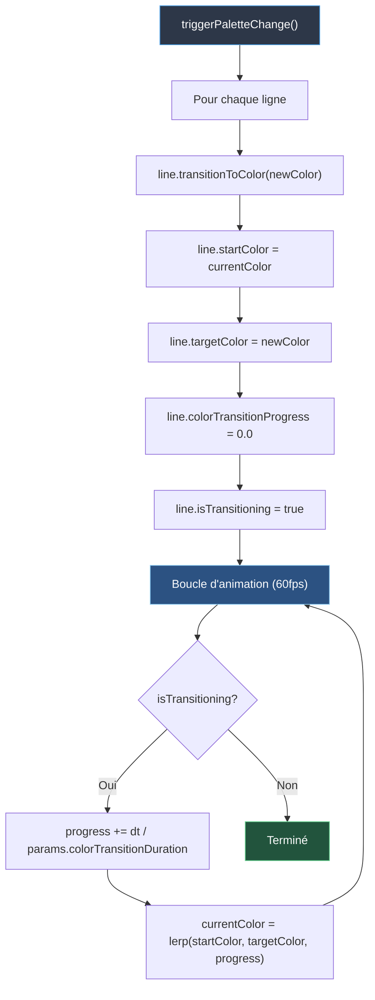

# Architecture du Système de Transitions SpaceFlow

## Table des Matières
1. [Aperçu](#aperçu)
2. [Types de Transitions](#types-de-transitions)
3. [Système de Transition de Couleurs](#système-de-transition-de-couleurs)
4. [Système de Transition d'États](#système-de-transition-détats)
5. [Synchronisation Multi-Fenêtres](#synchronisation-multi-fenêtres)
6. [Paramètres de Durée](#paramètres-de-durée)
7. [Flux du Code](#flux-du-code)
8. [Détails Techniques](#détails-techniques)

---

## Aperçu

SpaceFlow implémente un système sophistiqué de double transition qui permet des changements animés fluides entre :
- **Palettes de couleurs** (transitions de couleur par ligne + arrière-plan)
- **Paramètres d'état** (caméra, FOV, échelle de géométrie, rotation de l'émetteur)

Le système est conçu avec une **synchronisation parfaite** entre plusieurs fenêtres, garantissant que l'éditeur principal et les fenêtres d'affichage secondaires montrent des animations identiques avec une précision image par image.

### Philosophie de Conception

1. **Animation Décentralisée** : Chaque ligne anime sa propre transition de couleur indépendamment
2. **Timing Partagé** : Toutes les transitions lisent depuis `ZM.params` partagé pour un timing cohérent
3. **Mises à Jour par Frame** : Les transitions se mettent à jour dans la boucle d'animation (60fps)
4. **Architecture Propre** : Objets de transition séparés pour chaque propriété animable

---

## Types de Transitions

### 1. Transitions de Couleurs
**Durée** : `colorTransitionDuration` (0-30 secondes)
**Contrôles** : Changements de palette (touches 1, 2, 3, 4)
**Portée** : Par ligne + arrière-plan

### 2. Transitions d'États
**Durée** : `stateTransitionDuration` (0-30 secondes)
**Contrôles** : Chargement d'état (FlècheGauche, FlècheDroite, chargement de preset)
**Portée** : Caméra, FOV, échelle de géométrie, rotation de l'émetteur

---

## Système de Transition de Couleurs

### Architecture

Les transitions de couleurs utilisent une approche **distribuée par ligne** où chaque instance `ZigzagLine` gère sa propre animation de couleur :



### Composants Clés

#### 1. **Classe ZigzagLine** (`js/core/ZigzagLine.js`)

Chaque instance de ligne contient :
```javascript
{
  currentColor: [r, g, b],          // Couleur d'affichage en cache
  startColor: [r, g, b],            // Début de la transition
  targetColor: [r, g, b],           // Cible de la transition
  colorTransitionProgress: 0.0-1.0, // Progression de l'animation
  isTransitioning: boolean,         // Indicateur d'animation active
  params: reference to ZM.params    // Source de timing partagée
}
```

**Déclencheur de Transition** (`transitionToColor()`) :
```javascript
transitionToColor(newColor, newColorSlotIndex) {
  this.startColor = [...this.currentColor];  // Se souvenir d'où on part
  this.targetColor = [...newColor];
  this.colorTransitionProgress = 0.0;
  this.isTransitioning = true;
}
```

**Mise à Jour par Frame** (`update(dt)`) :
```javascript
if (this.isTransitioning) {
  this.colorTransitionProgress += dt / this.params.colorTransitionDuration;
  
  if (this.colorTransitionProgress >= 1.0) {
    // Transition terminée
    this.colorTransitionProgress = 1.0;
    this.currentColor = [...this.targetColor];
    this.isTransitioning = false;
  } else {
    // Interpoler la couleur
    this.currentColor = lerpColor(
      this.startColor, 
      this.targetColor, 
      this.colorTransitionProgress
    );
  }
}
```

#### 2. **Transition de l'Arrière-plan** (`js/rendering/SketchFactory.js`)

La couleur de l'arrière-plan utilise un objet de transition **centralisé** :
```javascript
ZM.bgTransition = {
  current: [r, g, b],   // Couleur d'affichage actuelle
  start: [r, g, b],     // Début de la transition
  target: [r, g, b],    // Cible de la transition
  progress: 0.0-1.0,    // Progression de l'animation
  isTransitioning: boolean
}
```

**Déclencheur** (`triggerPaletteChange()`) :
```javascript
const newBg = getBackgroundColor(ZM.params);
ZM.bgTransition.start = [...ZM.bgTransition.current];
ZM.bgTransition.target = newBg;
ZM.bgTransition.progress = 0.0;
ZM.bgTransition.isTransitioning = true;
```

**Animation** (canvas principal uniquement) :
```javascript
if (ZM.bgTransition.isTransitioning) {
  ZM.bgTransition.progress += dt / ZM.params.colorTransitionDuration;
  
  if (ZM.bgTransition.progress >= 1.0) {
    ZM.bgTransition.progress = 1.0;
    ZM.bgTransition.current = [...ZM.bgTransition.target];
    ZM.bgTransition.isTransitioning = false;
  } else {
    ZM.bgTransition.current = lerpColor(
      ZM.bgTransition.start,
      ZM.bgTransition.target,
      ZM.bgTransition.progress
    );
  }
}
```

#### 3. **Fonction de Déclenchement** (`js/core/colorUtils.js`)

```javascript
export function triggerPaletteChange(ZM) {
  // Transitionner toutes les lignes existantes
  if (ZM.emitterInstance && ZM.emitterInstance.lines) {
    for (const line of ZM.emitterInstance.lines) {
      const newColor = getColorForSlot(ZM.params, line.colorSlotIndex);
      line.transitionToColor(newColor, line.colorSlotIndex);
    }
  }
  
  // Transitionner l'arrière-plan
  if (ZM.bgTransition) {
    const newBg = getBackgroundColor(ZM.params);
    ZM.bgTransition.start = [...ZM.bgTransition.current];
    ZM.bgTransition.target = newBg;
    ZM.bgTransition.progress = 0.0;
    ZM.bgTransition.isTransitioning = true;
  }
}
```

### Pourquoi Cette Conception Fonctionne

1. **Pas de Diffusion Nécessaire** : Chaque ligne lit `this.params.colorTransitionDuration` directement
2. **Synchronisation Automatique** : Toutes les fenêtres partagent la même structure d'objet de paramètres
3. **Efficace en Mémoire** : Pas de suivi central de milliers de transitions
4. **Précision Frame-Parfaite** : Les lignes dans différentes fenêtres progressent de manière identique (même dt, même durée)
5. **Logique Propre** : Chaque ligne est autonome

### Interpolation de Couleur

Utilise l'interpolation RGB linéaire (`lerpColor()`) :
```javascript
function lerpColor(c1, c2, t) {
  return [
    c1[0] + (c2[0] - c1[0]) * t,
    c1[1] + (c2[1] - c1[1]) * t,
    c1[2] + (c2[2] - c1[2]) * t
  ];
}
```

---

## Système de Transition d'États

### Architecture

Les transitions d'états utilisent des **objets de transition centralisés** gérés au niveau de l'application :

```
loadState() / navigateHistory()
  ↓
restoreState(state, instant=false)
  ↓
Configuration des transitions :
  - camera.transitionTo(...)
  - fovTransition.setup(...)
  - geometryScaleTransition.setup(...)
  - emitterRotationTransition.setup(...)
  ↓
broadcastStateLoad(state, instant)
  ↓
Les fenêtres d'affichage appellent restoreState()
  ↓
Boucle d'animation (TOUTES les fenêtres) :
  Mise à jour de tous les objets de transition
```

### Objets de Transition

#### 1. **Transition de Caméra** (`ZM.camera.transition`)

```javascript
ZM.camera.transition = {
  isActive: boolean,
  duration: milliseconds,
  progress: 0.0-1.0,
  // Positions de départ
  startRotationX, startRotationY,
  startDistance, startOffsetX, startOffsetY,
  // Positions cibles
  targetRotationX, targetRotationY,
  targetDistance, targetOffsetX, targetOffsetY
}
```

**Configuration** (`camera.transitionTo()`) :
```javascript
transitionTo(rotX, rotY, dist, offX, offY) {
  this.transition.startRotationX = this.rotationX;
  this.transition.startRotationY = this.rotationY;
  // ... stocker toutes les valeurs de départ
  
  this.transition.targetRotationX = rotX;
  this.transition.targetRotationY = rotY;
  // ... stocker toutes les valeurs cibles
  
  this.transition.progress = 0.0;
  this.transition.duration = ZM.params.stateTransitionDuration * 1000;
  this.transition.isActive = true;
}
```

**Animation** :
```javascript
if (ZM.camera.transition.isActive) {
  ZM.camera.updateTransition(dt);
  // Synchroniser avec les params pour cohérence
  ZM.params.cameraRotationX = ZM.camera.rotationX;
  ZM.params.cameraRotationY = ZM.camera.rotationY;
  // ... synchroniser tous les params de caméra
}
```

#### 2. **Transition FOV** (`ZM.fovTransition`)

```javascript
ZM.fovTransition = {
  current: number,
  start: number,
  target: number,
  progress: 0.0-1.0,
  duration: milliseconds,
  isTransitioning: boolean
}
```

**Configuration** (`restoreState()`) :
```javascript
ZM.fovTransition.start = ZM.fovTransition.current;
ZM.fovTransition.target = state.params.fov;
ZM.fovTransition.progress = 0.0;
ZM.fovTransition.duration = ZM.params.stateTransitionDuration;
ZM.fovTransition.isTransitioning = true;
```

**Animation** (easing cubique entrée-sortie) :
```javascript
if (ZM.fovTransition.isTransitioning) {
  ZM.fovTransition.progress += dt / ZM.fovTransition.duration;
  
  if (ZM.fovTransition.progress >= 1.0) {
    ZM.fovTransition.current = ZM.fovTransition.target;
    ZM.fovTransition.isTransitioning = false;
  } else {
    // Easing cubique
    const t = ZM.fovTransition.progress < 0.5
      ? 4 * p * p * p
      : 1 - Math.pow(-2 * p + 2, 3) / 2;
    ZM.fovTransition.current = start + (target - start) * t;
  }
}
```

#### 3. **Transition d'Échelle de Géométrie** (`ZM.geometryScaleTransition`)

Même structure que la transition FOV, contrôle le paramètre `segmentLength`.

#### 4. **Transition de Rotation de l'Émetteur** (`ZM.emitterRotationTransition`)

Même structure que la transition FOV, contrôle le paramètre `emitterRotation`.

### Fonctions d'Easing

Les transitions d'états utilisent un **easing cubique entrée-sortie** pour un mouvement fluide et naturel :
```javascript
const easeInOutCubic = (t) => {
  return t < 0.5
    ? 4 * t * t * t
    : 1 - Math.pow(-2 * t + 2, 3) / 2;
};
```

---

## Synchronisation Multi-Fenêtres

### Stratégie de Synchronisation

SpaceFlow utilise une approche **diffuser une fois, animer localement** :

1. **Fenêtre principale** charge l'état → configure les transitions → diffuse le message `state-load`
2. **Fenêtres d'affichage** reçoivent le message → appellent le même `restoreState()` → configurent des transitions identiques
3. **Toutes les fenêtres** animent les transitions indépendamment en utilisant des durées partagées

### Pourquoi Cela Fonctionne

```
Fenêtre Principale :           Fenêtres d'Affichage :
├─ restoreState()             ├─ restoreState()
├─ camera.transitionTo()      ├─ camera.transitionTo()
├─ fovTransition.setup()      ├─ fovTransition.setup()
└─ broadcast("state-load")    └─ receive("state-load")
       │                             │
       └─────────────────────────────┘
                    │
          Mêmes Paramètres
          Mêmes Durées
          Mêmes Valeurs Départ/Cible
                    │
            ┌───────┴───────┐
            │               │
    Boucle Animation   Boucle Animation
    progress += dt     progress += dt
    lerp(s, t, p)      lerp(s, t, p)
```

### Points de Synchronisation Clés

#### 1. **Connexion Initiale** (`full-sync`)

Quand une fenêtre d'affichage se connecte :
```javascript
// La fenêtre principale envoie tout y compris les états de transition
{
  type: 'full-sync',
  params: ZM.params,  // Inclut tous les paramètres
  camera: { 
    rotationX, rotationY, distance, offsetX, offsetY,
    transition: {
      isActive: boolean,
      progress: 0.0-1.0,
      duration: millisecondes,
      startRotationX, targetRotationX,
      // ... tout l'état de transition
    }
  },
  fovTransition: { current, target, start, progress, isTransitioning, duration },
  geometryScaleTransition: { current, target, start, progress, isTransitioning, duration },
  emitterRotationTransition: { current, target, start, progress, isTransitioning, duration },
  bgTransition: { current, target, start, progress, isTransitioning }
}

// La fenêtre d'affichage reçoit et vérifie les états de transition
if (camera.transition.isActive) {
  // La principale est en transition - correspondre à la transition
  ZM.camera.transitionTo(valeurs cibles);
  ZM.camera.transition.progress = camera.transition.progress;
  ZM.camera.transition.duration = camera.transition.duration;
  ZM.camera.transition.isActive = true;
  // Définir la position actuelle pour correspondre à celle de la principale
} else {
  // La principale N'EST PAS en transition - s'ajuster aux valeurs actuelles
  ZM.camera.rotationX = camera.rotationX;
  ZM.camera.transition.isActive = false;
}

// Même modèle pour la géométrie, FOV, rotation émetteur, arrière-plan
```

**Décision de Conception Clé** : Les fenêtres d'affichage **respectent les transitions en cours** de la fenêtre principale.
- Si la principale est en mi-transition → l'affichage démarre une transition correspondante
- Si la principale est inactive → l'affichage s'ajuste aux valeurs actuelles
- Assure une synchronisation image par image même lors de la connexion en mi-animation

#### 2. **Changements d'États** (commandes de transition)

Quand un état est chargé, la fenêtre principale diffuse des commandes de transition spécifiques :

```javascript
// La fenêtre principale envoie des commandes de transition individuelles
broadcastCameraTransition(target, duration);
broadcastGeometryTransition(targetScale, duration);
broadcastFOVTransition(targetFOV, duration);
broadcastEmitterRotationTransition(targetRotation, duration);

// Exemples de messages :
{
  type: 'camera-transition',
  target: { rotationX, rotationY, distance, offsetX, offsetY },
  duration: 3000  // millisecondes
}

{
  type: 'geometry-transition',
  targetScale: 219,
  duration: 3000
}

// Les fenêtres d'affichage reçoivent et démarrent des transitions correspondantes
ZM.camera.transitionTo(target.rotationX, target.rotationY, ...);
ZM.camera.transition.duration = duration;

ZM.geometryScaleTransition.start = current;
ZM.geometryScaleTransition.target = targetScale;
ZM.geometryScaleTransition.duration = duration;
ZM.geometryScaleTransition.isTransitioning = true;

// Toutes les fenêtres animent ensuite indépendamment avec des paramètres identiques
```

**Pourquoi des commandes de transition séparées ?**
- **Synchronisation explicite** : Chaque type de transition obtient son propre message dédié
- **Timing image par image** : Toutes les fenêtres reçoivent la commande et démarrent la transition simultanément
- **Séparation propre** : Caméra, géométrie, FOV, rotation émetteur gérés indépendamment
- **Livraison fiable** : Les messages dédiés assurent que les transitions ne sont pas perdues dans full-sync

#### 3. **Contrôle Manuel de la Caméra** (`camera-immediate`)

Pendant l'interaction en temps réel (glissement souris, panoramique, zoom) :

```javascript
// La principale diffuse à 60fps (limité)
{
  type: 'camera-immediate',
  state: {
    rotationX, rotationY, distance, offsetX, offsetY,
    emitterRotation  // pour le contrôle de rotation Z
  }
}

// Les fenêtres d'affichage s'ajustent instantanément (sans transition)
ZM.camera.rotationX = state.rotationX;
ZM.camera.transition.isActive = false;  // Annuler toute transition en cours
```

**Le contrôle en temps réel remplace toujours les transitions** pour fournir une interaction manuelle réactive.

#### 4. **Changements de Curseur en Temps Réel** (`delta-sync`)

Quand l'utilisateur déplace les curseurs :
```javascript
// Diffusions limitées (~60fps)
{
  type: 'delta-sync',
  changes: {
    colorTransitionDuration: 15.0,
    // ... autres params
  }
}

// Les fenêtres d'affichage mettent à jour ZM.params
Object.assign(ZM.params, changes);
```

### Décision de Conception Critique : Diffusion des Curseurs

**Problème** : Si les curseurs ne diffusent que lors du relâchement de la souris, les fenêtres d'affichage peuvent avoir des valeurs obsolètes.

**Solution** : Diffuser pendant le glissement (événement `input`) **en plus** du relâchement :

```javascript
slider.addEventListener('input', () => {
  // Mettre à jour les params locaux immédiatement
  ZM.params[paramKey] = parseFloat(slider.value);
  
  // Diffuser aux fenêtres d'affichage (limité par WindowSync)
  if (ZM.windowSync && ZM.windowSync.broadcastParamChanges) {
    ZM.windowSync.broadcastParamChanges({ 
      [paramKey]: ZM.params[paramKey] 
    });
  }
});
```

Cela garantit que si l'utilisateur :
1. Fait glisser le curseur Transition de Couleur à 15 secondes
2. Appuie sur une touche de palette (1, 2, 3, 4) **avant de relâcher la souris**
3. Toutes les fenêtres utilisent 15 secondes pour la transition

---

## Paramètres de Durée

### Durée de Transition de Couleur

**Paramètre** : `colorTransitionDuration` (secondes)
**Plage** : 0 - 30 secondes
**Défaut** : 3 secondes
**Portée** : À l'échelle du projet (préservé lors des chargements d'état)

**Utilisé par** :
- Transitions de couleur ZigzagLine
- Transitions de couleur d'arrière-plan

**Emplacement du code** :
```javascript
// Animation par ligne
this.colorTransitionProgress += dt / this.params.colorTransitionDuration;

// Animation d'arrière-plan
ZM.bgTransition.progress += dt / ZM.params.colorTransitionDuration;
```

### Durée de Transition d'État

**Paramètre** : `stateTransitionDuration` (secondes)
**Plage** : 0 - 30 secondes
**Défaut** : 30 secondes
**Portée** : À l'échelle du projet (préservé lors des chargements d'état)

**Utilisé par** :
- Transitions de caméra
- Transitions FOV
- Transitions d'échelle de géométrie
- Transitions de rotation de l'émetteur

**Emplacement du code** :
```javascript
// Caméra
this.transition.duration = ZM.params.stateTransitionDuration * 1000; // ms

// FOV
ZM.fovTransition.duration = ZM.params.stateTransitionDuration;

// Géométrie
ZM.geometryScaleTransition.duration = ZM.params.stateTransitionDuration;

// Rotation de l'Émetteur
ZM.emitterRotationTransition.duration = ZM.params.stateTransitionDuration;
```

### Paramètres à l'Échelle du Projet

Les deux paramètres de durée sont marqués comme "à l'échelle du projet" et sont **préservés** lors du chargement des états :

```javascript
// Dans restoreState()
const preservedSettings = {
  stateTransitionDuration: ZM.params.stateTransitionDuration,
  colorTransitionDuration: ZM.params.colorTransitionDuration,
  // ... autres paramètres à l'échelle du projet
};

// Appliquer les params d'état
Object.assign(ZM.params, state.params);

// Restaurer les paramètres préservés
Object.assign(ZM.params, preservedSettings);
```

Cela garantit un timing de transition cohérent à travers tous les changements d'état dans un projet.

---

## Flux du Code

### Flux de Transition de Couleur

```
Action Utilisateur : Appuyer sur une touche de palette (1, 2, 3, 4)
  ↓
KeyboardHandler.js : executeAction('loadPalette', index)
  ↓
UIController.js : selectPalette(index)
  ↓
Mise à jour ZM.params.activePaletteIndex
  ↓
triggerPaletteChange(ZM)
  ↓
Pour chaque ligne : line.transitionToColor(newColor)
  ↓
Arrière-plan : bgTransition.start → target
  ↓
broadcastParamChanges({ activePaletteIndex, palettes })
  ↓
Fenêtres d'Affichage : Recevoir delta-sync
  ↓
Affichage : Mise à jour params → triggerPaletteChange()
  ↓
Boucle d'Animation (TOUTES les fenêtres) :
  ├─ Lignes : progress += dt / colorTransitionDuration
  ├─ Lignes : currentColor = lerp(start, target, progress)
  └─ Arrière-plan : bgTransition anime
```

### Flux de Transition d'État

```
Action Utilisateur : FlècheGauche/FlècheDroite ou charger état
  ↓
StateManager.js : navigateHistory(direction) / loadState(id)
  ↓
restoreState(ZM, state, instant=false)
  ↓
Configuration des transitions :
  ├─ camera.transitionTo(...)
  ├─ fovTransition : start → target, progress = 0
  ├─ geometryScaleTransition : start → target, progress = 0
  └─ emitterRotationTransition : start → target, progress = 0
  ↓
broadcastStateLoad(state, instant=false)
  ↓
Fenêtres d'Affichage : Recevoir state-load
  ↓
Affichage : restoreState(state, instant)
  ↓
Affichage : Configuration de transitions identiques
  ↓
Boucle d'Animation (TOUTES les fenêtres) :
  ├─ camera.updateTransition(dt)
  ├─ fovTransition.progress += dt / duration
  ├─ geometryScaleTransition.progress += dt / duration
  └─ emitterRotationTransition.progress += dt / duration
```

### Flux de Curseur en Temps Réel

```
Action Utilisateur : Glisser le curseur Transition de Couleur
  ↓
UIController.js : événement slider 'input'
  ↓
ZM.params.colorTransitionDuration = newValue
  ↓
broadcastParamChanges({ colorTransitionDuration: newValue })
  ↓
WindowSync.js : Limiter la diffusion (~60fps)
  ↓
Fenêtres d'Affichage : Recevoir delta-sync
  ↓
Affichage : Object.assign(ZM.params, changes)
  ↓
Affichage : ZM.params.colorTransitionDuration = newValue
  ↓
Frame Suivante : Toutes les lignes lisent la valeur mise à jour
  ↓
progress += dt / this.params.colorTransitionDuration
```

---

## Détails Techniques

### Delta Time (dt)

Toutes les transitions utilisent un timing indépendant des frames :

```javascript
// Dans SketchFactory.js draw()
const now = Date.now();
const dt = (now - lastFrameTime) / 1000.0; // Convertir en secondes
lastFrameTime = now;

// Calcul de progression (normalisé à 0-1)
progress += dt / durationInSeconds;
```

Cela garantit :
- **60fps** : dt ≈ 0.0167 secondes
- **30fps** : dt ≈ 0.0333 secondes
- **Vitesse d'animation cohérente** indépendamment du taux de frames

### Gestion de la Mémoire

**Transitions de couleur par ligne** :
- Chaque ligne stocke 3 tableaux de couleurs (12 flottants)
- Pas de suivi central requis
- Les lignes sont ramassées par le garbage collector quand elles quittent la fenêtre d'affichage
- La mémoire évolue avec le nombre de lignes visibles (~100-500 lignes)

**Transitions d'états** :
- Nombre fixe d'objets de transition (4)
- Allocation unique, réutilisée pour tous les changements d'état
- Pas d'allocations par frame

### Considérations de Performance

1. **Mises à Jour Conditionnelles** : Mise à jour seulement si `isTransitioning === true`
2. **Sortie Anticipée** : Arrêter de vérifier quand `progress >= 1.0`
3. **Lerp en Cache** : Stocker les valeurs interpolées, ne pas recalculer à chaque frame
4. **Diffusions Limitées** : WindowSync limite à 16ms (~60fps max)

### Optimisation des Fenêtres d'Affichage

Les fenêtres d'affichage sautent certaines opérations :
- Pas de mises à jour UI (`syncUIWithoutRestart()`)
- Pas de sauvegardes localStorage
- Pas d'opérations d'export

Mais elles **participent pleinement** à toutes les transitions :
```javascript
// Dans SketchFactory.js
// Mettre à jour les transitions (dans TOUS les canvas y compris fenêtres d'affichage)
if (ZM.camera.transition.isActive) { ... }
if (ZM.fovTransition.isTransitioning) { ... }
if (ZM.geometryScaleTransition.isTransitioning) { ... }
```

---

## Résumé

Le système de transition SpaceFlow réalise une **synchronisation multi-fenêtres parfaite** grâce à :

1. **Paramètres Partagés** : Toutes les fenêtres lisent depuis `ZM.params` structuré de manière identique
2. **Animation Distribuée** : Les lignes s'animent elles-mêmes en utilisant un timing partagé
3. **Commandes de Transition Explicites** : Messages de diffusion dédiés pour chaque type de transition
4. **Configuration de Transition Correspondante** : Les fenêtres d'affichage répliquent la configuration de transition de la principale
5. **Boucles d'Animation Indépendantes** : Chaque fenêtre exécute sa propre interpolation avec des paramètres identiques
6. **Préservation de l'État de Transition** : Full-sync respecte les transitions en cours lorsque l'affichage se connecte en mi-animation
7. **Synchronisation en Temps Réel** : Les changements de curseur et le contrôle manuel de caméra diffusent pendant l'interaction
8. **Timing Indépendant des Frames** : Delta time garantit une vitesse cohérente sur tous les affichages

Cette architecture est :
- ✅ **Simple** : Chaque composant ne connaît que ce dont il a besoin
- ✅ **Efficace** : Diffusion minimale, pas de calculs redondants
- ✅ **Évolutive** : Fonctionne avec n'importe quel nombre de fenêtres d'affichage
- ✅ **Maintenable** : Source unique de vérité pour la logique de transition
- ✅ **Robuste** : Synchronisation garantie par des chemins de code identiques
- ✅ **Synchronisée** : Animation correspondant image par image sur tous les affichages

### Idées Clés d'Implémentation

**Trois modèles de diffusion pour différents besoins :**

1. **Commandes de Transition** (`camera-transition`, `geometry-transition`, etc.)
   - Envoyées lors des changements d'états
   - Contient les valeurs cibles et la durée
   - Les fenêtres d'affichage démarrent une transition correspondante
   - Résultat : Changements d'états synchronisés fluides

2. **Mises à Jour en Temps Réel** (`camera-immediate`, `delta-sync`)
   - Envoyées pendant l'interaction manuelle (limitées à 60fps)
   - Contient les valeurs actuelles
   - Les fenêtres d'affichage s'ajustent instantanément
   - Résultat : Contrôle manuel réactif

3. **Synchronisation d'État Complet** (`full-sync`)
   - Envoyée quand une fenêtre d'affichage se connecte
   - Contient tous les paramètres ET les états de transition
   - L'affichage vérifie si les transitions sont actives
   - Résultat : Rejoindre en mi-animation fonctionne parfaitement

L'idée clé : **Ne pas diffuser les frames d'animation, diffuser les commandes de configuration et animer localement** — avec une gestion spéciale pour préserver les transitions en cours lorsque de nouveaux affichages se connectent.
