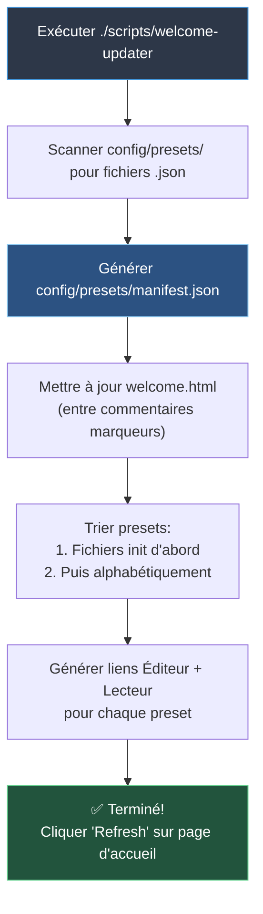

# Mise à Jour de la Liste des Presets



## Utilisation

Exécutez le script pour mettre à jour automatiquement la page d'accueil avec tous les presets trouvés dans `config/presets/` :

```bash
./scripts/welcome-updater
```

## Fonction

Le script :
- Scanne le répertoire `config/presets/` pour les fichiers `.json`
- Génère `config/presets/manifest.json` avec les métadonnées des presets
- Met à jour `welcome.html` entre les commentaires marqueurs
- Trie les presets avec les fichiers init en premier, puis alphabétiquement
- Génère des liens Éditeur et Lecteur pour chaque preset

## Ajouter de Nouveaux Presets

1. Sauvegardez votre fichier preset dans `config/presets/filename.json`
2. Exécutez `./scripts/welcome-updater`
3. Cliquez sur le bouton "Refresh" sur la page d'accueil (ou rechargez la page)

## Chargement Dynamique

La page d'accueil inclut un bouton **Refresh** qui recharge la liste des presets depuis `manifest.json` sans nécessiter un rechargement de page.

**Flux de travail :**
1. Ajoutez le fichier preset dans `config/presets/`
2. Exécutez `./scripts/welcome-updater` (génère le manifest)
3. Cliquez sur le bouton "Refresh" sur la page d'accueil

## Marqueurs

Ne supprimez pas ces commentaires HTML de `welcome.html` :
```html
<!-- PRESETS_START -->
<!-- PRESETS_END -->
```

Le script remplace tout le contenu entre ces marqueurs.

---

Voir [scripts/README.md](scripts/README.md) pour tous les scripts disponibles.
